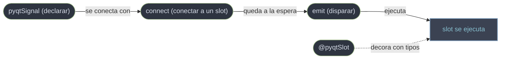

# QtCore/señales — declarar, conectar y emitir señales

Esta carpeta reune las **herramientas concretas** del mecanismo que explica [[concepto_signals_slots]]: las piezas de API que usas cada dia para que dos `QObject` se comuniquen. Son cuatro y forman un ciclo: **declarar** una señal propia (`pyqtSignal`), **conectar** esa señal a un slot (`connect`), **decorar** el slot con sus tipos (`@pyqtSlot`) y **disparar** la señal (`emit`). El concepto te dice por que existen las señales; estas notas te dicen como escribirlas.

## En accion

Las cuatro piezas en una sola clase: una subclase de `QObject` con una señal propia, un slot decorado, la conexion y la emision.

```python
from PyQt6.QtCore import QObject, pyqtSignal, pyqtSlot

class Sensor(QObject):
    medido = pyqtSignal(float)            # 1. declarar la señal (atributo de clase)

    def medir(self, t):
        self.medido.emit(t)              # 4. emitir -> dispara los slots conectados

class Panel(QObject):
    @pyqtSlot(float)                      # 3. decorar el slot con sus tipos
    def mostrar(self, t):
        print(f"temperatura = {t} C")

sensor = Sensor()
panel = Panel()
sensor.medido.connect(panel.mostrar)     # 2. conectar la señal al slot

sensor.medir(36.5)                        # imprime "temperatura = 36.5 C"
```

## El ciclo

`pyqtSignal` declara, `connect` enlaza, `emit` dispara y el slot (marcado con `@pyqtSlot`) corre:



## Las piezas

| Pieza | Para que |
|-------|----------|
| [[pyqtSignal]] | declarar una señal propia como atributo de clase |
| [[connect]] | conectar una señal a un slot |
| [[emit]] | disparar la señal y ejecutar los slots conectados |
| [[pyqtSlot]] | decorar el slot con los tipos que acepta |

## Notas relacionadas

- [[concepto_signals_slots]] — por que existen las señales y slots; el modelo mental
- [[QObject]] — solo los `QObject` pueden declarar y emitir señales
