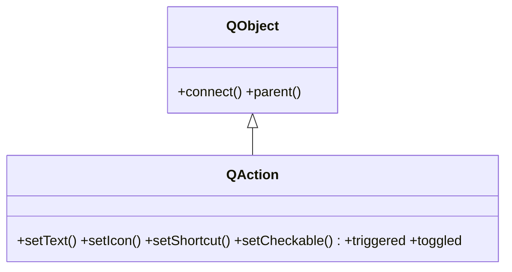

# QAction — comando reutilizable para menus y toolbars

Una `QAction` es un **comando reutilizable**: lo defines UNA sola vez (texto, icono, atajo) y lo anades a la vez a un menu Y a una barra de herramientas; pulsarlo en cualquiera de los dos emite la senal `triggered`, y cambiar su estado (`enabled`, `checked`) se refleja en **todas** sus apariciones. Es la pieza que evita duplicar logica entre el menu y la toolbar: una accion, muchos sitios donde aparece. En Qt6 vive en `QtGui` (en Qt5 estaba en `QtWidgets`).

## Importacion

```python
from PyQt6.QtGui import QAction
```

## Herencia



`QAction` **no es un `QWidget`**: es un `QObject`. No se muestra por si sola; son el menu y la toolbar quienes la dibujan. De `QObject` hereda el `parent` (que gestiona su memoria) y el `connect` para enganchar sus senales a slots.

## Senales

| Senal | Cuando se emite | Argumentos |
|-------|-----------------|------------|
| `triggered` | al ejecutar la accion (clic en menu/toolbar o atajo) | `checked: bool` (estado, solo util si es checkable) |
| `toggled` | cuando cambia el estado de una accion checkable | `checked: bool` |
| `hovered` | al pasar el raton por encima en el menu | — |

```python
accion.triggered.connect(self.guardar)        # lo habitual
accion.toggled.connect(lambda on: print(on))   # solo si setCheckable(True)
```

## Propiedades

En Qt los atributos son **propiedades** (getter/setter, no acceso directo). Las mas usadas:

| Propiedad | Tipo | Leer \| escribir | Controla |
|-----------|------|------------------|----------|
| `text` | `str` | `text()` \| `setText(str)` | el texto que se ve en el menu/toolbar |
| `icon` | `QIcon` | `icon()` \| `setIcon(QIcon)` | el icono de la accion |
| `shortcut` | `QKeySequence` | `shortcut()` \| `setShortcut(...)` | el atajo de teclado (ej. "Ctrl+S") |
| `checkable` | `bool` | `isCheckable()` \| `setCheckable(bool)` | si la accion mantiene estado on/off |
| `checked` | `bool` | `isChecked()` \| `setChecked(bool)` | estado actual (solo si es checkable) |
| `enabled` | `bool` | `isEnabled()` \| `setEnabled(bool)` | habilitada o en gris (se refleja en todas sus apariciones) |
| `statusTip` | `str` | `statusTip()` \| `setStatusTip(str)` | mensaje en la barra de estado al posarse sobre ella |
| `data` | `object` | `data()` \| `setData(obj)` | dato arbitrario que adjuntas a la accion |

## Constructor y metodos

```python
QAction(parent: QObject | None = None)
QAction(text: str, parent: QObject | None = None)
QAction(icon: QIcon, text: str, parent: QObject | None = None)
```

Lo habitual es `QAction("Guardar", self)` o, con icono, `QAction(QIcon("save.png"), "Guardar", self)`. El `parent` suele ser la ventana, que gestiona su memoria.

| Firma | Devuelve | Que hace |
|-------|----------|----------|
| `setText(text: str)` | `None` | fija el texto visible de la accion |
| `setIcon(icon: QIcon)` | `None` | pone el icono (aparece en menu y toolbar) |
| `setShortcut(shortcut: QKeySequence \| str)` | `None` | asigna el atajo de teclado (ej. `"Ctrl+S"`) |
| `setCheckable(on: bool)` | `None` | convierte la accion en conmutador (mantiene estado) |
| `setChecked(on: bool)` | `None` | fija el estado (solo si es checkable) |
| `isChecked()` | `bool` | `True` si esta marcada (util solo si es checkable) |
| `setEnabled(on: bool)` | `None` | habilita o deshabilita; se refleja en todas sus apariciones |
| `setStatusTip(text: str)` | `None` | texto que se muestra en la barra de estado |
| `setToolTip(text: str)` | `None` | texto del tooltip emergente |
| `setData(data: object)` | `None` | adjunta un dato arbitrario a la accion |
| `data()` | `object` | recupera el dato adjuntado con `setData` |

## Casos de uso

```python
from PyQt6.QtWidgets import QApplication, QMainWindow, QLabel
from PyQt6.QtGui import QAction          # PyQt6: QAction vive en QtGui
import sys

app = QApplication(sys.argv)
ventana = QMainWindow()
ventana.setCentralWidget(QLabel("Documento"))

# 1. UNA accion compartida por menu y toolbar
accion = QAction("Guardar", ventana)
accion.setShortcut("Ctrl+S")
accion.setStatusTip("Guarda el documento")
accion.triggered.connect(lambda: print("guardado"))

menu = ventana.menuBar().addMenu("Archivo")
menu.addAction(accion)                   # aparece en el menu
ventana.addToolBar("Principal").addAction(accion)  # y en la toolbar: la MISMA accion

# 2. Accion checkable (conmutador, ej. "Negrita")
negrita = QAction("Negrita", ventana)
negrita.setCheckable(True)
negrita.toggled.connect(lambda on: print("negrita" if on else "normal"))
menu.addAction(negrita)

ventana.show()
sys.exit(app.exec())                     # PyQt6: exec() (sin guion bajo)
```

## Errores comunes

| Error | Causa | Solucion |
|-------|-------|----------|
| `ImportError` al importar `QAction` de `QtWidgets` | en Qt6 se movio a `QtGui` | `from PyQt6.QtGui import QAction` |
| El menu y la toolbar no se mantienen sincronizados | creaste **dos** acciones distintas | crea UNA `QAction` y anadela a ambos con `addAction` |
| El slot se ejecuta al crear la accion | conectaste `triggered.connect(self.f())` con parentesis | quita los `()`: `triggered.connect(self.f)` |
| `setChecked`/`toggled` no hacen nada | la accion no es checkable | llama antes a `setCheckable(True)` |

## Notas relacionadas

- [[QShortcut]] — un atajo de teclado suelto, sin menu ni accion visible
- [[QKeySequence]] — la representacion de las teclas que se pasa a `setShortcut`
- [[QMenu]] — el menu desplegable que se llena de acciones con `addAction`
- [[QToolBar]] — la barra de herramientas que reutiliza la misma accion
- [[concepto_signals_slots]] — como conectar `triggered` a un slot
