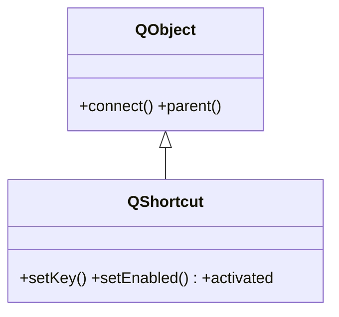

# QShortcut — atajo de teclado suelto, sin menu

`QShortcut` es un **atajo de teclado standalone**: una combinacion de teclas asociada a un widget que, al pulsarse, emite la senal `activated`. A diferencia del atajo de una [[QAction]], no necesita un menu ni una toolbar detras; es para atajos sueltos que no tienen un elemento visible. En Qt6 vive en `QtGui`.

## Importacion

```python
from PyQt6.QtGui import QShortcut, QKeySequence
```

## Herencia



`QShortcut` es un `QObject`: no se muestra. Se asocia a un `parent` (el widget en cuyo contexto el atajo esta activo) y emite `activated` cuando se pulsan sus teclas.

## Senales

| Senal | Cuando se emite | Argumentos |
|-------|-----------------|------------|
| `activated` | al pulsar la combinacion de teclas del atajo | — |
| `activatedAmbiguously` | cuando varias acciones comparten el mismo atajo y no se puede decidir | — |

```python
atajo.activated.connect(self.close)
```

## Constructor y metodos

```python
QShortcut(key: QKeySequence, parent: QWidget)
```

La forma habitual recibe la combinacion de teclas (un [[QKeySequence]] o un `str` que se convierte) y el widget de contexto. El atajo solo dispara cuando ese widget (o un descendiente) tiene el foco, segun su contexto.

| Firma | Devuelve | Que hace |
|-------|----------|----------|
| `setKey(key: QKeySequence)` | `None` | cambia la combinacion de teclas |
| `key()` | `QKeySequence` | la combinacion actual |
| `setEnabled(on: bool)` | `None` | activa o desactiva el atajo |

## Casos de uso

```python
from PyQt6.QtWidgets import QApplication, QWidget
from PyQt6.QtGui import QShortcut, QKeySequence
import sys

app = QApplication(sys.argv)
w = QWidget()

# Atajo suelto: cerrar la ventana con Ctrl+Q, sin menu ni accion visible
QShortcut(QKeySequence("Ctrl+Q"), w).activated.connect(w.close)

w.show()
sys.exit(app.exec())
```

## Cuando usar QShortcut vs el atajo de una QAction

| Situacion | Que usar |
|-----------|----------|
| Ya hay una [[QAction]] en un menu o toolbar | su `setShortcut` (no crees un `QShortcut` aparte) |
| Atajo suelto sin elemento visible (ej. un atajo de depuracion) | un `QShortcut` |

> [!nota] Regla practica
> Si el comando aparece en algun sitio (menu, toolbar), el atajo es responsabilidad de su `QAction`. `QShortcut` queda para los atajos que no tienen accion visible que los respalde.

## Errores comunes

| Error | Causa | Solucion |
|-------|-------|----------|
| `ImportError` al importar de `QtWidgets` | en Qt6 se movio a `QtGui` | `from PyQt6.QtGui import QShortcut` |
| El atajo nunca dispara | el `parent` no tiene el foco o fue recolectado | asocialo a un widget vivo y con foco (ej. la ventana) |
| Atajo duplicado con una `QAction` | definiste el mismo atajo en ambos | usa solo el `setShortcut` de la accion |

## Notas relacionadas

- [[QAction]] — si el comando ya esta en un menu/toolbar, usa su `setShortcut` en vez de esto
- [[QKeySequence]] — la combinacion de teclas que recibe el constructor
- [[concepto_signals_slots]] — como conectar `activated` a un slot
