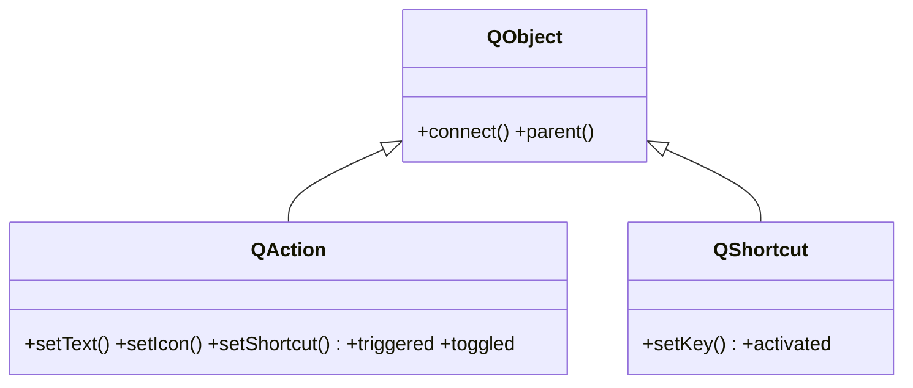
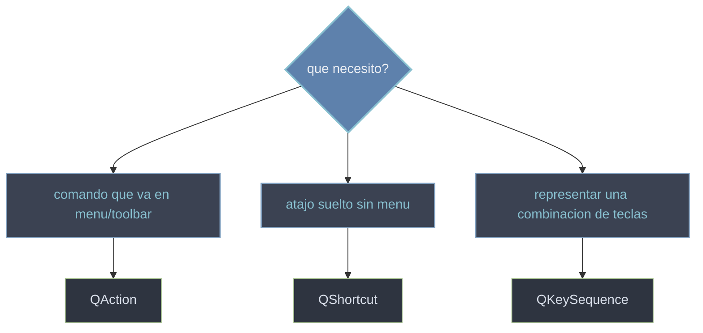

# QtGui/acciones — comandos, atajos y teclas

Esta carpeta agrupa las **acciones y atajos** de teclado de PyQt6. La [[QAction]] es el comando reutilizable: la defines una vez (texto, icono, atajo) y la pones a la vez en un menu, una toolbar y como atajo, todo en una sola pieza. La [[QShortcut]] es un atajo de teclado suelto, sin menu ni accion visible detras. Y la [[QKeySequence]] es la representacion de las propias teclas, el valor que ambas reciben para saber que combinacion las dispara. En Qt6 las tres viven en `QtGui` (en Qt5, `QAction` y `QShortcut` estaban en `QtWidgets`).

## En accion

Un `QMainWindow` donde una **misma** `QAction` (con icono, atajo `Ctrl+S` y su `triggered`) se añade al menu y a la toolbar a la vez:

```python
from PyQt6.QtWidgets import QApplication, QMainWindow, QLabel
from PyQt6.QtGui import QAction, QIcon
import sys

app = QApplication(sys.argv)

ventana = QMainWindow()
ventana.setWindowTitle("acciones compartidas")
ventana.setCentralWidget(QLabel("Documento"))

# UNA accion: texto, icono, atajo y su slot
guardar = QAction(QIcon.fromTheme("document-save"), "Guardar", ventana)
guardar.setShortcut("Ctrl+S")
guardar.setStatusTip("Guarda el documento")
guardar.triggered.connect(lambda: ventana.statusBar().showMessage("guardado"))

# la MISMA accion en el menu y en la toolbar
menu = ventana.menuBar().addMenu("Archivo")
menu.addAction(guardar)
ventana.addToolBar("Principal").addAction(guardar)

ventana.show()
sys.exit(app.exec())                     # PyQt6: exec() (sin guion bajo)
```

## Herencia



`QAction` y `QShortcut` son `QObject` (no widgets): no se muestran solos, los dibuja quien los aloja. `QKeySequence` queda aparte: es una **clase de valor** (no hereda de `QObject`), solo representa las teclas.

## Que uso



## Las clases

| Clase | Hereda de | Rol |
|-------|-----------|-----|
| [[QAction]] | `QObject` | comando reutilizable: menu + toolbar + atajo en una sola pieza |
| [[QShortcut]] | `QObject` | atajo de teclado suelto, sin menu ni accion visible |
| [[QKeySequence]] | — (clase de valor) | representa la combinacion de teclas que reciben las dos anteriores |

## Notas relacionadas

- [[QMenu]] — el menu desplegable que se llena de acciones con `addAction`
- [[QToolBar]] — la barra de herramientas que reutiliza la misma accion
- [[concepto_signals_slots]] — como conectar `triggered` y `activated` a slots
