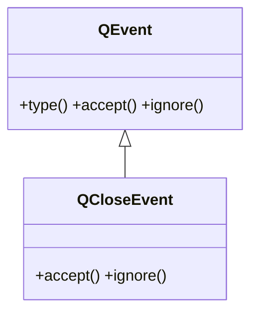

# QCloseEvent — evento de cierre de una ventana

`QCloseEvent` es el evento que Qt envia cuando se intenta **cerrar** una ventana (la X del titulo, `close()`, salir de la app). Se recibe sobreescribiendo `closeEvent(self, e)`, y ahi se puede **confirmar o cancelar** el cierre: `accept()` deja cerrar, `ignore()` lo veta y la ventana sigue abierta.

## Importacion

```python
from PyQt6.QtGui import QCloseEvent
```

## Herencia



Lo comun a cualquier evento lo hereda de [[QEvent]]. En `QCloseEvent` lo decisivo son justo `accept()` e `ignore()`: deciden si la ventana se cierra o no.

## Propiedades

`QCloseEvent` no expone propiedades getter/setter: solo se acepta o se ignora con los metodos de abajo.

## Constructor y metodos

```python
QCloseEvent()
```

Lo crea Qt y lo entrega a `closeEvent`. Lo habitual es **decidir** si permites el cierre.

| Firma | Devuelve | Que hace |
|-------|----------|----------|
| `accept()` | `None` | **permite** cerrar la ventana (cierre normal) |
| `ignore()` | `None` | **cancela** el cierre: la ventana sigue abierta |

## Casos de uso

```python
from PyQt6.QtWidgets import QApplication, QMainWindow, QMessageBox
import sys

class Ventana(QMainWindow):
    def closeEvent(self, e):
        resp = QMessageBox.question(self, "Salir", "¿Guardar cambios antes de cerrar?")
        if resp == QMessageBox.StandardButton.Yes:
            e.accept()    # permite cerrar
        else:
            e.ignore()    # cancela: la ventana queda abierta

app = QApplication(sys.argv)
w = Ventana()
w.show()
sys.exit(app.exec())
```

El dialogo de confirmacion lo aporta un [[QMessageBox]]; el `closeEvent` solo decide con `accept()`/`ignore()`.

## Errores comunes

| Error | Causa | Solucion |
|-------|-------|----------|
| Comportamiento ambiguo al cerrar | olvidaste llamar a `e.accept()` o `e.ignore()` | decide siempre: `accept()` para cerrar, `ignore()` para cancelar |
| La ventana no se cierra "normal" cuando no gestionas nada | sobreescribiste `closeEvent` sin delegar | llama a `super().closeEvent(e)` si no manejas el caso |

## Notas relacionadas

- [[QEvent]] — la clase base de la que hereda `type()`, `accept()` e `ignore()`
- [[QMessageBox]] — el dialogo para confirmar el cierre dentro de `closeEvent`
- [[concepto_herencia_widgets]] — por que se subclasea y se sobreescribe `closeEvent`
