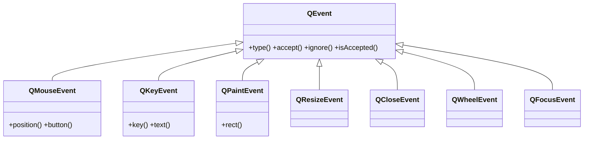

# QEvent — la clase base de todos los eventos

`QEvent` es la clase base de **todos** los eventos de Qt: un objeto que **describe algo que ocurrio** (un clic del raton, una tecla pulsada, una peticion de repintado). No lo creas tu: Qt lo construye y lo entrega a `event()` y a los **manejadores** especificos (`mousePressEvent`, `keyPressEvent`, `paintEvent`...). Cada tipo de interaccion llega como una **subclase** concreta de `QEvent` con los datos de ese evento.

> [!nota] QEvent vive en QtCore
> Aunque casi todas sus subclases de evento (`QMouseEvent`, `QKeyEvent`, `QPaintEvent`...) viven en `QtGui`, la clase base `QEvent` esta en `QtCore`, porque el sistema de eventos es parte del nucleo no visual de Qt.

## Importacion

```python
from PyQt6.QtCore import QEvent
```

## Herencia



Lo que `QEvent` aporta a todas sus subclases es lo **comun a cualquier evento**: saber su tipo (`type()`) y poder aceptarlo o ignorarlo (`accept()` / `ignore()`). Cada subclase agrega **los datos propios** de su evento: `QMouseEvent` la posicion y el boton, `QKeyEvent` la tecla, etc.

## Propiedades

`QEvent` no expone propiedades al estilo getter/setter de los widgets; lo relevante es su **tipo** y su **estado de aceptacion**, que se consultan con los metodos de abajo (`type()`, `isAccepted()`).

## Constructor y metodos

```python
QEvent(type: QEvent.Type)
```

Rara vez lo construyes a mano (lo hace Qt). Lo habitual es **recibir** un `QEvent` ya creado y leer su tipo o marcar su aceptacion.

| Firma | Devuelve | Que hace |
|-------|----------|----------|
| `type()` | `QEvent.Type` | el tipo concreto del evento (ej. `QEvent.Type.MouseButtonPress`) |
| `accept()` | `None` | marca el evento como **manejado** (no se propaga al padre) |
| `ignore()` | `None` | marca el evento como **no manejado**: lo pasa al widget padre |
| `isAccepted()` | `bool` | `True` si el evento esta aceptado |

## Cada evento y su manejador

Lo normal no es inspeccionar `QEvent` directamente, sino sobreescribir el **manejador** de cada tipo de evento, que ya recibe la subclase concreta:

| Subclase de QEvent | Manejador a sobreescribir | Cuando |
|--------------------|---------------------------|--------|
| `QMouseEvent` | `mousePressEvent` | se presiona un boton del raton |
| `QKeyEvent` | `keyPressEvent` | se pulsa una tecla |
| `QPaintEvent` | `paintEvent` | el widget necesita repintarse |
| `QResizeEvent` | `resizeEvent` | el widget cambia de tamaño |
| `QCloseEvent` | `closeEvent` | se intenta cerrar la ventana |
| `QWheelEvent` | `wheelEvent` | se gira la rueda del raton |

## Casos de uso

```python
from PyQt6.QtWidgets import QApplication, QWidget
from PyQt6.QtCore import QEvent
import sys

# 1. Leer e.type() dentro de un event() sobreescrito
class Panel(QWidget):
    def event(self, e: QEvent) -> bool:
        if e.type() == QEvent.Type.MouseButtonPress:
            print("clic detectado en event()")
        return super().event(e)   # delega el resto al comportamiento normal

# 2. Aceptar o ignorar un closeEvent (preguntar antes de cerrar)
class Ventana(QWidget):
    def closeEvent(self, e: QEvent) -> None:
        guardado = True
        if guardado:
            e.accept()    # permite cerrar
        else:
            e.ignore()    # cancela el cierre

app = QApplication(sys.argv)
w = Panel()
w.show()
sys.exit(app.exec())
```

## Errores comunes

| Error | Causa | Solucion |
|-------|-------|----------|
| Comparar el tipo con `Qt.MouseButtonPress` o un entero suelto | en Qt6 los enums tienen scope | usa el enum completo: `QEvent.Type.MouseButtonPress` |
| La ventana se cierra aunque "cancelas" en `closeEvent` | olvidaste llamar a `e.ignore()` | `ignore()` para cancelar, `accept()` para permitir |
| El evento deja de comportarse como antes al sobreescribir `event()` | no delegaste al padre | termina con `return super().event(e)` |

## Notas relacionadas

- [[concepto_sistema_eventos]] — como Qt despacha eventos a `event()` y a los manejadores
- [[QWidget]] — quien recibe los eventos y define los manejadores que se sobreescriben
