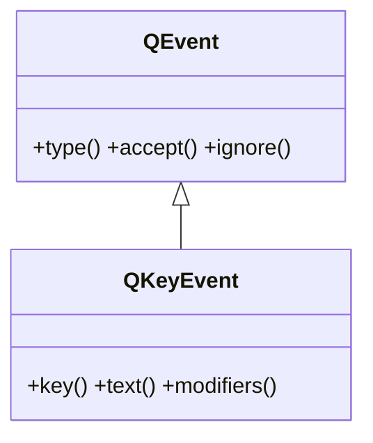

# QKeyEvent — el evento de teclado

`QKeyEvent` es el evento que Qt entrega cuando se **pulsa o suelta una tecla** mientras el widget tiene el foco. No lo creas tu: Qt lo construye y lo pasa al **manejador** que sobreescribes en una subclase de [[QWidget]]. Lleva la tecla (`key()`), el caracter que produjo (`text()`) y los modificadores activos (`modifiers()`: Ctrl, Shift, Alt).

## Importacion

```python
from PyQt6.QtGui import QKeyEvent
```

> [!nota] Lo que de verdad importas es `Qt`
> El `QKeyEvent` llega ya construido al manejador; el import solo sirve para la anotacion de tipo. Lo imprescindible es `Qt` (de `QtCore`) para comparar teclas y modificadores: `Qt.Key.Key_Escape`, `Qt.KeyboardModifier.ControlModifier`.

## En que manejador se recibe

Se **sobreescribe** el manejador en una subclase de `QWidget`. Ambos reciben un `QKeyEvent`:

| Manejador a sobreescribir | Cuando |
|---------------------------|--------|
| `keyPressEvent(self, e)` | se pulsa una tecla |
| `keyReleaseEvent(self, e)` | se suelta una tecla |

> [!nota] Hace falta el foco
> Solo el widget con el foco de teclado recibe estos eventos. Un `QWidget` plano no lo toma por defecto; activalo con `self.setFocusPolicy(Qt.FocusPolicy.StrongFocus)`.

## Herencia



Entre `QEvent` y `QKeyEvent` esta la clase intermedia `QInputEvent` (comun a raton, teclado y rueda; de ahi viene `modifiers()`). Lo comun a cualquier evento (`type()`, `accept()`, `ignore()`) lo hereda de [[QEvent]]; lo propio del teclado lo agrega `QKeyEvent`.

## Propiedades

`QKeyEvent` no expone propiedades getter/setter: sus datos se leen con los metodos de abajo.

## Constructor y metodos

Rara vez lo construyes a mano (lo hace Qt). Lo habitual es **recibir** un `QKeyEvent` y leer la tecla y los modificadores:

| Firma | Devuelve | Que hace |
|-------|----------|----------|
| `key()` | `int` | codigo de la tecla; se compara con la enum `Qt.Key` (ej. `Qt.Key.Key_Escape`, `Qt.Key.Key_Return`, `Qt.Key.Key_S`) |
| `text()` | `str` | el **caracter** producido (`"a"`, `"A"`, `"!"`); vacio en teclas sin texto (flechas, Esc, F1...) |
| `modifiers()` | `Qt.KeyboardModifier` | los modificadores activos (Ctrl/Shift/Alt) como combinacion OR; ej. `Qt.KeyboardModifier.ControlModifier` |

## Casos de uso

```python
from PyQt6.QtWidgets import QApplication, QWidget
from PyQt6.QtGui import QKeyEvent
from PyQt6.QtCore import Qt
import sys

class Editor(QWidget):
    def __init__(self):
        super().__init__()
        # sin esto un QWidget plano no recibe teclas
        self.setFocusPolicy(Qt.FocusPolicy.StrongFocus)

    def keyPressEvent(self, e: QKeyEvent) -> None:
        # tecla especial: comparar con key(), NO con text()
        if e.key() == Qt.Key.Key_Escape:
            self.close()
            return

        # combinacion Ctrl+S
        if (e.key() == Qt.Key.Key_S
                and e.modifiers() == Qt.KeyboardModifier.ControlModifier):
            print("guardar")
            return

        # tecla normal: aqui si tiene sentido text()
        print("caracter:", e.text())
        super().keyPressEvent(e)

app = QApplication(sys.argv)
w = Editor()
w.resize(300, 200)
w.show()
sys.exit(app.exec())
```

## Errores comunes

| Error | Causa | Solucion |
|-------|-------|----------|
| Esc o las flechas "no se detectan" comparando `text()` | las teclas especiales no producen caracter: `text()` es `""` | compara con `e.key()` y la enum `Qt.Key` (`Qt.Key.Key_Escape`...) |
| El atajo Ctrl+S se dispara con cualquier tecla | olvidaste comprobar `modifiers()` | combina `key()` y `modifiers()`: `e.modifiers() == Qt.KeyboardModifier.ControlModifier` |
| El widget no recibe ninguna tecla | un `QWidget` plano no toma el foco por defecto | `self.setFocusPolicy(Qt.FocusPolicy.StrongFocus)` |
| Comparas con `Qt.Key_Escape` o `Qt.ControlModifier` y falla | en Qt6 los enums tienen scope | usa el enum completo: `Qt.Key.Key_Escape`, `Qt.KeyboardModifier.ControlModifier` |

## Notas relacionadas

- [[QEvent]] — la clase base de la que hereda; aporta `type()`, `accept()`, `ignore()`
- [[concepto_sistema_eventos]] — como Qt despacha el evento al manejador que sobreescribes
- [[QMouseEvent]] — el evento hermano del raton
