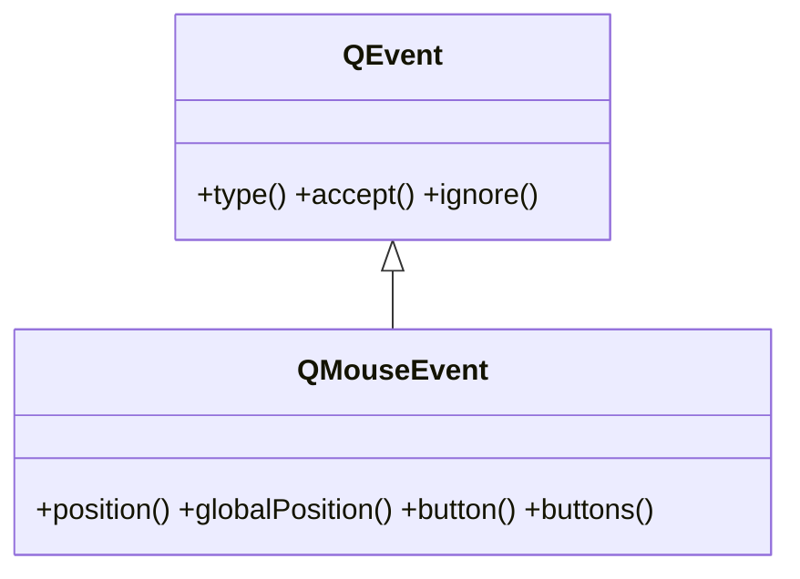

# QMouseEvent — el evento de raton (clic y movimiento)

`QMouseEvent` es el evento que Qt entrega cuando el raton **se presiona, se suelta, se mueve o hace doble clic** sobre un widget. No lo creas tu: Qt lo construye y lo pasa al **manejador** correspondiente, que sobreescribes en una subclase de [[QWidget]]. Lleva los datos del evento: **donde** ocurrio (`position()`) y **que boton** cambio (`button()`).

## Importacion

```python
from PyQt6.QtGui import QMouseEvent
```

> [!nota] Casi nunca lo importas
> El tipo llega ya construido al manejador; el import solo hace falta para la anotacion de tipo (`def mousePressEvent(self, e: QMouseEvent)`). Lo que de verdad necesitas importar es `Qt` (de `QtCore`), para comparar botones: `Qt.MouseButton.LeftButton`.

## En que manejador se recibe

No se inspecciona el objeto directamente: se **sobreescribe** el manejador del tipo de interaccion en una subclase de `QWidget`. Todos reciben un `QMouseEvent`:

| Manejador a sobreescribir | Cuando |
|---------------------------|--------|
| `mousePressEvent(self, e)` | se presiona un boton del raton |
| `mouseReleaseEvent(self, e)` | se suelta un boton |
| `mouseMoveEvent(self, e)` | se mueve el raton (por defecto solo con un boton pulsado; ver `setMouseTracking`) |
| `mouseDoubleClickEvent(self, e)` | se hace doble clic |

## Herencia



Entre `QEvent` y `QMouseEvent` existe la clase intermedia `QInputEvent` (comun a raton, teclado y rueda; aporta `modifiers()` y `timestamp()`). Lo comun a cualquier evento (`type()`, `accept()`, `ignore()`) lo hereda de [[QEvent]]; lo propio del raton (posicion y botones) lo agrega `QMouseEvent`.

## Propiedades

`QMouseEvent` no expone propiedades getter/setter: sus datos se leen con los metodos de abajo (`position()`, `button()`...).

## Constructor y metodos

Rara vez lo construyes a mano (lo hace Qt). Lo habitual es **recibir** un `QMouseEvent` en el manejador y leer su posicion y botones:

| Firma | Devuelve | Que hace |
|-------|----------|----------|
| `position()` | `QPointF` | posicion del cursor **local** al widget (origen en su esquina superior izquierda) |
| `globalPosition()` | `QPointF` | posicion del cursor en **coordenadas de pantalla** |
| `button()` | `Qt.MouseButton` | el boton que **cambio** de estado (el que disparo este evento): `LeftButton`, `RightButton`, `MiddleButton` |
| `buttons()` | `Qt.MouseButton` | los botones que estan **pulsados ahora mismo** (combinacion OR) |

> [!nota] En Qt6 es `position()`, no `pos()`
> El metodo `pos()` (que devolvia `QPoint` entero) quedo obsoleto. En PyQt6 usa `position()`, que devuelve `QPointF` (con decimales). Para un entero: `e.position().toPoint()`.

## Casos de uso

```python
from PyQt6.QtWidgets import QApplication, QWidget
from PyQt6.QtGui import QMouseEvent
from PyQt6.QtCore import Qt
import sys

class Lienzo(QWidget):
    def mousePressEvent(self, e: QMouseEvent) -> None:
        # posicion LOCAL al widget (QPointF)
        print("clic en:", e.position())
        print("en pantalla:", e.globalPosition())

        # detectar QUE boton se pulso (enum con scope en Qt6)
        if e.button() == Qt.MouseButton.LeftButton:
            print("boton izquierdo")
        elif e.button() == Qt.MouseButton.RightButton:
            print("boton derecho")

        super().mousePressEvent(e)   # conserva el comportamiento base

app = QApplication(sys.argv)
w = Lienzo()
w.resize(300, 200)
w.show()
sys.exit(app.exec())
```

Para detectar **arrastre** (mover con el boton pulsado), sobreescribe `mouseMoveEvent` y consulta `buttons()` (los pulsados ahora), no `button()` (que en un move suele ser `NoButton`):

```python
class Arrastre(QWidget):
    def mouseMoveEvent(self, e: QMouseEvent) -> None:
        if e.buttons() & Qt.MouseButton.LeftButton:
            print("arrastrando hasta:", e.position())
```

## Errores comunes

| Error | Causa | Solucion |
|-------|-------|----------|
| `AttributeError` o aviso por `e.pos()` | en Qt6 `pos()` quedo obsoleto | usa `e.position()` (devuelve `QPointF`); para entero `.toPoint()` |
| El clic se registra en la posicion equivocada | confundes `position()` (local al widget) con `globalPosition()` (pantalla) | usa `position()` para coordenadas dentro del widget |
| `button()` da `NoButton` dentro de `mouseMoveEvent` | en un move no hay boton que "cambie"; `button()` es el del press/release | usa `buttons()` para saber que botones siguen pulsados |
| Comparas con `Qt.LeftButton` y falla | en Qt6 los enums tienen scope | usa el enum completo: `Qt.MouseButton.LeftButton` |
| El widget pierde su comportamiento normal al clicar | no delegaste al base | llama a `super().mousePressEvent(e)` cuando quieras conservar la conducta heredada |

## Notas relacionadas

- [[QEvent]] — la clase base de la que hereda; aporta `type()`, `accept()`, `ignore()`
- [[concepto_sistema_eventos]] — como Qt despacha el evento al manejador que sobreescribes
- [[QKeyEvent]] — el evento hermano del teclado
