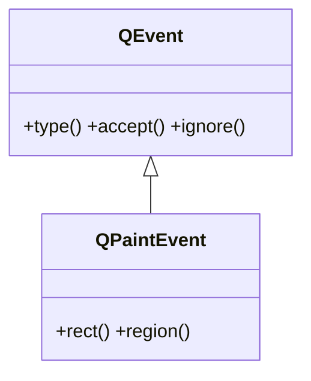

# QPaintEvent — evento de repintado de un widget

`QPaintEvent` es el evento que Qt envia a un widget cuando este **necesita redibujarse** (al mostrarse, al taparse y volver a quedar visible, al cambiar de tamaño o al pedirlo el propio codigo). Se recibe sobreescribiendo `paintEvent(self, e)`, y es **dentro de ese manejador** donde se crea el `QPainter` y se dibuja. Es el evento clave para construir widgets personalizados que se pintan a si mismos (ver [[concepto_herencia_widgets]]).

## Importacion

```python
from PyQt6.QtGui import QPaintEvent
```

## Herencia



Lo comun a cualquier evento (`type()`, `accept()`, `ignore()`) lo hereda de [[QEvent]]. Lo propio de `QPaintEvent` es saber **que zona** del widget hay que repintar: `rect()` y `region()`.

## Propiedades

`QPaintEvent` no expone propiedades getter/setter: la informacion util (la region a repintar) se consulta con los metodos de abajo.

## Constructor y metodos

```python
QPaintEvent(rect: QRect)
```

No lo construyes tu: lo crea Qt y lo entrega a `paintEvent`. Lo habitual es **leer** que region pide repintar.

| Firma | Devuelve | Que hace |
|-------|----------|----------|
| `rect()` | `QRect` | la **region** rectangular que hay que repintar; sirve para repintar solo lo necesario |
| `region()` | `QRegion` | la region a repintar como `QRegion` (mas precisa que el rectangulo) |

## Casos de uso

```python
from PyQt6.QtWidgets import QApplication, QWidget
from PyQt6.QtGui import QPainter, QColor
import sys

class Lienzo(QWidget):
    def paintEvent(self, e):
        painter = QPainter(self)                 # el painter SIEMPRE dentro de paintEvent
        painter.fillRect(e.rect(), QColor("#88c0d0"))   # rellena solo la zona pedida
        painter.drawText(20, 30, "dibujado en paintEvent")

app = QApplication(sys.argv)
w = Lienzo()
w.resize(240, 120)
w.show()
sys.exit(app.exec())
```

Para **forzar** un repintado no se llama a `paintEvent` a mano: se llama a `self.update()`, que programa un `QPaintEvent` y deja que Qt invoque `paintEvent` cuando toque. El dibujo en si lo hace [[QPainter]].

## Errores comunes

| Error | Causa | Solucion |
|-------|-------|----------|
| Llamar `paintEvent` directamente para refrescar | no es un metodo a invocar a mano | usa `self.update()` (o `repaint()`) para pedir el repintado |
| `QPainter` creado fuera de `paintEvent` | el painter sobre un widget solo es valido durante el repintado | crea `QPainter(self)` dentro de `paintEvent` |
| Repintar siempre todo el widget | ignoras `e.rect()` | usa `e.rect()` para limitar el dibujo a la zona afectada |

## Notas relacionadas

- [[QEvent]] — la clase base de la que hereda `type()`, `accept()` e `ignore()`
- [[QPainter]] — el motor de dibujo que se crea dentro de `paintEvent`
- [[concepto_herencia_widgets]] — por que se subclasea y se sobreescribe `paintEvent`
