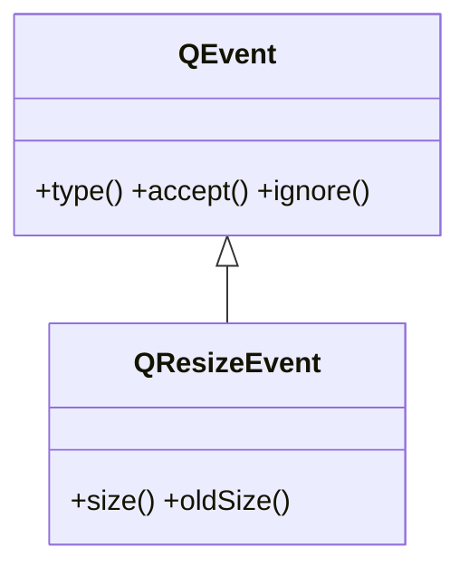

# QResizeEvent — evento de cambio de tamaño del widget

`QResizeEvent` es el evento que Qt envia cuando un widget **cambia de tamaño**. Se recibe sobreescribiendo `resizeEvent(self, e)`, y lleva el tamaño **nuevo** y el **anterior**, util para reubicar o reescalar contenido dibujado a mano que no gestiona un layout.

## Importacion

```python
from PyQt6.QtGui import QResizeEvent
```

## Herencia



Lo comun a cualquier evento lo hereda de [[QEvent]]. Lo propio de `QResizeEvent` son las dos medidas: `size()` (la nueva) y `oldSize()` (la previa).

## Propiedades

`QResizeEvent` no expone propiedades getter/setter: el tamaño nuevo y el anterior se consultan con los metodos de abajo.

## Constructor y metodos

```python
QResizeEvent(size: QSize, oldSize: QSize)
```

Lo crea Qt y lo entrega a `resizeEvent`. Lo habitual es **leer** el tamaño nuevo.

| Firma | Devuelve | Que hace |
|-------|----------|----------|
| `size()` | `QSize` | el tamaño **nuevo** del widget tras el cambio |
| `oldSize()` | `QSize` | el tamaño **anterior** (antes del cambio) |

## Casos de uso

```python
from PyQt6.QtWidgets import QApplication, QWidget, QLabel
import sys

class Panel(QWidget):
    def __init__(self):
        super().__init__()
        self.etiqueta = QLabel("centrada", self)

    def resizeEvent(self, e):
        ancho = e.size().width()                 # el ancho NUEVO
        self.etiqueta.move(ancho // 2 - 30, 20)  # reubica segun el tamaño actual

app = QApplication(sys.argv)
w = Panel()
w.resize(300, 150)
w.show()
sys.exit(app.exec())
```

## Errores comunes

| Error | Causa | Solucion |
|-------|-------|----------|
| Trabajo pesado dentro de `resizeEvent` | se dispara muchas veces al arrastrar el borde | manten el manejador ligero; difiere el calculo costoso |
| Sobreescribir `resizeEvent` para colocar widgets hijos | normalmente los layouts ya redimensionan solos | usa un layout; reserva `resizeEvent` para dibujo custom |

## Notas relacionadas

- [[QEvent]] — la clase base de la que hereda `type()`, `accept()` e `ignore()`
- [[concepto_herencia_widgets]] — por que se subclasea y se sobreescribe `resizeEvent`
