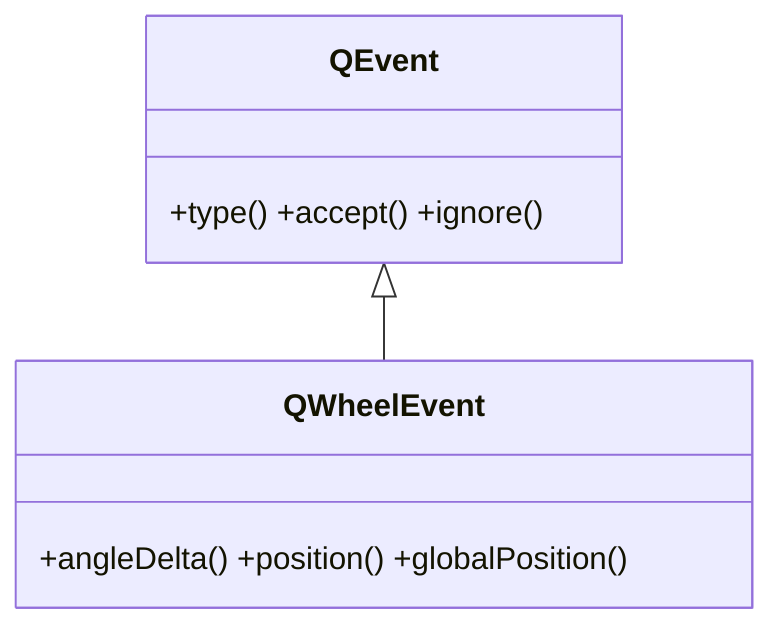

# QWheelEvent — el evento de la rueda del raton

`QWheelEvent` es el evento que Qt entrega cuando se **gira la rueda del raton** sobre un widget. No lo creas tu: Qt lo construye y lo pasa al **manejador** `wheelEvent`, que sobreescribes en una subclase de [[QWidget]]. Lleva cuanto y en que sentido giro la rueda (`angleDelta()`) y la posicion del cursor (`position()`). Es la materia prima tipica de un **zoom** o un **scroll** a mano.

## Importacion

```python
from PyQt6.QtGui import QWheelEvent
```

> [!nota] Casi nunca lo importas
> El evento llega ya construido al manejador; el import solo hace falta para la anotacion de tipo (`def wheelEvent(self, e: QWheelEvent)`).

## En que manejador se recibe

Se **sobreescribe** un unico manejador en una subclase de `QWidget`, que recibe el `QWheelEvent`:

| Manejador a sobreescribir | Cuando |
|---------------------------|--------|
| `wheelEvent(self, e)` | se gira la rueda del raton sobre el widget |

## Herencia



Entre `QEvent` y `QWheelEvent` esta la clase intermedia `QInputEvent` (comun a raton, teclado y rueda; aporta `modifiers()`). Lo comun a cualquier evento (`type()`, `accept()`, `ignore()`) lo hereda de [[QEvent]]; lo propio de la rueda lo agrega `QWheelEvent`.

## Propiedades

`QWheelEvent` no expone propiedades getter/setter: sus datos se leen con los metodos de abajo.

## Constructor y metodos

Rara vez lo construyes a mano (lo hace Qt). Lo habitual es **recibir** un `QWheelEvent` y leer el giro:

| Firma | Devuelve | Que hace |
|-------|----------|----------|
| `angleDelta()` | `QPoint` | el giro en octavos de grado; lo util es `.y()`: **positivo = rueda hacia arriba** (alejar), negativo = hacia abajo (acercar) |
| `position()` | `QPointF` | posicion del cursor **local** al widget cuando se giro la rueda |
| `globalPosition()` | `QPointF` | posicion del cursor en **coordenadas de pantalla** |

> [!nota] No asumas un valor fijo por "tic"
> `angleDelta().y()` suele ser `120` (un tic de una rueda estandar = 15 grados x 8), pero **no es garantizado**: ruedas de alta resolucion y touchpads dan valores menores y mas frecuentes. Fiate del **signo** y, si acaso, acumula; no esperes exactamente `120`.

## Casos de uso

```python
from PyQt6.QtWidgets import QApplication, QWidget
from PyQt6.QtGui import QWheelEvent
import sys

class Visor(QWidget):
    def __init__(self):
        super().__init__()
        self.zoom = 1.0

    def wheelEvent(self, e: QWheelEvent) -> None:
        # solo importa el SIGNO del giro vertical
        if e.angleDelta().y() > 0:
            self.zoom *= 1.1     # rueda arriba: acercar
        else:
            self.zoom /= 1.1     # rueda abajo: alejar

        print("zoom:", round(self.zoom, 2), "en", e.position())
        e.accept()               # consumimos el evento (no se propaga)

app = QApplication(sys.argv)
w = Visor()
w.resize(300, 200)
w.show()
sys.exit(app.exec())
```

## Errores comunes

| Error | Causa | Solucion |
|-------|-------|----------|
| El zoom da saltos distintos segun el raton | asumiste un valor fijo (`120`) por tic | usa solo el **signo** de `angleDelta().y()`; no esperes una magnitud exacta |
| El zoom va al reves | ignoraste el signo o lo invertiste | `y() > 0` es rueda hacia arriba (alejar); decide la direccion a partir de ahi |
| Confundes el giro con la posicion | `angleDelta()` es cuanto giro, `position()` es donde esta el cursor | usa `angleDelta()` para el zoom y `position()` como centro del zoom |
| La rueda tambien hace scroll del padre | no consumiste el evento | llama a `e.accept()` cuando manejes el zoom tu mismo |

## Notas relacionadas

- [[QEvent]] — la clase base de la que hereda; aporta `type()`, `accept()`, `ignore()`
- [[concepto_sistema_eventos]] — como Qt despacha el evento al manejador que sobreescribes
- [[QMouseEvent]] — el otro evento del raton (clic y movimiento)
