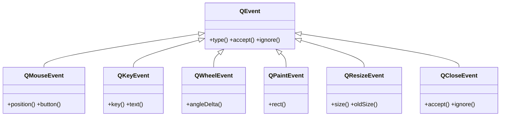

# QtGui/eventos — entrada de raton, teclado y sistema

Esta carpeta agrupa los **eventos concretos** (subclases de [[QEvent]]) que le llegan a un widget: el raton, el teclado, la rueda, el repintado, el cambio de tamaño y el cierre. Cada uno trae los datos propios de ese evento y se recibe **sobreescribiendo su manejador** en una subclase de `QWidget`. La maquinaria que despacha cada evento al manejador correcto se explica en [[concepto_sistema_eventos]].

## En accion

Una subclase de `QWidget` que sobreescribe `mousePressEvent` y `keyPressEvent` e imprime los datos de cada evento.

```python
from PyQt6.QtWidgets import QApplication, QWidget
import sys

class Lienzo(QWidget):
    def mousePressEvent(self, e):
        print("boton:", e.button())          # que boton se pulso
        print("posicion:", e.position())     # QPointF relativo al widget

    def keyPressEvent(self, e):
        print("tecla:", e.key(), "texto:", repr(e.text()))

app = QApplication(sys.argv)
w = Lienzo()
w.setWindowTitle("eventos")
w.resize(240, 160)
w.show()
sys.exit(app.exec())                          # exec() (PyQt6, sin guion bajo)
```

## Herencia



Todos heredan de [[QEvent]] lo comun (`type()`, `accept()`, `ignore()`); cada uno agrega los datos propios de su evento.

## Evento -> manejador

| Evento | Manejador a sobreescribir | Para que |
|--------|---------------------------|----------|
| [[QMouseEvent]] | `mousePressEvent` / `mouseMoveEvent` | clic y arrastre del raton (posicion, boton) |
| [[QKeyEvent]] | `keyPressEvent` | tecla pulsada (codigo y texto) |
| [[QWheelEvent]] | `wheelEvent` | giro de la rueda del raton |
| [[QPaintEvent]] | `paintEvent` | repintar el widget (crear el `QPainter` y dibujar) |
| [[QResizeEvent]] | `resizeEvent` | reaccionar al cambio de tamaño |
| [[QCloseEvent]] | `closeEvent` | confirmar o cancelar el cierre de la ventana |

## Notas relacionadas

- [[QEvent]] — la clase base comun a todos estos eventos
- [[concepto_sistema_eventos]] — como Qt despacha cada evento a su manejador
- [[concepto_herencia_widgets]] — por que se subclasea para sobreescribir manejadores
