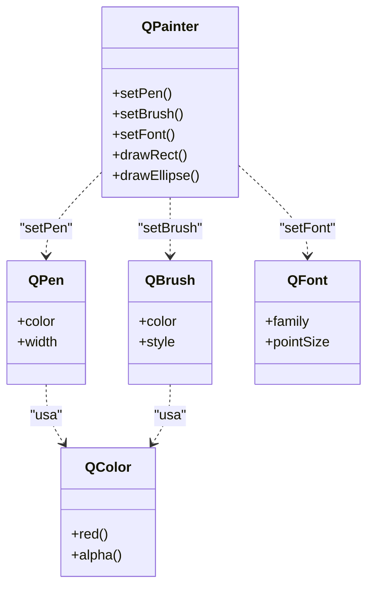

# QPainter — el motor de dibujo 2D de Qt

`QPainter` es el **motor de dibujo 2D** de Qt: dibuja lineas, formas, texto e imagenes sobre un *dispositivo de pintado* (normalmente un widget, pero tambien `QPixmap`, `QImage` o `QPrinter`). Es la herramienta central para construir **widgets personalizados**: cuando un widget necesita dibujarse a su manera, se subclasea `QWidget` y se sobreescribe `paintEvent`, donde se crea un `QPainter` y se le dan ordenes de dibujo (ver [[concepto_herencia_widgets]] y [[widget_personalizado]]). No es un objeto que vive en el arbol Qt: es una **clase de utilidad** de vida corta que se crea, se usa y se destruye dentro de un mismo metodo.

## Importacion

```python
from PyQt6.QtGui import QPainter
```

## Herencia

> [!note] No hereda de QObject
> `QPainter` es una **clase de utilidad**, no un `QObject`: no tiene `parent`, no vive en el arbol de objetos y **no emite senales**. No se subclasea ni se conecta a slots; se instancia, se usa y se destruye. Por eso esta nota no lleva `classDiagram` de herencia: lo relevante de `QPainter` es con quien **colabora**, no de quien desciende.

## Clases que colaboran

`QPainter` no trabaja solo: su *estado de dibujo* se configura con otras clases de [[PyQt6/QtGui/pintura/index|pintura]]. El pluma (pen) define el contorno, el pincel (brush) el relleno y el color es el valor que ambos consumen.



| Clase | Rol | Como se pasa al painter |
|-------|-----|-------------------------|
| `QPen` | contorno: color, grosor y estilo de las lineas | `painter.setPen(QPen(...))` o `setPen(QColor(...))` |
| `QBrush` | relleno: color y patron del interior de las formas | `painter.setBrush(QBrush(...))` o `setBrush(QColor(...))` |
| [[QColor]] | el **valor color** que consumen pen y brush | directamente a `setPen`/`setBrush`, o dentro de `QPen`/`QBrush` |
| `QFont` | tipografia del texto que se dibuja con `drawText` | `painter.setFont(QFont(...))` |

## Estado del painter

Antes de dibujar se configura el estado; cada orden de dibujo posterior usa el estado vigente.

| Metodo | Devuelve | Que controla |
|--------|----------|--------------|
| `setPen(pen: QPen \| QColor)` | `None` | el contorno (color y grosor de lineas y bordes) |
| `setBrush(brush: QBrush \| QColor)` | `None` | el relleno del interior de las formas |
| `setFont(font: QFont)` | `None` | la tipografia usada por `drawText` |
| `setRenderHint(hint: QPainter.RenderHint, on: bool = True)` | `None` | activa opciones de calidad, p. ej. `Antialiasing` (suavizado de bordes) |

```python
painter.setRenderHint(QPainter.RenderHint.Antialiasing)   # bordes suaves
painter.setPen(QColor("black"))                            # contorno negro
painter.setBrush(QColor(136, 192, 208))                    # relleno azul
```

## Constructor y metodos

```python
QPainter()                       # vacio: requiere begin(device) antes de dibujar
QPainter(device: QPaintDevice)   # lo habitual: QPainter(self) dentro de paintEvent
```

La forma habitual es `QPainter(self)` dentro de `paintEvent`: queda activo sobre el widget y se cierra solo al destruirse al final del metodo. Si se usa el constructor vacio hay que llamar a `begin(device)` y, al terminar, a `end()`.

| Firma | Devuelve | Que hace |
|-------|----------|----------|
| `begin(device: QPaintDevice)` | `bool` | empieza a pintar sobre un dispositivo (solo si se uso el constructor vacio) |
| `end()` | `bool` | termina el pintado y libera el dispositivo (obligatorio tras `begin`) |
| `drawLine(x1: int, y1: int, x2: int, y2: int)` | `None` | dibuja una linea entre dos puntos |
| `drawRect(x: int, y: int, w: int, h: int)` | `None` | dibuja un rectangulo (contorno con el pen, relleno con el brush) |
| `drawEllipse(x: int, y: int, w: int, h: int)` | `None` | dibuja una elipse/circulo dentro del rectangulo dado |
| `drawText(x: int, y: int, texto: str)` | `None` | dibuja texto con la baseline en `(x, y)` |
| `drawPixmap(x: int, y: int, pixmap: QPixmap)` | `None` | dibuja una imagen `QPixmap` en la posicion dada |
| `drawPath(path: QPainterPath)` | `None` | dibuja una trayectoria compleja (curvas, poligonos) |
| `fillRect(rect: QRect, color: QColor)` | `None` | rellena un rectangulo con un color, ignorando el brush actual |

## Casos de uso

### Un widget que se dibuja a si mismo

El uso canonico: subclase de `QWidget` que en su `paintEvent` dibuja un circulo relleno con antialiasing. El `QPainter` se crea sobre `self` y se destruye al salir del metodo.

```python
from PyQt6.QtWidgets import QApplication, QWidget
from PyQt6.QtGui import QPainter, QColor
import sys

class CirculoWidget(QWidget):
    def paintEvent(self, event):
        painter = QPainter(self)
        painter.setRenderHint(QPainter.RenderHint.Antialiasing)  # bordes suaves
        painter.setBrush(QColor(136, 192, 208))                  # relleno azul
        painter.drawEllipse(20, 20, 120, 120)                    # circulo relleno
        # el QPainter se cierra solo al destruirse al final del metodo

app = QApplication(sys.argv)
w = CirculoWidget()
w.resize(160, 160)
w.show()
sys.exit(app.exec())
```

### Dibujar texto y una linea

```python
from PyQt6.QtWidgets import QApplication, QWidget
from PyQt6.QtGui import QPainter, QColor, QFont
import sys

class Lienzo(QWidget):
    def paintEvent(self, event):
        painter = QPainter(self)
        painter.setPen(QColor("black"))
        painter.drawLine(10, 10, 200, 10)        # linea horizontal
        painter.setFont(QFont("Arial", 14))
        painter.drawText(10, 50, "Hola QPainter") # texto bajo la linea

app = QApplication(sys.argv)
w = Lienzo()
w.resize(220, 80)
w.show()
sys.exit(app.exec())
```

## Errores comunes

| Error | Causa | Solucion |
|-------|-------|----------|
| El dibujo no aparece, parpadea o salta un warning de "painter outside paintEvent" | creaste `QPainter(self)` fuera de `paintEvent` (un widget solo se pinta dentro de su evento de pintado) | dibuja **solo** dentro de `paintEvent`; para forzar repintado llama a `self.update()` |
| El dispositivo queda bloqueado o el dibujo no se completa | usaste `begin(device)` y olvidaste `end()` | si usas el constructor vacio + `begin`, cierra siempre con `end()`; mejor usa `QPainter(self)` que se cierra solo |
| Los bordes salen dentados (escalonados) | no activaste el suavizado | llama a `setRenderHint(QPainter.RenderHint.Antialiasing)` antes de dibujar |
| Cambie un dato pero el widget no se redibuja | llamaste a `paintEvent` a mano (no se hace) | llama a `self.update()`, que agenda un `paintEvent` en el event loop |

## Notas relacionadas

- [[concepto_herencia_widgets]] — donde y por que se usa `QPainter`: dentro de `paintEvent` de una subclase
- [[widget_personalizado]] — la receta completa de un widget que se dibuja a si mismo
- [[QColor]] — el valor color que se pasa a `setPen`/`setBrush`
- [[PyQt6/QtGui/pintura/index | pintura]] — el grupo de clases de dibujo de Qt
