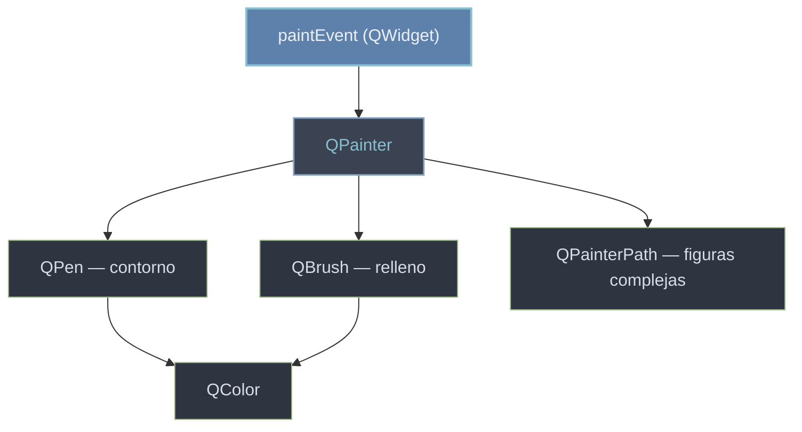

# QtGui/pintura — dibujar en 2D con QPainter

Esta carpeta agrupa el **motor de dibujo 2D** de Qt. El [[QPainter]] es quien dibuja (lineas, rectangulos, texto, rutas); el [[QPen]] define el **contorno** (color, grosor y estilo del trazo); el [[QBrush]] define el **relleno** (color, patron o gradiente del interior); el [[QColor]] aporta el color que usan pluma y brocha; y el [[QPainterPath]] describe **figuras complejas** que se dibujan de una vez. Todo esto se usa dentro del `paintEvent` de un widget, sobreescrito al subclasear (ver [[concepto_herencia_widgets]]): Qt lo llama cuando hay que repintar y ahi se crea el painter y se pinta.

## En accion

Una subclase de `QWidget` que sobreescribe `paintEvent` y dibuja un circulo con borde y relleno, con antialiasing para que los bordes salgan suaves.

```python
from PyQt6.QtWidgets import QApplication, QWidget
from PyQt6.QtGui import QPainter, QPen, QBrush, QColor
from PyQt6.QtCore import Qt
import sys

class Lienzo(QWidget):
    def paintEvent(self, event):
        painter = QPainter(self)
        painter.setRenderHint(QPainter.RenderHint.Antialiasing)  # bordes suaves

        painter.setPen(QPen(QColor("#2e3440"), 3))      # contorno: pluma oscura 3px
        painter.setBrush(QBrush(QColor("#88c0d0")))      # relleno: brocha azul solida
        painter.drawEllipse(40, 40, 120, 120)            # circulo con borde y relleno

app = QApplication(sys.argv)
w = Lienzo()
w.setWindowTitle("pintura 2D")
w.resize(200, 200)
w.show()
sys.exit(app.exec())                                     # exec() (PyQt6, sin guion bajo)
```

## Como colaboran



`QPainter` esta en el centro: dentro del `paintEvent` usa `QPen` para el contorno y `QBrush` para el relleno (ambos toman su `QColor`), y dibuja rutas complejas con `QPainterPath`.

## Las clases

| Clase | Rol |
|-------|-----|
| [[QPainter]] | el motor: dibuja lineas, formas, texto y rutas sobre el widget |
| [[QColor]] | representa un color (nombre, RGB o RGBA) para pluma y brocha |
| [[QPen]] | define el **contorno**: color, grosor y estilo del trazo |
| [[QBrush]] | define el **relleno**: color, patron o gradiente del interior |
| [[QPainterPath]] | describe una **figura compleja** (lineas + curvas) para dibujarla de una vez |

## Notas relacionadas

- [[concepto_herencia_widgets]] — por que se subclasea y se sobreescribe `paintEvent`
- [[widget_personalizado]] — la receta de un widget que se dibuja a si mismo
- [[QWidget]] — el contenedor cuyo `paintEvent` se sobreescribe para pintar
