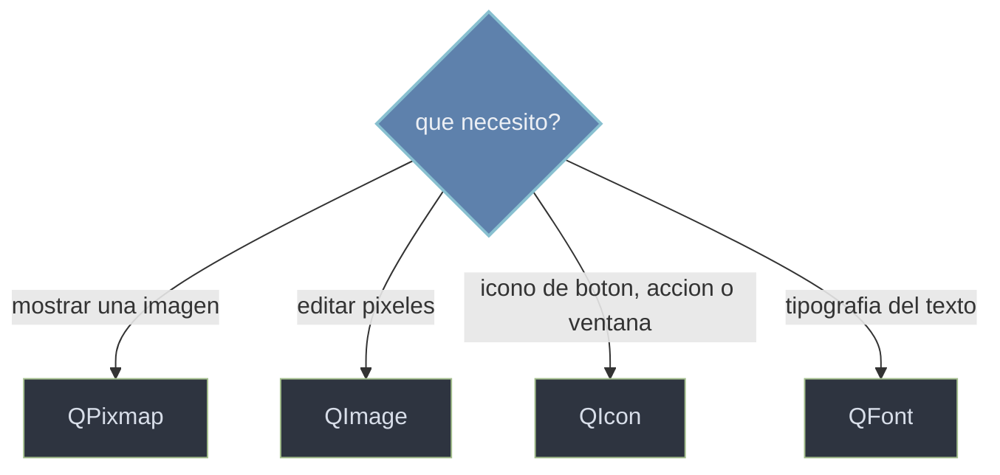

# QtGui/recursos — imagenes, iconos y fuentes

Esta carpeta agrupa los **recursos visuales** que consumen los widgets para verse: imagenes ([[QPixmap]] para mostrar en pantalla, [[QImage]] para editar pixel a pixel), iconos ([[QIcon]] para botones, acciones y la ventana) y fuentes ([[QFont]] para la tipografia del texto). No son widgets ni objetos del arbol: son **valores** que se crean y se entregan a quien los muestra (un `QLabel`, un `QPushButton`, un `QPainter`).

## En accion

Un `QLabel` con un `QPixmap`, un `QPushButton` con un `QIcon`, y un `QLabel` con un `QFont` en negrita, todo en una misma ventana.

```python
from PyQt6.QtWidgets import QApplication, QWidget, QVBoxLayout, QLabel, QPushButton
from PyQt6.QtGui import QPixmap, QIcon, QFont
import sys

app = QApplication(sys.argv)
w = QWidget(); lay = QVBoxLayout(w)

imagen = QLabel()
imagen.setPixmap(QPixmap("foto.png"))                    # mostrar una imagen
lay.addWidget(imagen)

boton = QPushButton("Guardar")
boton.setIcon(QIcon("save.png"))                         # icono en el boton
lay.addWidget(boton)

titulo = QLabel("Titulo")
titulo.setFont(QFont("Arial", 18, QFont.Weight.Bold))    # fuente en negrita
lay.addWidget(titulo)

w.show()
sys.exit(app.exec())
```

## Que recurso uso



Para **mostrar** una imagen tal cual se usa `QPixmap`; para **editar** sus pixeles, `QImage`; para un **icono** multi-estado (boton, accion, ventana), `QIcon`; y para la **tipografia** del texto, `QFont`.

## Las clases

| Clase | Rol |
|-------|-----|
| [[QPixmap]] | imagen optimizada para **mostrar** en pantalla (QLabel, QPainter) |
| [[QImage]] | imagen para **editar pixel a pixel** (acceso y manipulacion) |
| [[QIcon]] | **icono** multi-resolucion y multi-estado para botones, acciones y ventana |
| [[QFont]] | **fuente** del texto: familia, tamaño, peso y estilo |

## Notas relacionadas

- [[QLabel]] — muestra un `QPixmap` o aplica un `QFont` a su texto
- [[QAction]] — recibe un `QIcon` para menus y barras de herramientas
- [[QPainter]] — usa `QFont`, dibuja un `QPixmap` y pinta sobre un `QImage`
