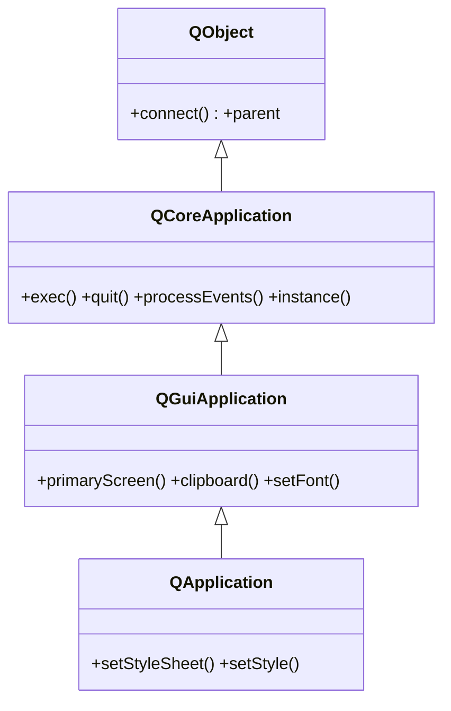

# QApplication — la app y el bucle de eventos

`QApplication` gestiona el **bucle de eventos** y la **configuracion global** de una app de escritorio (estilo, fuente, portapapeles, pantallas). Hay **una sola instancia** por proceso y debe crearse **antes que cualquier widget**: `app = QApplication(sys.argv)`. Luego `app.exec()` arranca el bucle y **bloquea** hasta que la app termina; por eso el patron tipico es `sys.exit(app.exec())`. Es el primer objeto que vive y el ultimo que muere.

## Importacion

```python
from PyQt6.QtWidgets import QApplication
```

## Herencia



Lo que `QApplication` **no** define lo hereda: el bucle de eventos (`exec`, `quit`, `processEvents`) y la instancia activa (`instance`) vienen de `QCoreApplication`; las pantallas, el portapapeles y la fuente global vienen de [[QGuiApplication]]; conectar señales y el `parent` vienen de `QObject`. Lo propio de `QApplication` (la rama de widgets) son las hojas de estilo QSS y el estilo visual (`setStyleSheet`, `setStyle`).

## Señales

| Señal | Cuando se emite | Argumentos |
|-------|-----------------|------------|
| `aboutToQuit` | justo antes de que la app termine, antes de salir de `exec()` | — |
| `lastWindowClosed` | al cerrarse la ultima ventana visible | — |
| `focusChanged` | cuando el foco de teclado pasa de un widget a otro | `old: QWidget`, `now: QWidget` |

```python
app.aboutToQuit.connect(guardar_estado)        # limpiar antes de cerrar
app.focusChanged.connect(lambda old, now: print(now))
```

## Constructor y metodos

```python
QApplication(argv: list[str])
```

Una unica forma habitual: recibe la lista de argumentos de linea de comandos (`sys.argv`), que Qt usa para leer flags propios (`-style`, `-platform`...). Se crea **una sola vez**, antes de cualquier widget.

| Firma | Devuelve | Que hace |
|-------|----------|----------|
| `exec()` | `int` | arranca el bucle de eventos y **bloquea**; devuelve el codigo de salida (PyQt6: sin guion bajo) |
| `quit()` | `None` | termina el bucle de eventos (sale de `exec()`) |
| `processEvents()` | `None` | procesa los eventos pendientes sin ceder el bucle (util en tareas largas) |
| `instance()` | `QApplication` | `staticmethod`: la instancia activa (o `None` si no hay) |
| `setStyleSheet(sheet: str)` | `None` | aplica una hoja QSS **global** a toda la app |
| `setStyle(style: str)` | `None` | cambia el estilo visual (`"Fusion"`, `"Windows"`...) |
| `clipboard()` | `QClipboard` | el portapapeles del sistema |
| `primaryScreen()` | `QScreen` | la pantalla principal (geometria, DPI) |
| `setFont(font: QFont)` | `None` | fija la fuente por defecto de toda la app |

## Casos de uso

```python
from PyQt6.QtWidgets import QApplication, QWidget
import sys

# 1. App minima: crear app -> crear/mostrar ventana -> exec()
app = QApplication(sys.argv)
w = QWidget()
w.setWindowTitle("Hola PyQt6")
w.show()
sys.exit(app.exec())          # bloquea hasta cerrar; exec() sin guion bajo
```

```python
from PyQt6.QtWidgets import QApplication, QPushButton
import sys

# 2. QSS global: setStyleSheet en la app estiliza todos los botones
app = QApplication(sys.argv)
app.setStyleSheet("""
    QPushButton { background: #5e81ac; color: #eceff4;
                  border-radius: 6px; padding: 6px; }
""")
b = QPushButton("Estilizado")
b.show()
sys.exit(app.exec())
```

## Errores comunes

| Error | Causa | Solucion |
|-------|-------|----------|
| `QWidget: Must construct a QApplication before a QWidget` | creaste un widget antes de la `QApplication` | crea `QApplication(sys.argv)` como primera linea |
| `RuntimeError` / comportamiento raro al instanciar | creaste **dos** `QApplication` en el mismo proceso | una sola instancia; reusa `QApplication.instance()` |
| La ventana se abre y se cierra al instante | olvidaste arrancar el bucle (`app.exec()`) | termina con `sys.exit(app.exec())` |

## Notas relacionadas

- [[concepto_event_loop]] — que hace `exec()` y por que bloquea
- [[QWidget]] — los widgets que la app muestra
- [[PyQt6/QtWidgets/index\|QtWidgets]] — el modulo de widgets de escritorio
