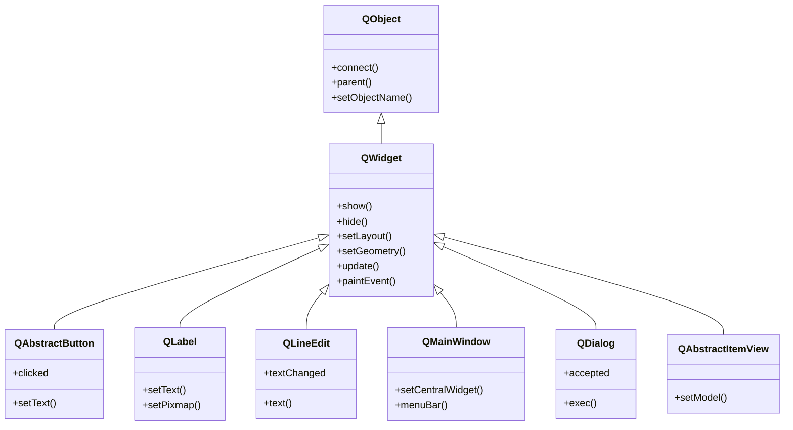

# QWidget — la clase base de todo elemento visual

`QWidget` es la **clase base de todo elemento visual** en PyQt6. Todo lo que ves en pantalla
(botones, etiquetas, campos de texto, ventanas) **ES un QWidget**: hereda de el. Lo que aporta
es la materia prima de cualquier interfaz: un **area rectangular con geometria** (posicion y
tamaño), la **recepcion de eventos** (raton, teclado, pintado), **visibilidad** (mostrarse u
ocultarse), un **parent visual** (el widget que lo contiene) y la capacidad de **alojar un
layout** que coloque a sus hijos. Subclasearlo, sobreescribiendo sus metodos-evento, es la via
para crear **widgets propios** con dibujo o comportamiento a medida.

## Importacion

```python
from PyQt6.QtWidgets import QWidget
```

## Herencia



Como `QWidget` **ES un `QObject`**, hereda de el lo fundamental del modelo de objetos de Qt:
el mecanismo de **señales y slots** (`.connect`, `pyqtSignal`), el **arbol de objetos via
`parent`** (al destruir el padre se destruyen los hijos, gestionando la memoria), el
**sistema de propiedades** y el `objectName`. Sobre esa base `QWidget` añade todo lo *visual*.
A su vez, **toda la jerarquia de widgets cuelga de `QWidget`**: los botones, etiquetas, campos,
ventanas y vistas heredan su geometria, visibilidad y manejo de eventos, y solo añaden lo suyo.

## Señales

`QWidget` emite **pocas** señales por si mismo; lo habitual es que sean los widgets concretos
(botones, campos…) los que añaden las suyas. Las propias de `QWidget`:

| Señal | Cuando se emite | Argumentos |
|-------|-----------------|------------|
| `windowTitleChanged` | al cambiar el titulo de la ventana (`setWindowTitle`) | `title: str` |
| `customContextMenuRequested` | al pedir menu contextual, si `contextMenuPolicy` es `CustomContextMenu` | `pos: QPoint` |

```python
w.windowTitleChanged.connect(lambda t: print("titulo:", t))
```

## Propiedades

En Qt los "atributos" son **propiedades**: no se leen como `w.width` sino con su getter/setter
(`w.width()` / `w.resize(...)`). Estas son las mas usadas de `QWidget`, y las **heredan todos
los widgets**:

| Propiedad | Tipo | Leer \| escribir | Controla |
|-----------|------|------------------|----------|
| `geometry` | `QRect` | `geometry()` \| `setGeometry(QRect)` | posicion + tamaño del area cliente |
| `size` | `QSize` | `size()` \| `resize(QSize)` | tamaño (ancho x alto) |
| `width` | `int` | `width()` \| (via `resize`) | ancho en px |
| `height` | `int` | `height()` \| (via `resize`) | alto en px |
| `pos` | `QPoint` | `pos()` \| `move(QPoint)` | esquina superior izquierda relativa al parent |
| `enabled` | `bool` | `isEnabled()` \| `setEnabled(bool)` | si responde a eventos o esta en gris |
| `visible` | `bool` | `isVisible()` \| `setVisible(bool)` | si esta mostrado en pantalla |
| `windowTitle` | `str` | `windowTitle()` \| `setWindowTitle(str)` | titulo (solo si es ventana top-level) |
| `toolTip` | `str` | `toolTip()` \| `setToolTip(str)` | texto de ayuda al pasar el raton |
| `styleSheet` | `str` | `styleSheet()` \| `setStyleSheet(str)` | apariencia via QSS |
| `font` | `QFont` | `font()` \| `setFont(QFont)` | fuente del texto del widget |
| `cursor` | `QCursor` | `cursor()` \| `setCursor(QCursor)` | forma del cursor sobre el widget |
| `minimumSize` | `QSize` | `minimumSize()` \| `setMinimumSize(QSize)` | tamaño minimo que el layout respeta |
| `maximumSize` | `QSize` | `maximumSize()` \| `setMaximumSize(QSize)` | tamaño maximo que el layout respeta |
| `sizePolicy` | `QSizePolicy` | `sizePolicy()` \| `setSizePolicy(...)` | como crece/encoge dentro de un layout |
| `focusPolicy` | `Qt.FocusPolicy` | `focusPolicy()` \| `setFocusPolicy(...)` | si y como recibe el foco de teclado |

## Constructor y metodos

```python
QWidget(parent: QWidget | None = None)
```

Un unico constructor: el `parent` es opcional. **Sin parent** el widget es una **ventana
top-level**; **con parent** es un widget hijo dibujado dentro de el. Normalmente el layout
asigna el parent al hacer `addWidget`, asi que pocas veces se pasa a mano.

| Firma | Devuelve | Que hace |
|-------|----------|----------|
| `show()` | `None` | muestra el widget (y sus hijos visibles) |
| `hide()` | `None` | lo oculta sin destruirlo |
| `close()` | `bool` | cierra el widget; `True` si se cerro (dispara `closeEvent`) |
| `setVisible(visible: bool)` | `None` | muestra u oculta segun el bool |
| `setLayout(layout: QLayout)` | `None` | instala un layout que coloca a los hijos |
| `setGeometry(x: int, y: int, w: int, h: int)` | `None` | fija posicion y tamaño de golpe |
| `resize(w: int, h: int)` | `None` | cambia el tamaño |
| `move(x: int, y: int)` | `None` | reposiciona la esquina superior izquierda |
| `setEnabled(enabled: bool)` | `None` | habilita o pone en gris (ignora eventos) |
| `isEnabled()` | `bool` | `True` si esta habilitado |
| `setWindowTitle(title: str)` | `None` | titulo de la ventana (emite `windowTitleChanged`) |
| `setToolTip(text: str)` | `None` | texto de ayuda emergente |
| `setStyleSheet(sheet: str)` | `None` | aplica QSS a este widget y sus hijos |
| `setFixedSize(w: int, h: int)` | `None` | fija minimo == maximo (tamaño no redimensionable) |
| `setMinimumSize(w: int, h: int)` | `None` | tamaño minimo permitido |
| `setSizePolicy(horizontal, vertical)` | `None` | politica de crecimiento en el layout |
| `setFocus()` | `None` | le da el foco de teclado |
| `setParent(parent: QWidget)` | `None` | reasigna el parent (lo reubica) |
| `update()` | `None` | **solicita** un repintado (asincrono, encola un `paintEvent`) |
| `repaint()` | `None` | repinta **ya** (sincrono; usar `update()` casi siempre) |
| `raise_()` | `None` | trae el widget al frente (sobre sus hermanos) |
| `lower()` | `None` | lo manda al fondo (bajo sus hermanos) |

> `raise_` lleva guion bajo porque `raise` es palabra reservada de Python.

## Casos de uso

```python
from PyQt6.QtWidgets import QApplication, QWidget, QLabel, QPushButton, QVBoxLayout
import sys

app = QApplication(sys.argv)

# 1. Una ventana simple: un QWidget top-level (sin parent) con un layout
ventana = QWidget()
ventana.setWindowTitle("Ventana base")
ventana.resize(300, 150)

lay = QVBoxLayout(ventana)          # el layout coloca a los hijos
lay.addWidget(QLabel("Hola QWidget"))
lay.addWidget(QPushButton("Aceptar"))

# 2. Un QWidget como contenedor reutilizable de varios widgets
panel = QWidget()                   # agrupa controles bajo un mismo padre
panel_lay = QVBoxLayout(panel)
panel_lay.addWidget(QPushButton("A"))
panel_lay.addWidget(QPushButton("B"))
lay.addWidget(panel)                # el panel entero entra en la ventana

ventana.show()                      # sin show() no se ve nada
sys.exit(app.exec())                # PyQt6: exec() (sin guion bajo)
```

## Personalizar (subclasear)

Esta es la seccion **clave**: cuando ningun widget existente sirve, se **subclasea `QWidget`**
y se **sobreescriben sus metodos-evento**. Qt los llama solo (los dispara el bucle de eventos,
ver [[concepto_event_loop]]); tu pones el contenido. Los mas habituales:

| Metodo a sobreescribir | Firma | Cuando lo llama Qt |
|------------------------|-------|--------------------|
| `paintEvent` | `paintEvent(self, e: QPaintEvent)` | hay que (re)dibujar el widget |
| `sizeHint` | `sizeHint(self) -> QSize` | el layout pregunta el tamaño ideal |
| `mousePressEvent` | `mousePressEvent(self, e: QMouseEvent)` | se presiona un boton del raton |
| `mouseMoveEvent` | `mouseMoveEvent(self, e: QMouseEvent)` | se mueve el raton sobre el widget |
| `mouseReleaseEvent` | `mouseReleaseEvent(self, e: QMouseEvent)` | se suelta el boton del raton |
| `keyPressEvent` | `keyPressEvent(self, e: QKeyEvent)` | se pulsa una tecla (con foco) |
| `resizeEvent` | `resizeEvent(self, e: QResizeEvent)` | cambia el tamaño del widget |
| `closeEvent` | `closeEvent(self, e: QCloseEvent)` | se intenta cerrar (puedes `e.ignore()`) |
| `enterEvent` | `enterEvent(self, e: QEnterEvent)` | el raton entra en el area del widget |
| `leaveEvent` | `leaveEvent(self, e: QEvent)` | el raton sale del area del widget |

Todo el **dibujo** va dentro de `paintEvent`, con un `QPainter`. Para forzar un redibujado tras
cambiar el estado, se llama a **`update()`** (que encola un `paintEvent`), nunca se pinta fuera:

```python
from PyQt6.QtWidgets import QWidget
from PyQt6.QtGui import QPainter, QColor
from PyQt6.QtCore import QSize

class Cuadro(QWidget):
    def __init__(self, color: QColor, parent: QWidget | None = None):
        super().__init__(parent)
        self._color = color

    def sizeHint(self) -> QSize:
        return QSize(80, 80)                 # tamaño ideal para el layout

    def paintEvent(self, e):
        p = QPainter(self)                   # todo el dibujo, aqui
        p.fillRect(self.rect(), self._color)

    def mousePressEvent(self, e):
        self._color = QColor("tomato")
        self.update()                        # pide repintar -> dispara paintEvent
```

Para la receta completa de subclase ver [[widget_personalizado]]; para el modelo mental de la
herencia de widgets, [[concepto_herencia_widgets]].

## Errores comunes

| Error | Causa | Solucion |
|-------|-------|----------|
| Los hijos se amontonan en la esquina (0,0) y se solapan | añadiste widgets sin un layout que los coloque | instala un layout: `QVBoxLayout(widget)` y usa `addWidget` |
| La ventana no aparece al ejecutar | olvidaste `show()` (o `setVisible(True)`) | llama `widget.show()` antes de `app.exec()` |
| `RuntimeError`/dibujo que no se ve al pintar | usaste un `QPainter` fuera de `paintEvent` | dibuja solo dentro de `paintEvent`; desde fuera, cambia estado y llama `update()` |
| Cambio el estado pero el widget no se redibuja | no avisaste a Qt de que hay que repintar | llama `self.update()` tras cambiar lo que se dibuja |

## Notas relacionadas

- [[QObject]] — la base no visual: señales/slots, parent y propiedades que QWidget hereda
- [[concepto_herencia_widgets]] — por que todo widget ES un QWidget y como subclasearlo
- [[QMainWindow]] — la ventana principal (con barra de menus y central widget) que hereda de QWidget
- [[QLayout]] — los gestores que colocan a los hijos dentro de un QWidget
