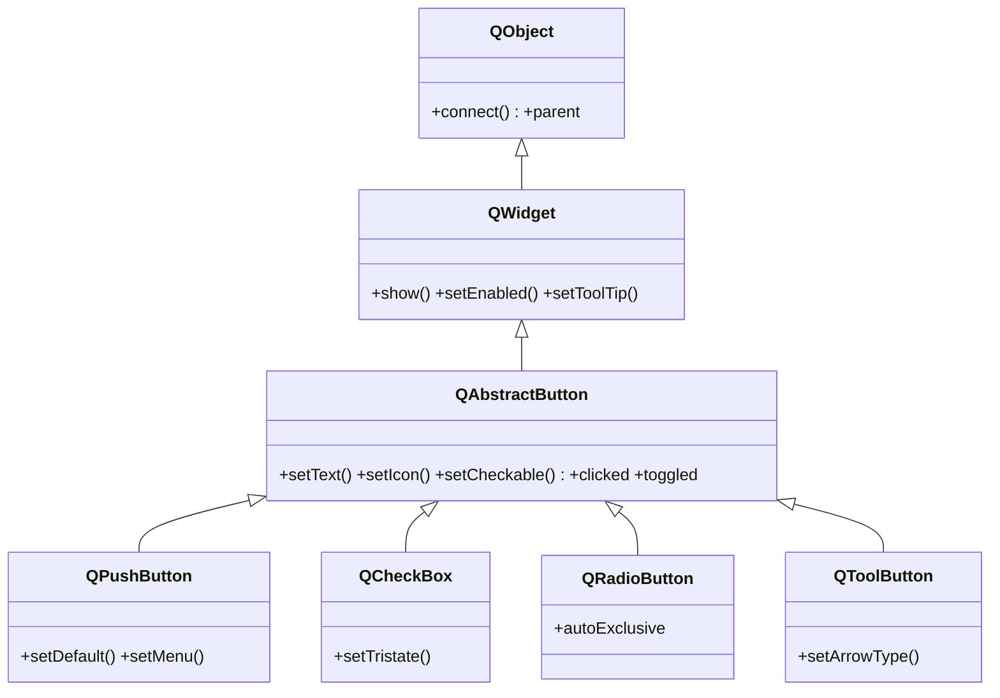

# QAbstractButton — base abstracta de todos los botones

`QAbstractButton` es la clase base de **todos** los botones de Qt: [[QPushButton]], `QCheckBox`, `QRadioButton` y `QToolButton`. Aporta lo comun a cualquier boton — texto, icono, estado checkable y las señales `clicked`/`toggled` — pero **es abstracta**: no se instancia directo. Se usan sus hijas concretas, o se subclasea para construir un boton propio (forma o dibujo a medida). Cuando consultes una señal o un metodo de boton, casi siempre vive aqui.

## Importacion

```python
from PyQt6.QtWidgets import QAbstractButton
```

En la practica no se importa para instanciarla, sino para **subclasearla** o como tipo en anotaciones.

## Herencia



`QAbstractButton` toma de [[QWidget]] el ser visible (`show`, `setEnabled`, tooltip) y de `QObject` el `parent` y el `connect`. Lo suyo es la **logica de boton**: texto, icono, estado pulsado y las señales. Cada hija solo agrega su matiz (`setDefault` en [[QPushButton]], tristate en `QCheckBox`, exclusion mutua en `QRadioButton`).

## Señales

| Señal | Cuando se emite | Argumentos |
|-------|-----------------|------------|
| `clicked` | al pulsar y soltar dentro del boton | `checked: bool` (estado, solo util si es checkable) |
| `pressed` | al presionar (antes de soltar) | — |
| `released` | al soltar | — |
| `toggled` | cuando cambia el estado de un boton checkable | `checked: bool` |

```python
boton.clicked.connect(self.aceptar)           # lo habitual
boton.toggled.connect(lambda on: print(on))   # solo si setCheckable(True)
```

## Propiedades

En Qt los atributos son **propiedades**: se leen y escriben con getter/setter, no como `boton.text`. Estas son comunes a toda boton porque viven en `QAbstractButton`:

| Propiedad | Tipo | Leer \| escribir | Controla |
|-----------|------|------------------|----------|
| `text` | `str` | `text()` \| `setText(str)` | el texto visible del boton |
| `icon` | `QIcon` | `icon()` \| `setIcon(QIcon)` | icono a la izquierda del texto |
| `checkable` | `bool` | `isCheckable()` \| `setCheckable(bool)` | si el boton mantiene estado pulsado |
| `checked` | `bool` | `isChecked()` \| `setChecked(bool)` | estado actual (solo si es checkable) |
| `autoRepeat` | `bool` | `autoRepeat()` \| `setAutoRepeat(bool)` | reemite `clicked` mientras se mantiene pulsado |
| `iconSize` | `QSize` | `iconSize()` \| `setIconSize(QSize)` | tamaño en pixeles del icono |

## Constructor y metodos

```python
QAbstractButton(parent: QWidget | None = None)
```

Tiene constructor, pero es **abstracta**: instanciarla directa no da un boton usable. Se usan sus hijas o se subclasea. Sus metodos los heredan todas:

| Firma | Devuelve | Que hace |
|-------|----------|----------|
| `setText(text: str)` | `None` | fija el texto del boton |
| `text()` | `str` | el texto actual |
| `setIcon(icon: QIcon)` | `None` | pone un icono a la izquierda del texto |
| `icon()` | `QIcon` | el icono actual |
| `setCheckable(checkable: bool)` | `None` | convierte el boton en conmutador (mantiene estado) |
| `isChecked()` | `bool` | `True` si esta pulsado (util solo si es checkable) |
| `setChecked(checked: bool)` | `None` | fija el estado pulsado por codigo |
| `click()` | `None` | simula un clic completo por codigo (emite `clicked`) |
| `animateClick()` | `None` | clic visual animado, util en demos o atajos |
| `toggle()` | `None` | invierte el estado de un boton checkable |

## Casos de uso

Como es abstracta, lo habitual es usar una hija. El uso "propio" de `QAbstractButton` es subclasearla:

```python
from PyQt6.QtWidgets import QApplication, QAbstractButton
from PyQt6.QtGui import QPainter, QColor
import sys

class BotonCirculo(QAbstractButton):
    def __init__(self, parent=None):
        super().__init__(parent)
        self.setCheckable(True)          # logica heredada lista para usar

    def paintEvent(self, ev):
        p = QPainter(self)
        p.setBrush(QColor("#a3be8c") if self.isChecked() else QColor("#5e81ac"))
        p.drawEllipse(self.rect())

    def sizeHint(self):
        from PyQt6.QtCore import QSize
        return QSize(48, 48)

app = QApplication(sys.argv)
b = BotonCirculo()
b.clicked.connect(lambda: print("clic", b.isChecked()))   # señal heredada
b.show()
sys.exit(app.exec())
```

## Personalizar (subclasear)

Para un boton con **forma o dibujo propio** (no rectangular, con animacion), se subclasea `QAbstractButton` y se sobreescribe `paintEvent` para dibujarlo y `sizeHint` para su tamaño. Se aprovecha gratis toda la logica de boton (estado checkable, señales `clicked`/`toggled`). Receta completa en [[widget_personalizado]].

## Errores comunes

| Error | Causa | Solucion |
|-------|-------|----------|
| Instancio `QAbstractButton(...)` y no se ve ni reacciona | es abstracta: no dibuja nada por si sola | usa una hija (`QPushButton`...) o subclasea con `paintEvent` |
| Mi slot recibe un `False` inesperado | `clicked` emite el argumento `checked` (bool) | usa un `lambda: ...` que lo ignore, o acepta el parametro |
| `setChecked`/`toggle` no hacen nada visible | el boton no es checkable | llama antes a `setCheckable(True)` |

## Notas relacionadas

- [[QPushButton]] — la hija concreta mas comun
- [[concepto_signals_slots]] — como conectar `clicked` y `toggled` a un slot
- [[QWidget]] — de donde vienen `show`, `setEnabled` y el resto
- [[widget_personalizado]] — subclasear para un boton de dibujo propio
