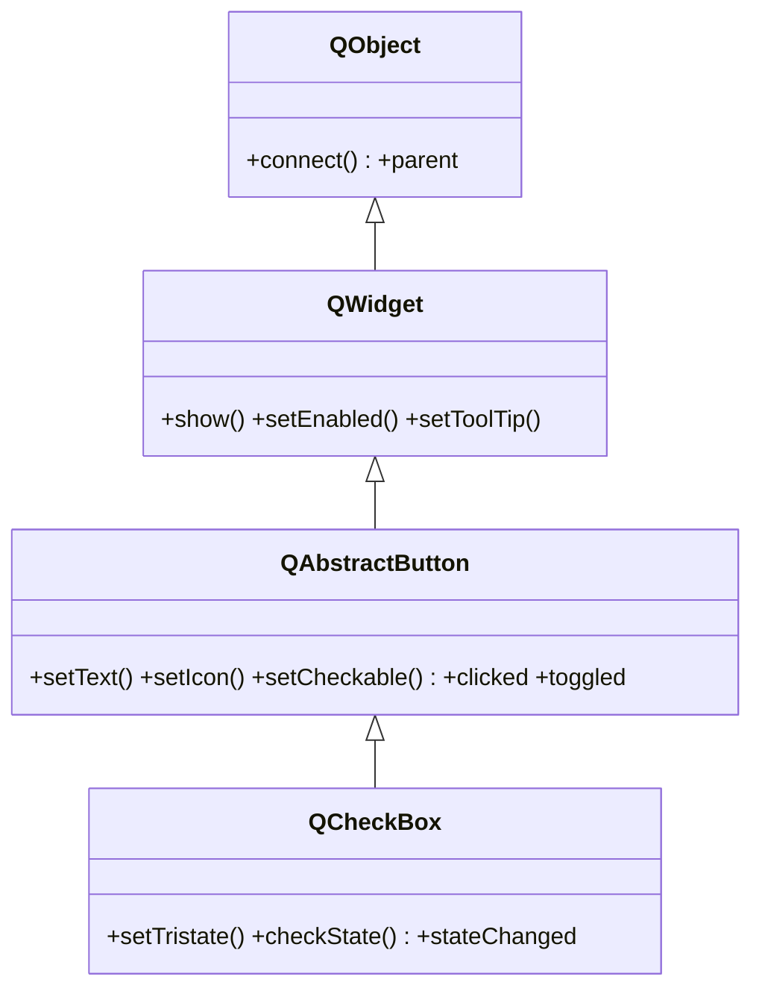

# QCheckBox — casilla de verificacion marcada/desmarcada

`QCheckBox` es una **casilla de verificacion**: un boton que muestra una marca y un texto al lado, y alterna entre marcada y desmarcada al pulsarse. A diferencia de [[QAbstractButton]] generico, **ya es checkable por defecto** (no hace falta `setCheckable(True)`), porque su razon de ser es mantener un estado on/off independiente. Opcionalmente admite un **tercer estado** (parcial) para arboles de opciones. Su texto, icono y la senal `clicked` los hereda de la base; lo suyo es el estado y la senal `stateChanged`.

## Importacion

```python
from PyQt6.QtWidgets import QCheckBox
```

## Herencia



Lo que `QCheckBox` **no** define lo hereda: el texto, el icono y las senales `clicked`/`toggled` vienen de [[QAbstractButton]]; mostrarse, habilitarse o el tooltip vienen de [[QWidget]]; el `parent` y `connect` vienen de `QObject`. Lo propio es el tri-estado (`setTristate`, `checkState`) y la senal `stateChanged`.

## Senales

| Senal | Cuando se emite | Argumentos |
|-------|-----------------|------------|
| `stateChanged` | cuando cambia el estado de la casilla | `state: int` (0=unchecked, 2=checked; con tri-estado 1=partial) |
| `toggled` | cuando cambia entre marcada y desmarcada | `checked: bool` |
| `clicked` | al pulsar y soltar dentro de la casilla | `checked: bool` |

```python
casilla.toggled.connect(lambda on: print("on" if on else "off"))  # bool, lo comun
casilla.stateChanged.connect(lambda s: print(s))                  # int (0/1/2)
```

`stateChanged` entrega un **int** (util cuando hay tri-estado, porque distingue el parcial); `toggled` entrega un **bool** (suficiente para una casilla normal).

## Propiedades

En Qt los atributos son **propiedades**: se leen y escriben con getter/setter, no como `casilla.text`. Las mas usadas (varias heredadas de [[QAbstractButton]]):

| Propiedad | Tipo | Leer \| escribir | Controla |
|-----------|------|------------------|----------|
| `text` | `str` | `text()` \| `setText(str)` | el texto a la derecha de la casilla |
| `checked` | `bool` | `isChecked()` \| `setChecked(bool)` | si esta marcada (estado binario) |
| `checkState` | `Qt.CheckState` | `checkState()` \| `setCheckState(Qt.CheckState)` | el estado completo (incluye el parcial) |
| `tristate` | `bool` | `isTristate()` \| `setTristate(bool)` | habilita el tercer estado (parcial) |
| `enabled` | `bool` | `isEnabled()` \| `setEnabled(bool)` | habilitada o en gris (de [[QWidget]]) |

## Constructor y metodos

```python
QCheckBox(parent: QWidget | None = None)
QCheckBox(text: str, parent: QWidget | None = None)
```

Dos sobrecargas; la habitual es `QCheckBox("Texto")`. El `parent` es opcional: el layout lo asigna al hacer `addWidget`.

| Firma | Devuelve | Que hace |
|-------|----------|----------|
| `isChecked()` | `bool` | `True` si esta marcada |
| `setChecked(checked: bool)` | `None` | marca o desmarca por codigo |
| `setTristate(on: bool = True)` | `None` | habilita el tercer estado (parcial) |
| `isTristate()` | `bool` | `True` si el tri-estado esta activado |
| `checkState()` | `Qt.CheckState` | el estado actual (`Unchecked` / `PartiallyChecked` / `Checked`) |
| `setCheckState(state: Qt.CheckState)` | `None` | fija el estado completo (necesario para el parcial) |
| `setText(text: str)` | `None` | fija el texto de la casilla |

## Casos de uso

```python
from PyQt6.QtWidgets import QApplication, QWidget, QCheckBox, QVBoxLayout
from PyQt6.QtCore import Qt
import sys

app = QApplication(sys.argv)
w = QWidget(); lay = QVBoxLayout(w)

# 1. Casilla simple: leer su estado con toggled (bool)
c1 = QCheckBox("Acepto los terminos")
c1.toggled.connect(lambda on: print("acepta" if on else "rechaza"))
lay.addWidget(c1)

# 2. Tri-estado: tres valores con Qt.CheckState (enum con scope en Qt6)
c2 = QCheckBox("Seleccionar todo")
c2.setTristate(True)                                  # hay que activarlo
c2.setCheckState(Qt.CheckState.PartiallyChecked)      # estado parcial inicial
c2.stateChanged.connect(lambda s: print("estado:", s))  # 0 / 1 / 2
lay.addWidget(c2)

w.show()
sys.exit(app.exec())
```

## Errores comunes

| Error | Causa | Solucion |
|-------|-------|----------|
| Recibo un `0/1/2` donde esperaba `True/False` | conectaste `stateChanged` (emite `int`), no `toggled` | usa `toggled` para un bool, o compara con `Qt.CheckState` |
| El estado parcial nunca aparece | el tri-estado no esta activado | llama antes a `setTristate(True)` |
| `Qt.CheckState.Checked` da error de atributo | en Qt6 los enums llevan scope | usa el nombre completo: `Qt.CheckState.Checked`, no `Qt.Checked` |

## Notas relacionadas

- [[QAbstractButton]] — la base que aporta texto, icono y las senales `clicked`/`toggled`
- [[QRadioButton]] — para una opcion exclusiva en vez de un on/off independiente
- [[concepto_signals_slots]] — como conectar `toggled` o `stateChanged` a un slot
