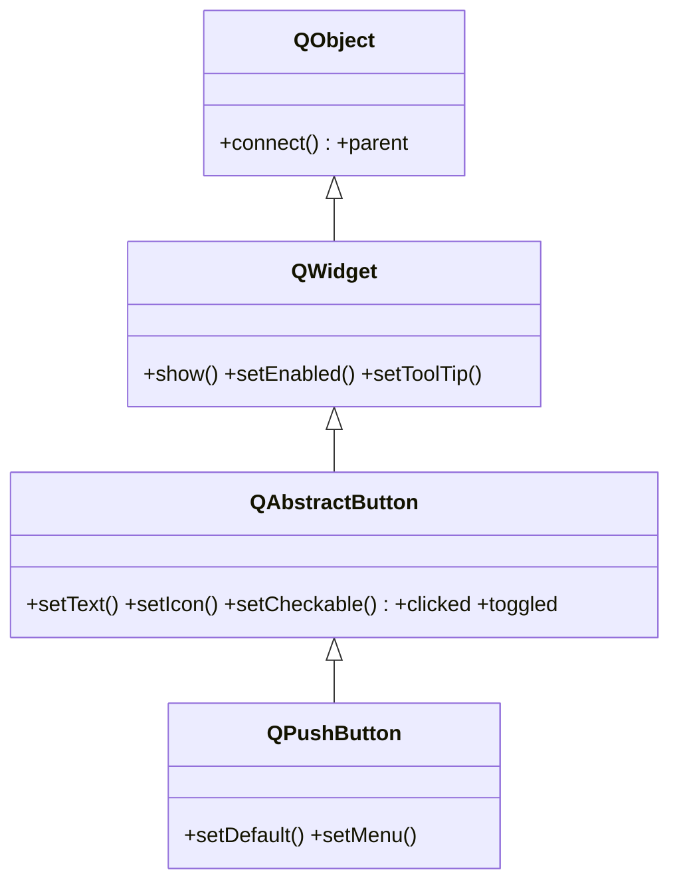

# QPushButton — boton que emite clicked al pulsarse

`QPushButton` es el boton de pulsar mas comun: muestra un texto (o icono) y **emite la señal `clicked`** cuando el usuario lo pulsa. Casi no se usa "tal cual": lo normal es crearlo, conectar su `clicked` a un slot, y estilizarlo con QSS. Toda su logica de boton (texto, icono, estado pulsado) la hereda de [[QAbstractButton]].

## Importacion

```python
from PyQt6.QtWidgets import QPushButton
```

## Herencia



Lo que `QPushButton` **no** define lo hereda: el texto/icono y las señales (`clicked`, `toggled`…) vienen de [[QAbstractButton]]; mostrarse, habilitarse o el tooltip vienen de [[QWidget]]; conectar señales y el `parent` vienen de `QObject`. Apenas agrega lo suyo (`setDefault`, `setMenu`).

## Señales

| Señal | Cuando se emite | Argumentos |
|-------|-----------------|------------|
| `clicked` | al pulsar y soltar dentro del boton | `checked: bool` (estado, solo util si es checkable) |
| `pressed` | al presionar (antes de soltar) | — |
| `released` | al soltar | — |
| `toggled` | cuando cambia el estado de un boton checkable | `checked: bool` |

```python
boton.clicked.connect(self.guardar)          # lo habitual
boton.toggled.connect(lambda on: print(on))  # solo si setCheckable(True)
```

## Propiedades

En Qt los "atributos" son **propiedades**: no se leen como `boton.text` sino con su getter/setter (`boton.text()` / `boton.setText(...)`). Las mas usadas (la mayoria heredadas de [[QAbstractButton]] y [[QWidget]]):

| Propiedad | Tipo | Leer \| escribir | Controla |
|-----------|------|------------------|----------|
| `text` | `str` | `text()` \| `setText(str)` | el texto visible del boton |
| `icon` | `QIcon` | `icon()` \| `setIcon(QIcon)` | icono a la izquierda del texto |
| `checkable` | `bool` | `isCheckable()` \| `setCheckable(bool)` | si el boton mantiene estado pulsado |
| `checked` | `bool` | `isChecked()` \| `setChecked(bool)` | estado actual (solo si es checkable) |
| `default` | `bool` | `isDefault()` \| `setDefault(bool)` | si responde a Enter dentro de un dialogo |
| `flat` | `bool` | `isFlat()` \| `setFlat(bool)` | dibujo sin relieve (plano) |
| `enabled` | `bool` | `isEnabled()` \| `setEnabled(bool)` | habilitado o en gris (de [[QWidget]]) |

## Constructor y metodos

```python
QPushButton(parent: QWidget | None = None)
QPushButton(text: str, parent: QWidget | None = None)
QPushButton(icon: QIcon, text: str, parent: QWidget | None = None)
```

Tres sobrecargas; la habitual es `QPushButton("Texto")`. El `parent` es opcional: el layout lo asigna al hacer `addWidget`.

| Firma | Devuelve | Que hace |
|-------|----------|----------|
| `setText(text: str)` | `None` | fija el texto del boton |
| `text()` | `str` | el texto actual |
| `setIcon(icon: QIcon)` | `None` | pone un icono a la izquierda del texto |
| `setCheckable(checkable: bool)` | `None` | convierte el boton en conmutador (mantiene estado) |
| `isChecked()` | `bool` | `True` si esta pulsado (util solo si es checkable) |
| `setDefault(on: bool)` | `None` | marca el boton por defecto del dialogo (responde a Enter) |
| `setMenu(menu: QMenu)` | `None` | adjunta un menu desplegable que se abre al pulsar |
| `click()` | `None` | simula un clic por codigo (emite `clicked`) |
| `animateClick()` | `None` | clic visual animado, util en demos o atajos |

## Casos de uso

```python
from PyQt6.QtWidgets import QApplication, QWidget, QPushButton, QVBoxLayout
import sys

app = QApplication(sys.argv)
w = QWidget(); lay = QVBoxLayout(w)

# 1. Boton simple conectado a un slot
b1 = QPushButton("Guardar")
b1.clicked.connect(lambda: print("guardado"))
lay.addWidget(b1)

# 2. Boton conmutador (checkable): emite toggled con su estado
b2 = QPushButton("Modo oscuro")
b2.setCheckable(True)
b2.toggled.connect(lambda on: print("oscuro" if on else "claro"))
lay.addWidget(b2)

# 3. Deshabilitado hasta que algo ocurra
b3 = QPushButton("Enviar"); b3.setEnabled(False)
lay.addWidget(b3)

w.show(); sys.exit(app.exec())
```

## Personalizar

Para cambiar **apariencia**, casi siempre basta QSS (ver [[estilado/index|estilado]]), sin subclasear:

```python
boton.setStyleSheet("QPushButton { background: #5e81ac; border-radius: 6px; padding: 6px; }")
```

Para un boton con **comportamiento o dibujo propio** (forma no rectangular, animacion), se subclasea `QAbstractButton` y se sobreescribe `paintEvent` — ver [[widget_personalizado]].

## Errores comunes

| Error | Causa | Solucion |
|-------|-------|----------|
| El slot se ejecuta al crear el boton, no al pulsar | conectaste `clicked.connect(self.f())` con parentesis | quita los `()`: `clicked.connect(self.f)` |
| Mi slot recibe un `False` inesperado | `clicked` emite el argumento `checked` (bool) | usa un `lambda: ...` que lo ignore, o acepta el parametro |
| `setChecked`/`toggled` no hacen nada | el boton no es checkable | llama antes a `setCheckable(True)` |

## Notas relacionadas

- [[QAbstractButton]] — la clase base que aporta texto, icono y las señales
- [[concepto_signals_slots]] — como conectar `clicked` a un slot
- [[QWidget]] — de donde vienen `show`, `setEnabled` y el resto
