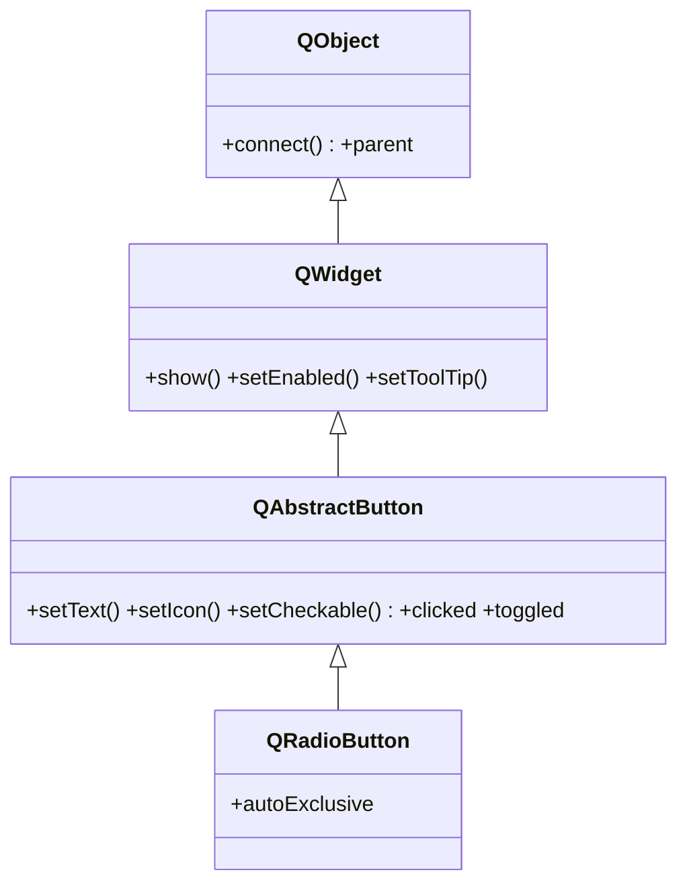

# QRadioButton — boton de opcion exclusivo

`QRadioButton` es un **boton de opcion exclusivo**: dentro de un mismo parent (o un `QButtonGroup`), **solo uno puede estar activo a la vez** — marcar uno desmarca automaticamente a los demas. Es la eleccion para "elige una de varias" (sexo, metodo de pago, calidad). Como [[QCheckBox]] ya es checkable; la diferencia es la exclusion mutua automatica entre radios que comparten contenedor. Texto, icono y la senal `clicked` los hereda de [[QAbstractButton]].

## Importacion

```python
from PyQt6.QtWidgets import QRadioButton
```

## Herencia



Lo que `QRadioButton` **no** define lo hereda: el texto, el icono y las senales `clicked`/`toggled` vienen de [[QAbstractButton]]; mostrarse, habilitarse o el tooltip vienen de [[QWidget]]; el `parent` y `connect` vienen de `QObject`. Apenas agrega lo suyo: la exclusion mutua (`autoExclusive`, activa por defecto).

## Senales

| Senal | Cuando se emite | Argumentos |
|-------|-----------------|------------|
| `toggled` | cuando cambia entre marcado y desmarcado | `checked: bool` |
| `clicked` | al pulsar y soltar dentro del radio | `checked: bool` |

```python
radio.toggled.connect(lambda on: print("seleccionado") if on else None)
```

Como al marcar un radio se desmarca otro, conviene **conectar solo el que interesa** y filtrar por `if on:` para reaccionar una sola vez.

## Propiedades

En Qt los atributos son **propiedades**: se leen y escriben con getter/setter, no como `radio.text`. Las mas usadas (varias heredadas de [[QAbstractButton]]):

| Propiedad | Tipo | Leer \| escribir | Controla |
|-----------|------|------------------|----------|
| `text` | `str` | `text()` \| `setText(str)` | el texto a la derecha del radio |
| `checked` | `bool` | `isChecked()` \| `setChecked(bool)` | si esta seleccionado |
| `autoExclusive` | `bool` | `autoExclusive()` \| `setAutoExclusive(bool)` | exclusion mutua con los radios hermanos (por defecto `True`) |
| `enabled` | `bool` | `isEnabled()` \| `setEnabled(bool)` | habilitado o en gris (de [[QWidget]]) |

## Constructor y metodos

```python
QRadioButton(parent: QWidget | None = None)
QRadioButton(text: str, parent: QWidget | None = None)
```

Dos sobrecargas; la habitual es `QRadioButton("Texto")`. El `parent` es opcional: el layout lo asigna al hacer `addWidget`.

| Firma | Devuelve | Que hace |
|-------|----------|----------|
| `isChecked()` | `bool` | `True` si esta seleccionado |
| `setChecked(checked: bool)` | `None` | selecciona o deselecciona por codigo |
| `setText(text: str)` | `None` | fija el texto del radio |
| `setAutoExclusive(on: bool)` | `None` | activa o desactiva la exclusion mutua automatica |

## Casos de uso

```python
from PyQt6.QtWidgets import (
    QApplication, QWidget, QRadioButton, QVBoxLayout, QButtonGroup
)
import sys

app = QApplication(sys.argv)
w = QWidget(); lay = QVBoxLayout(w)

# 1. Grupo de 3 radios: exclusividad automatica por compartir parent (w via layout)
r1 = QRadioButton("Baja")
r2 = QRadioButton("Media")
r3 = QRadioButton("Alta")
r2.setChecked(True)                       # uno marcado de inicio
for r in (r1, r2, r3):
    lay.addWidget(r)

# 2. QButtonGroup: agrupa y avisa cual se marco (con id opcional)
grupo = QButtonGroup(w)
grupo.addButton(r1, 0); grupo.addButton(r2, 1); grupo.addButton(r3, 2)
grupo.buttonClicked.connect(lambda b: print("elegido:", b.text()))

w.show()
sys.exit(app.exec())
```

Los tres radios son exclusivos **solo porque comparten el mismo contenedor**. Un `QButtonGroup` agrupa de forma explicita (incluso entre layouts distintos) y centraliza el "cual esta marcado" en una sola senal `buttonClicked`.

## Errores comunes

| Error | Causa | Solucion |
|-------|-------|----------|
| Varios radios quedan marcados a la vez | no comparten parent ni grupo | mete los radios en el mismo layout/widget, o en un `QButtonGroup` |
| Reacciono al radio equivocado | conectaste el `toggled` de otro radio | conecta el radio correcto, o usa `QButtonGroup.buttonClicked` |
| Mi slot corre dos veces al cambiar | `toggled` se emite tambien en el que se desmarca | filtra con `if on:` dentro del slot |

## Notas relacionadas

- [[QAbstractButton]] — la base que aporta texto, icono y las senales `clicked`/`toggled`
- [[QCheckBox]] — para un on/off independiente en vez de una opcion exclusiva
- [[concepto_signals_slots]] — como conectar `toggled` o `buttonClicked` a un slot
