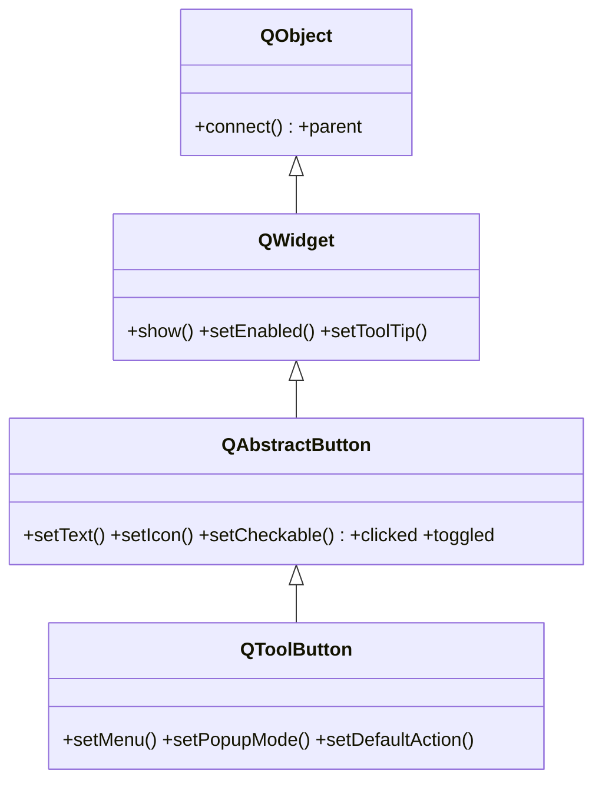

# QToolButton — boton compacto de barra de herramientas

`QToolButton` es un **boton compacto pensado para barras de herramientas**: normalmente muestra **solo un icono** (sin texto ni relieve) y puede **desplegar un menu**. Es el boton que rellena una `QToolBar`. Comparte con [[QPushButton]] la señal `clicked`, pero su rol es distinto: ocupa poco, suele ir asociado a una `QAction` y admite un popup de opciones. Texto, icono y `clicked` los hereda de [[QAbstractButton]].

## Importacion

```python
from PyQt6.QtWidgets import QToolButton
```

## Herencia



Lo que `QToolButton` **no** define lo hereda: el texto, el icono y las señales `clicked`/`toggled` vienen de [[QAbstractButton]]; mostrarse, habilitarse o el tooltip vienen de [[QWidget]]; el `parent` y `connect` vienen de `QObject`. Lo suyo es el menu desplegable (`setMenu`, `setPopupMode`) y la integracion con acciones (`setDefaultAction`).

## Señales

| Señal | Cuando se emite | Argumentos |
|-------|-----------------|------------|
| `clicked` | al pulsar y soltar dentro del boton | `checked: bool` |
| `triggered` | cuando se dispara una accion de su menu | `action: QAction` |

```python
boton.clicked.connect(self.recortar)                 # como cualquier boton
boton.triggered.connect(lambda a: print(a.text()))   # accion elegida del menu
```

## Propiedades

En Qt los atributos son **propiedades**: se leen y escriben con getter/setter, no como `boton.icon`. Las mas usadas (`text`/`icon` heredadas de [[QAbstractButton]]):

| Propiedad | Tipo | Leer \| escribir | Controla |
|-----------|------|------------------|----------|
| `icon` | `QIcon` | `icon()` \| `setIcon(QIcon)` | el icono del boton (lo habitual: solo icono) |
| `toolButtonStyle` | `Qt.ToolButtonStyle` | `toolButtonStyle()` \| `setToolButtonStyle(...)` | si muestra solo icono, solo texto, o ambos |
| `popupMode` | `QToolButton.ToolButtonPopupMode` | `popupMode()` \| `setPopupMode(...)` | como se abre el menu (instant / boton aparte / con retardo) |
| `arrowType` | `Qt.ArrowType` | `arrowType()` \| `setArrowType(...)` | dibuja una flecha en vez de icono |
| `autoRaise` | `bool` | `autoRaise()` \| `setAutoRaise(bool)` | sin relieve hasta que el raton pasa por encima |

## Constructor y metodos

```python
QToolButton(parent: QWidget | None = None)
```

Una sola sobrecarga util; el texto y el icono se ponen luego (o, mejor, via `setDefaultAction`). El `parent` es opcional: la `QToolBar` lo asigna al anadirlo.

| Firma | Devuelve | Que hace |
|-------|----------|----------|
| `setIcon(icon: QIcon)` | `None` | fija el icono del boton |
| `setToolButtonStyle(style: Qt.ToolButtonStyle)` | `None` | solo icono / solo texto / icono + texto |
| `setMenu(menu: QMenu)` | `None` | adjunta un menu desplegable |
| `menu()` | `QMenu \| None` | el menu adjunto, o `None` |
| `setPopupMode(mode: QToolButton.ToolButtonPopupMode)` | `None` | `InstantPopup` / `MenuButtonPopup` / `DelayedPopup` |
| `setDefaultAction(action: QAction)` | `None` | enlaza una `QAction`: copia icono/texto/tooltip y reemite su `triggered` |

## Casos de uso

```python
from PyQt6.QtWidgets import (
    QApplication, QMainWindow, QToolButton, QToolBar, QMenu
)
from PyQt6.QtGui import QIcon, QAction        # QAction vive en QtGui en Qt6
import sys

app = QApplication(sys.argv)
win = QMainWindow()
barra = QToolBar()
win.addToolBar(barra)

# 1. Tool button con icono en una QToolBar
guardar = QToolButton()
guardar.setIcon(QIcon.fromTheme("document-save"))
guardar.setToolTip("Guardar")
guardar.clicked.connect(lambda: print("guardado"))
barra.addWidget(guardar)

# 2. Tool button con menu desplegable (popup al pulsar)
exportar = QToolButton()
exportar.setText("Exportar")
menu = QMenu(exportar)
menu.addAction(QAction("PDF", exportar))
menu.addAction(QAction("PNG", exportar))
exportar.setMenu(menu)
exportar.setPopupMode(QToolButton.ToolButtonPopupMode.InstantPopup)
exportar.triggered.connect(lambda a: print("export:", a.text()))
barra.addWidget(exportar)

win.show()
sys.exit(app.exec())
```

## Errores comunes

| Error | Causa | Solucion |
|-------|-------|----------|
| Lo uso para una accion normal de formulario | `QToolButton` es para barras/iconos compactos | para un boton con texto en un dialogo usa [[QPushButton]] |
| El boton sale vacio (no se ve nada) | no se le puso icono ni texto | llama a `setIcon`, o mejor enlaza una `QAction` con `setDefaultAction` |
| `QToolButton.InstantPopup` da error de atributo | en Qt6 los enums llevan scope | usa `QToolButton.ToolButtonPopupMode.InstantPopup` |

## Notas relacionadas

- [[QAbstractButton]] — la base que aporta texto, icono y las señales `clicked`/`toggled`
- [[QPushButton]] — el boton estandar para acciones con texto en dialogos
- [[concepto_signals_slots]] — como conectar `clicked` o `triggered` a un slot
