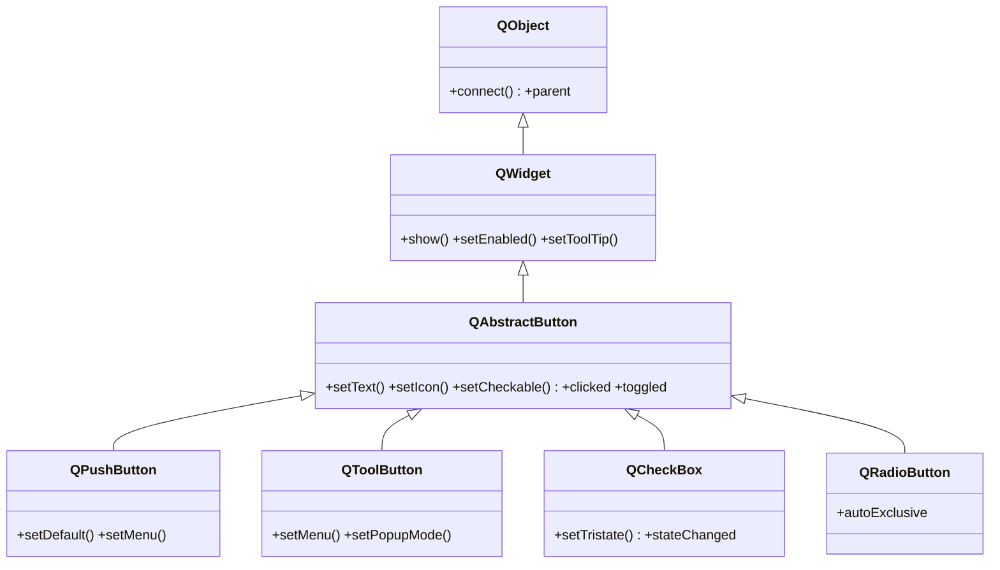
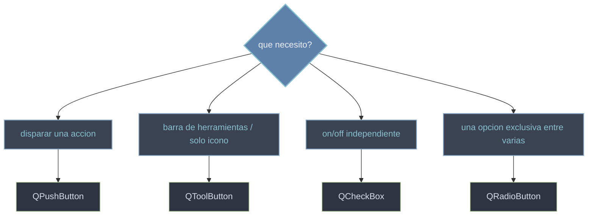

# QtWidgets/botones — botones y casillas

Esta carpeta agrupa los **botones**: widgets que el usuario pulsa para disparar una accion o fijar una opcion. Todos heredan de [[QAbstractButton]], asi que comparten lo esencial — texto, icono y las señales `clicked`/`toggled` — y cada uno solo agrega su matiz. [[QPushButton]] es el boton de accion clasico; [[QToolButton]] su version compacta para barras de herramientas; [[QCheckBox]] una casilla on/off independiente; y [[QRadioButton]] una opcion exclusiva dentro de un grupo. Saber cual usar es, sobre todo, saber que señal vas a conectar.

## En accion

Un solo layout con los cuatro tipos conectados: un boton de accion, una casilla independiente y dos radios exclusivos entre si.

```python
from PyQt6.QtWidgets import (
    QApplication, QWidget, QVBoxLayout,
    QPushButton, QCheckBox, QRadioButton
)
import sys

app = QApplication(sys.argv)
w = QWidget()
w.setWindowTitle("botones")
lay = QVBoxLayout(w)

# Accion: emite clicked al pulsar
boton = QPushButton("Aplicar")
boton.clicked.connect(lambda: print("aplicado"))
lay.addWidget(boton)

# On/off independiente: leer su estado con toggled (bool)
recordar = QCheckBox("Recordar sesion")
recordar.toggled.connect(lambda on: print("recordar:", on))
lay.addWidget(recordar)

# Opcion exclusiva: dos radios en el mismo parent -> exclusion automatica
claro = QRadioButton("Tema claro")
oscuro = QRadioButton("Tema oscuro")
oscuro.setChecked(True)
claro.toggled.connect(lambda on: print("tema claro") if on else None)
oscuro.toggled.connect(lambda on: print("tema oscuro") if on else None)
lay.addWidget(claro)
lay.addWidget(oscuro)

w.show()
sys.exit(app.exec())
```

## Herencia



`QAbstractButton` es la **base abstracta**: no se instancia, pero concentra la logica de boton (texto, icono, estado checkable, señales `clicked`/`toggled`). Cada hija concreta solo agrega lo suyo: el menu/default de [[QPushButton]], el popup compacto de [[QToolButton]], el tri-estado de [[QCheckBox]] y la exclusion mutua de [[QRadioButton]].

## Que boton uso



## Las clases

| Clase | Hereda de | Señal clave | Rol |
|-------|-----------|-------------|-----|
| [[QAbstractButton]] | `QWidget` | `clicked` | base abstracta: texto, icono, estado y señales comunes |
| [[QPushButton]] | `QAbstractButton` | `clicked` | boton de accion estandar con texto en dialogos |
| [[QToolButton]] | `QAbstractButton` | `clicked` | boton compacto de barra de herramientas; admite menu |
| [[QCheckBox]] | `QAbstractButton` | `toggled` | casilla on/off independiente (opcional tri-estado) |
| [[QRadioButton]] | `QAbstractButton` | `toggled` | opcion exclusiva dentro de un parent o grupo |

## Notas relacionadas

- [[QAbstractButton]] — la base de la que cuelgan los cuatro botones
- [[concepto_signals_slots]] — como conectar `clicked` y `toggled` a un slot
