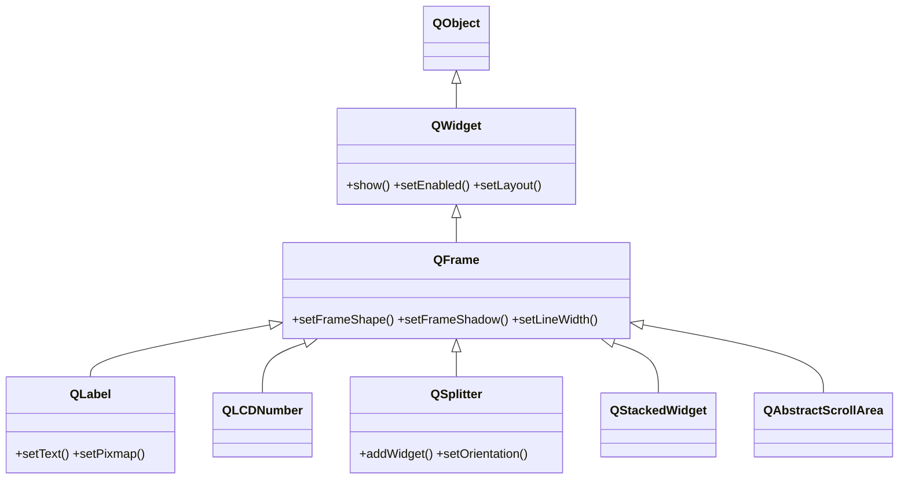

# QFrame — widget con marco/borde opcional y base de varios widgets

`QFrame` es un [[QWidget]] que puede dibujar un **marco/borde** alrededor de su contenido. Por si solo sirve como **separador** (una linea) o como caja con borde para delimitar visualmente una zona. Pero su importancia real es estructural: es la **clase base** de varios widgets muy usados (`QLabel`, `QLCDNumber`, `QSplitter`, `QStackedWidget`, `QAbstractScrollArea`), que heredan de el la capacidad de tener marco.

## Importacion

```python
from PyQt6.QtWidgets import QFrame
```

## Herencia



Lo que `QFrame` agrega sobre [[QWidget]] es solo el **marco** (forma, sombra, grosor). Todo lo demas —mostrarse, habilitarse, alojar un layout— viene de `QWidget`. A su vez, widgets como `QLabel` o `QSplitter` heredan ese marco de `QFrame`: por eso a un `QLabel` se le puede poner un borde sin codigo extra.

## Propiedades

| Propiedad | Tipo | Leer \| escribir | Controla |
|-----------|------|------------------|----------|
| `frameShape` | `QFrame.Shape` | `frameShape()` \| `setFrameShape(Shape)` | la forma del marco (Box, HLine, ...) |
| `frameShadow` | `QFrame.Shadow` | `frameShadow()` \| `setFrameShadow(Shadow)` | el relieve (Plain, Raised, Sunken) |
| `lineWidth` | `int` | `lineWidth()` \| `setLineWidth(int)` | grosor de la linea del marco |
| `frameStyle` | `int` | `frameStyle()` \| `setFrameStyle(int)` | shape + shadow combinados (OR de enums) |

Los valores de `Shape` son `Box`, `Panel`, `StyledPanel`, `HLine`, `VLine`, `NoFrame`; los de `Shadow` son `Plain`, `Raised`, `Sunken`. En PyQt6 los enums llevan **scope**: se escriben `QFrame.Shape.HLine`, `QFrame.Shadow.Sunken` (no `QFrame.HLine`).

## Constructor y metodos

```python
QFrame(parent: QWidget | None = None)
```

| Firma | Devuelve | Que hace |
|-------|----------|----------|
| `setFrameShape(shape: QFrame.Shape)` | `None` | fija la forma del marco (`Box`, `Panel`, `StyledPanel`, `HLine`, `VLine`, `NoFrame`) |
| `frameShape()` | `QFrame.Shape` | la forma actual |
| `setFrameShadow(shadow: QFrame.Shadow)` | `None` | fija el relieve (`Plain`, `Raised`, `Sunken`) |
| `setLineWidth(width: int)` | `None` | grosor en px de la linea del marco |
| `setFrameStyle(style: int)` | `None` | shape y shadow a la vez, como OR (`Box \| Raised`) |

## Casos de uso

```python
from PyQt6.QtWidgets import QApplication, QWidget, QFrame, QLabel, QVBoxLayout
import sys

app = QApplication(sys.argv)
w = QWidget(); lay = QVBoxLayout(w)

# 1. Linea separadora horizontal entre secciones
lay.addWidget(QLabel("Seccion A"))
linea = QFrame()
linea.setFrameShape(QFrame.Shape.HLine)
linea.setFrameShadow(QFrame.Shadow.Sunken)
lay.addWidget(linea)
lay.addWidget(QLabel("Seccion B"))

# 2. Caja con borde para agrupar visualmente
caja = QFrame()
caja.setFrameShape(QFrame.Shape.Box)
caja.setLineWidth(2)
caja_lay = QVBoxLayout(caja)
caja_lay.addWidget(QLabel("dentro de la caja"))
lay.addWidget(caja)

w.show(); sys.exit(app.exec())
```

## Errores comunes

| Error | Causa | Solucion |
|-------|-------|----------|
| El marco no se ve | no fijaste el shape (por defecto `NoFrame`) | llama a `setFrameShape(QFrame.Shape.Box)` (o el que toque) |
| Quiero agrupar con titulo y no aparece | `QFrame` no tiene titulo | usa [[QGroupBox]], que si lo dibuja |
| `QFrame.HLine` da `AttributeError` | en PyQt6 los enums llevan scope | escribe `QFrame.Shape.HLine` |

## Notas relacionadas

- [[QWidget]] — de donde `QFrame` hereda mostrarse, layout y el resto
- [[QGroupBox]] — cuando ademas del borde necesitas un titulo
- [[QSplitter]] — un divisor ajustable que hereda de `QFrame`
