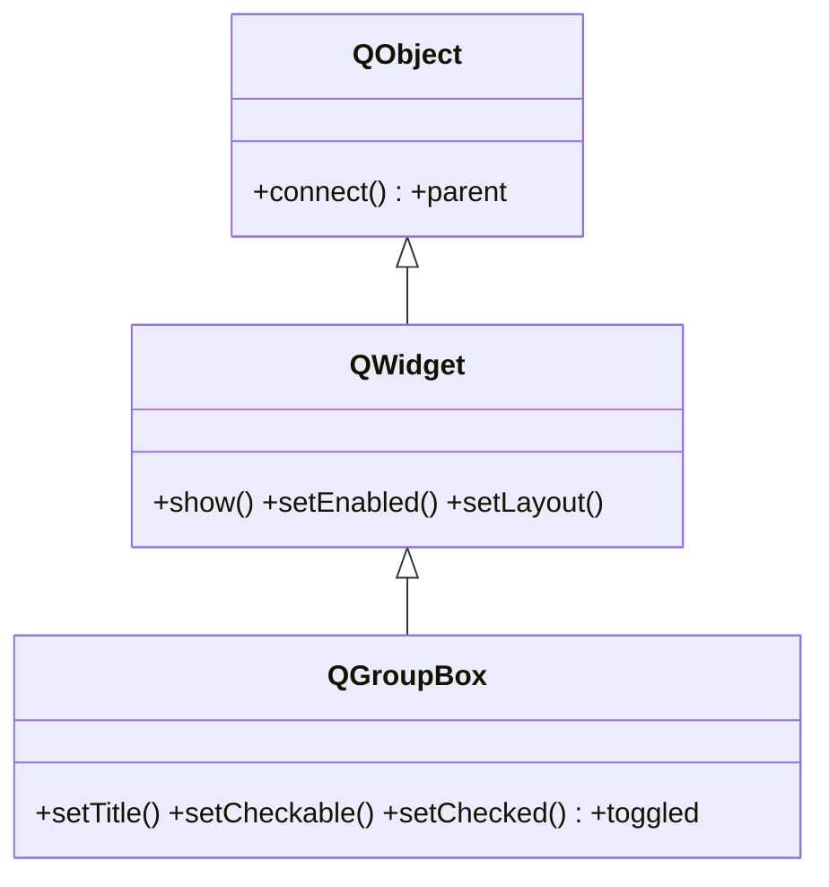

# QGroupBox — contenedor con titulo y borde para agrupar widgets

`QGroupBox` es un [[QWidget]] que dibuja un **borde con un titulo** y aloja dentro a otros widgets relacionados (los suyos van en un **layout**). Ademas puede ser **checkable**: muestra una casilla junto al titulo que activa o desactiva todo el grupo, deshabilitando su contenido cuando se desmarca. Es la forma estandar de agrupar opciones con una etiqueta visible (a diferencia de [[QFrame]], que solo da el borde sin titulo).

## Importacion

```python
from PyQt6.QtWidgets import QGroupBox
```

## Herencia



`QGroupBox` agrega el **titulo, el borde y el estado checkable**; el resto (mostrarse, alojar un layout, habilitarse) lo hereda de [[QWidget]]. El layout interno y los widgets que contiene los gestiona como cualquier `QWidget` contenedor.

## Senales

| Senal | Cuando se emite | Argumentos |
|-------|-----------------|------------|
| `toggled` | al marcar/desmarcar la casilla del titulo (solo si es checkable) | `on: bool` (nuevo estado) |
| `clicked` | al pulsar la casilla del titulo | `checked: bool` |

```python
grupo.toggled.connect(lambda on: print("grupo activo" if on else "grupo inactivo"))
```

## Propiedades

| Propiedad | Tipo | Leer \| escribir | Controla |
|-----------|------|------------------|----------|
| `title` | `str` | `title()` \| `setTitle(str)` | el texto del titulo del grupo |
| `checkable` | `bool` | `isCheckable()` \| `setCheckable(bool)` | si muestra casilla que activa el grupo |
| `checked` | `bool` | `isChecked()` \| `setChecked(bool)` | estado de la casilla (solo si es checkable) |
| `flat` | `bool` | `isFlat()` \| `setFlat(bool)` | dibujo plano (solo linea superior, sin caja) |

## Constructor y metodos

```python
QGroupBox(parent: QWidget | None = None)
QGroupBox(title: str, parent: QWidget | None = None)
```

| Firma | Devuelve | Que hace |
|-------|----------|----------|
| `setTitle(title: str)` | `None` | fija el texto del titulo |
| `setCheckable(checkable: bool)` | `None` | anade la casilla que activa/desactiva el grupo |
| `setChecked(checked: bool)` | `None` | marca/desmarca la casilla (solo si es checkable) |
| `isChecked()` | `bool` | `True` si la casilla esta marcada |
| `setFlat(flat: bool)` | `None` | dibujo plano sin la caja completa |

El contenido se mete en un **layout** asignado al groupbox, con `grupo.setLayout(layout)` o pasando el grupo al crear el layout (`QVBoxLayout(grupo)`).

## Casos de uso

```python
from PyQt6.QtWidgets import (QApplication, QWidget, QGroupBox,
                             QCheckBox, QVBoxLayout)
import sys

app = QApplication(sys.argv)
w = QWidget(); lay = QVBoxLayout(w)

# 1. Grupo "Opciones" con varios checks dentro
grupo = QGroupBox("Opciones")
gl = QVBoxLayout(grupo)            # layout asignado al groupbox
gl.addWidget(QCheckBox("Negrita"))
gl.addWidget(QCheckBox("Cursiva"))
lay.addWidget(grupo)

# 2. Grupo checkable: al desmarcarlo se deshabilita su contenido
avanzado = QGroupBox("Avanzado")
avanzado.setCheckable(True)
avanzado.setChecked(False)        # arranca desactivado y en gris
al = QVBoxLayout(avanzado)
al.addWidget(QCheckBox("Modo experto"))
lay.addWidget(avanzado)

w.show(); sys.exit(app.exec())
```

## Errores comunes

| Error | Causa | Solucion |
|-------|-------|----------|
| Los widgets no aparecen dentro del grupo | les diste como `parent` el grupo pero sin layout | crea un layout en el groupbox (`QVBoxLayout(grupo)`) y usa `addWidget` |
| `toggled` no se emite nunca | el grupo no es checkable | llama antes a `setCheckable(True)` |
| Quiero solo un borde, sin titulo | `QGroupBox` siempre reserva el titulo | usa [[QFrame]] con `setFrameShape(QFrame.Shape.Box)` |

## Notas relacionadas

- [[QWidget]] — de donde hereda alojar el layout y el resto
- [[QFrame]] — caja/borde sin titulo, cuando no necesitas la etiqueta
- [[QVBoxLayout]] — el layout que organiza los widgets dentro del grupo
