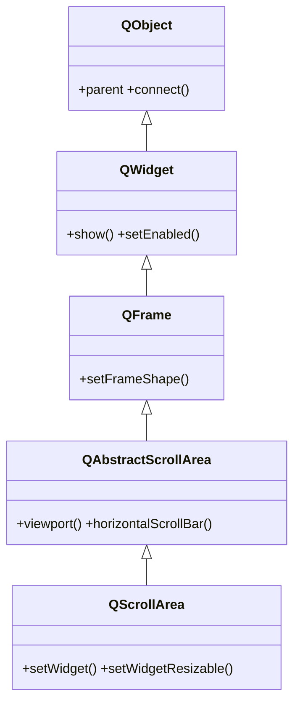

# QScrollArea — area con barras de desplazamiento

`QScrollArea` muestra un widget dentro de un viewport con **barras de desplazamiento**: cuando el contenido es mas grande que el espacio disponible, el usuario lo recorre con las barras. Lo normal es crear un widget contenedor (con su layout y sus campos), meterselo con `setWidget` y, casi siempre, llamar a `setWidgetResizable(True)` para que ese contenido se ajuste al ancho del area.

## Importacion

```python
from PyQt6.QtWidgets import QScrollArea
```

## Herencia



Lo que `QScrollArea` **no** define lo hereda: el viewport y las barras de scroll vienen de `QAbstractScrollArea`; el marco de `QFrame`; mostrarse y habilitarse de [[QWidget]]; el `parent` de `QObject`. Lo propio es alojar **un** widget de contenido (`setWidget`) y decidir si se redimensiona con el area.

## Propiedades

En Qt los "atributos" son **propiedades** (getter/setter):

| Propiedad | Tipo | Leer \| escribir | Controla |
|-----------|------|------------------|----------|
| `widget` | `QWidget` | `widget()` \| `setWidget(w)` | el contenido que se desplaza |
| `widgetResizable` | `bool` | `widgetResizable()` \| `setWidgetResizable(bool)` | si el widget se ajusta al area en vez de a su tamaño natural |
| `horizontalScrollBarPolicy` | `enum` | `horizontalScrollBarPolicy()` \| `setHorizontalScrollBarPolicy(...)` | cuando aparece la barra horizontal |
| `verticalScrollBarPolicy` | `enum` | `verticalScrollBarPolicy()` \| `setVerticalScrollBarPolicy(...)` | cuando aparece la barra vertical |
| `enabled` | `bool` | `isEnabled()` \| `setEnabled(bool)` | habilitado o en gris (de [[QWidget]]) |

Las politicas de barra usan el enum con scope de PyQt6: `Qt.ScrollBarPolicy.ScrollBarAsNeeded` (por defecto), `ScrollBarAlwaysOn`, `ScrollBarAlwaysOff`.

## Constructor y metodos

```python
QScrollArea(parent: QWidget | None = None)
```

Un unico constructor; el `parent` es opcional. El contenido se asigna despues con `setWidget`.

| Firma | Devuelve | Que hace |
|-------|----------|----------|
| `setWidget(w: QWidget)` | `None` | fija el **contenido** que se desplaza (toma posesion del widget) |
| `setWidgetResizable(resizable: bool)` | `None` | si `True`, el widget se ajusta al ancho del area |
| `widget()` | `QWidget` | el widget de contenido actual |
| `setHorizontalScrollBarPolicy(policy)` | `None` | cuando se muestra la barra horizontal |
| `setVerticalScrollBarPolicy(policy)` | `None` | cuando se muestra la barra vertical |

## Casos de uso

```python
from PyQt6.QtWidgets import (
    QApplication, QScrollArea, QWidget, QFormLayout, QLineEdit
)
from PyQt6.QtCore import Qt
import sys

app = QApplication(sys.argv)

# 1. El contenido: un formulario largo dentro de un widget contenedor
contenido = QWidget()
form = QFormLayout(contenido)
for n in range(30):
    form.addRow(f"Campo {n}", QLineEdit())

# 2. El area de scroll envuelve ese contenido
area = QScrollArea()
area.setWidget(contenido)              # imprescindible: el widget a desplazar
area.setWidgetResizable(True)          # que el formulario se ajuste al ancho
area.setHorizontalScrollBarPolicy(
    Qt.ScrollBarPolicy.ScrollBarAlwaysOff
)
area.setWindowTitle("formulario largo con scroll")

area.show()
sys.exit(app.exec())                   # PyQt6: exec() sin guion bajo
```

## Errores comunes

| Error | Causa | Solucion |
|-------|-------|----------|
| El area sale vacia | olvidaste `setWidget` | asigna el contenido con `area.setWidget(contenido)` |
| El contenido no se adapta al ancho y queda angosto | `widgetResizable` sigue en `False` (por defecto) | llama a `setWidgetResizable(True)` |
| Aparece scroll horizontal que no quiero | el contenido es mas ancho que el area | `setWidgetResizable(True)` y/o `setHorizontalScrollBarPolicy(ScrollBarAlwaysOff)` |

## Notas relacionadas

- [[QWidget]] — el contenedor de contenido que se mete con `setWidget`
- [[QFrame]] — el marco que `QScrollArea` hereda a traves de `QAbstractScrollArea`
