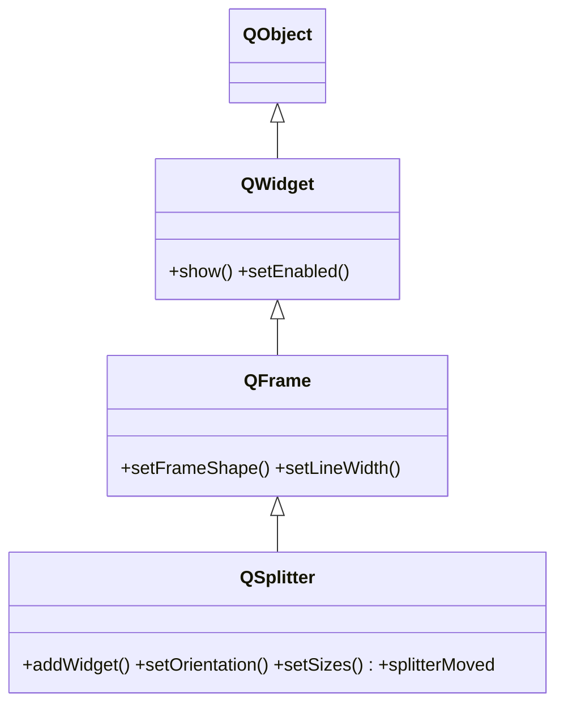

# QSplitter — divisor ajustable que el usuario redimensiona arrastrando

`QSplitter` coloca varios widgets **uno al lado del otro** (o uno sobre otro) y dibuja entre ellos una **barra arrastrable**: el usuario tira de esa barra para redimensionar los paneles en tiempo de ejecucion. Es lo que da el comportamiento de un IDE (panel lateral + area principal ajustables). A diferencia de un layout, los widgets se **agregan al splitter** con `addWidget`, no a un layout, porque es el splitter quien gestiona el arrastre.

## Importacion

```python
from PyQt6.QtWidgets import QSplitter
```

## Herencia



`QSplitter` hereda de [[QFrame]] (y por tanto de [[QWidget]]): de ahi vienen el marco opcional y todo lo basico de widget. Lo que aporta es **la barra divisoria y el reparto de tamanos** entre los widgets que aloja.

## Senales

| Senal | Cuando se emite | Argumentos |
|-------|-----------------|------------|
| `splitterMoved` | cuando el usuario arrastra la barra y cambia el reparto | `pos: int` (posicion), `index: int` (que barra) |

```python
splitter.splitterMoved.connect(lambda pos, idx: print(pos, idx))
```

## Propiedades

| Propiedad | Tipo | Leer \| escribir | Controla |
|-----------|------|------------------|----------|
| `orientation` | `Qt.Orientation` | `orientation()` \| `setOrientation(Qt.Orientation)` | reparto horizontal o vertical |
| `childrenCollapsible` | `bool` | `childrenCollapsible()` \| `setChildrenCollapsible(bool)` | si un panel puede colapsar a tamano 0 |
| `handleWidth` | `int` | `handleWidth()` \| `setHandleWidth(int)` | grosor de la barra arrastrable |

La orientacion usa el enum con **scope** de PyQt6: `Qt.Orientation.Horizontal` (por defecto) o `Qt.Orientation.Vertical`.

## Constructor y metodos

```python
QSplitter(parent: QWidget | None = None)
QSplitter(orientation: Qt.Orientation, parent: QWidget | None = None)
```

| Firma | Devuelve | Que hace |
|-------|----------|----------|
| `addWidget(widget: QWidget)` | `None` | agrega un panel al final del splitter |
| `setOrientation(orientation: Qt.Orientation)` | `None` | reparto `Horizontal` o `Vertical` |
| `setSizes(sizes: list[int])` | `None` | tamanos iniciales de cada panel (en px) |
| `sizes()` | `list[int]` | tamanos actuales de los paneles |
| `setStretchFactor(index: int, factor: int)` | `None` | que panel crece al redimensionar la ventana |

## Casos de uso

```python
from PyQt6.QtWidgets import (QApplication, QSplitter, QTreeWidget,
                             QTextEdit, QLabel)
from PyQt6.QtCore import Qt
import sys

app = QApplication(sys.argv)

# 1. Panel lateral + area principal redimensionables (como un IDE)
split = QSplitter(Qt.Orientation.Horizontal)
split.addWidget(QTreeWidget())     # panel lateral
split.addWidget(QTextEdit())       # area principal
split.setSizes([180, 600])         # ancho inicial de cada panel
split.setStretchFactor(1, 1)       # al agrandar la ventana, crece el editor
split.show()

# 2. Splitter vertical (uno sobre otro)
vsplit = QSplitter(Qt.Orientation.Vertical)
vsplit.addWidget(QLabel("arriba"))
vsplit.addWidget(QLabel("abajo"))
vsplit.show()

sys.exit(app.exec())
```

## Errores comunes

| Error | Causa | Solucion |
|-------|-------|----------|
| No se puede arrastrar para redimensionar | metiste los widgets en un layout, no en el splitter | agregalos con `split.addWidget(w)` directamente |
| El reparto sale al reves del esperado | la orientacion por defecto es horizontal | fija `setOrientation(Qt.Orientation.Vertical)` si lo quieres vertical |
| `Qt.Horizontal` da `AttributeError` | en PyQt6 los enums llevan scope | usa `Qt.Orientation.Horizontal` |

## Notas relacionadas

- [[QFrame]] — la clase base de la que `QSplitter` hereda el marco
- [[QWidget]] — los paneles que se agregan al splitter
- [[QVBoxLayout]] — para reparto fijo (sin arrastre) usa un layout normal
