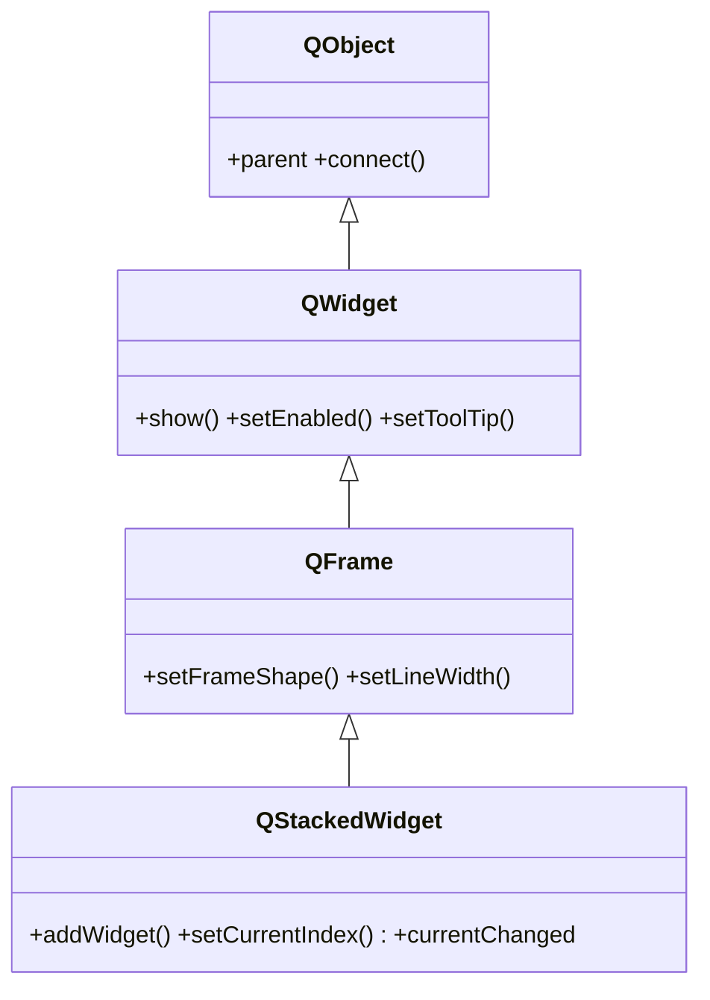

# QStackedWidget — pila de widgets sin solapas

`QStackedWidget` apila varios widgets ocupando el mismo hueco, pero **solo uno es visible a la vez** y **sin solapas**: el cambio de pagina se hace por **codigo** (no hay barra que pulse el usuario). Es ideal para un asistente (wizard) por pasos o para paneles que se alternan segun una seleccion. Lo normal es añadir las paginas con `addWidget` y mover el indice con `setCurrentIndex`.

## Importacion

```python
from PyQt6.QtWidgets import QStackedWidget
```

## Herencia



Lo que `QStackedWidget` **no** define lo hereda: el marco (`setFrameShape`) viene de `QFrame`; mostrarse, habilitarse y el tamaño vienen de [[QWidget]]; conectar señales y el `parent` (que destruye las paginas hijas) vienen de `QObject`. Lo propio es la pila: añadir paginas y elegir cual se muestra.

## Señales

| Señal | Cuando se emite | Argumentos |
|-------|-----------------|------------|
| `currentChanged` | al cambiar la pagina visible | `index: int` (la pagina ahora activa, `-1` si no hay) |

```python
stack.currentChanged.connect(lambda i: print("paso", i))
```

## Propiedades

En Qt los "atributos" son **propiedades** (getter/setter):

| Propiedad | Tipo | Leer \| escribir | Controla |
|-----------|------|------------------|----------|
| `currentIndex` | `int` | `currentIndex()` \| `setCurrentIndex(int)` | la pagina visible |
| `count` | `int` | `count()` \| — | numero de paginas en la pila |
| `currentWidget` | `QWidget` | `currentWidget()` \| `setCurrentWidget(w)` | la pagina visible, por widget |
| `enabled` | `bool` | `isEnabled()` \| `setEnabled(bool)` | habilitado o en gris (de [[QWidget]]) |

## Constructor y metodos

```python
QStackedWidget(parent: QWidget | None = None)
```

Un unico constructor; el `parent` es opcional. Las paginas se añaden despues con `addWidget`.

| Firma | Devuelve | Que hace |
|-------|----------|----------|
| `addWidget(w: QWidget)` | `int` | apila una pagina al final; devuelve su **indice** |
| `setCurrentIndex(index: int)` | `None` | muestra la pagina `index` (el cambio programatico) |
| `setCurrentWidget(w: QWidget)` | `None` | muestra la pagina por su widget en vez de por indice |
| `currentIndex()` | `int` | indice de la pagina visible (`-1` si no hay) |
| `count()` | `int` | numero de paginas |

## Casos de uso

```python
from PyQt6.QtWidgets import (
    QApplication, QWidget, QStackedWidget, QVBoxLayout, QLabel, QPushButton
)
import sys

app = QApplication(sys.argv)

ventana = QWidget()
ventana.setWindowTitle("asistente en 3 pasos")
raiz = QVBoxLayout(ventana)

# 1. La pila: cada pagina es un paso del asistente
stack = QStackedWidget()
for n in (1, 2, 3):
    paso = QWidget()
    lay = QVBoxLayout(paso)
    lay.addWidget(QLabel(f"Paso {n} de 3"))
    stack.addWidget(paso)
raiz.addWidget(stack)

# 2. Un boton "Siguiente" avanza por codigo (no hay solapas)
siguiente = QPushButton("Siguiente")
def avanzar():
    i = stack.currentIndex()
    if i + 1 < stack.count():
        stack.setCurrentIndex(i + 1)
siguiente.clicked.connect(avanzar)
raiz.addWidget(siguiente)

# 3. Reaccionar al cambio de paso
stack.currentChanged.connect(lambda i: print("ahora en el paso", i))

ventana.show()
sys.exit(app.exec())                        # PyQt6: exec() sin guion bajo
```

## Diferencia con QTabWidget

| | [[QTabWidget]] | `QStackedWidget` |
|---|---|---|
| Solapas | **si**, barra de pestanas visible | **no**, sin barra |
| Como se cambia de pagina | el usuario pulsa una solapa | por **codigo** (`setCurrentIndex`) |
| Tipico para | secciones de ajustes navegables | wizard por pasos, paneles que se alternan |

`QStackedWidget` es justamente la pila interna que `QTabWidget` usa por debajo, pero exponiendo solo el cambio programatico.

## Errores comunes

| Error | Causa | Solucion |
|-------|-------|----------|
| Veo todas las paginas a la vez | no se trata de eso: se muestra **una** a la vez | comprueba que cada pagina sea un widget añadido con `addWidget` |
| No cambia de pagina al pulsar | esperabas solapas; aqui el cambio es por codigo | conecta el boton a `setCurrentIndex(i)` o `setCurrentWidget(w)` |
| `setCurrentIndex` se sale de rango | indice mayor que `count() - 1` | valida `i + 1 < stack.count()` antes de avanzar |

## Notas relacionadas

- [[QTabWidget]] — la misma pila pero **con** solapas que pulsa el usuario
- [[QWidget]] — de donde vienen `show`, `setEnabled` y el `parent` de las paginas
- [[concepto_signals_slots]] — como conectar `currentChanged`
