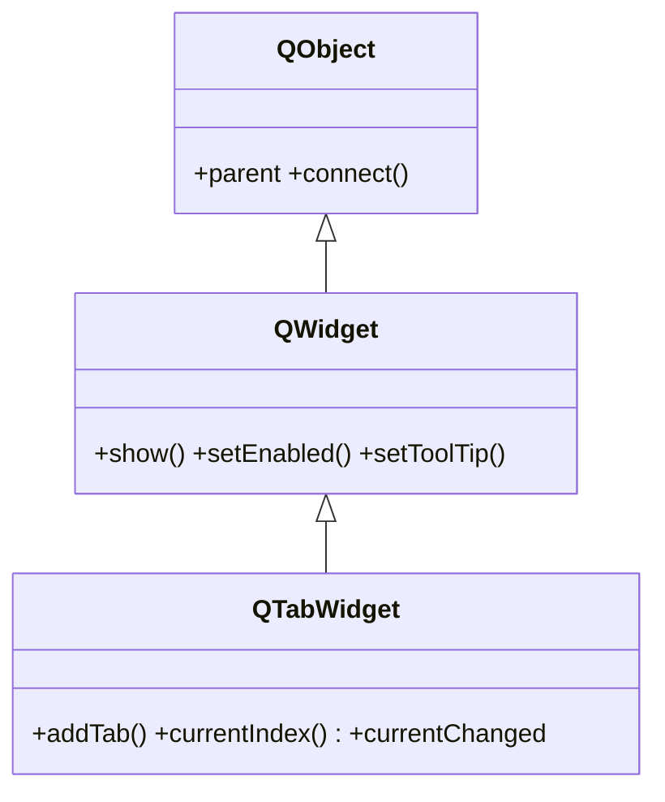

# QTabWidget — contenedor de pestanas con solapas

`QTabWidget` es un contenedor de **pestanas**: muestra una barra de solapas y, debajo, el widget asociado a la solapa activa. Cada pestana aloja un **widget distinto** (normalmente un contenedor con su propio layout) y el usuario cambia de pagina pulsando las solapas. Lo normal es crearlo, ir anadiendo paginas con `addTab(widget, "Titulo")` y, si interesa, conectar `currentChanged` para reaccionar al cambio.

## Importacion

```python
from PyQt6.QtWidgets import QTabWidget
```

## Herencia



Lo que `QTabWidget` **no** define lo hereda: mostrarse, habilitarse, el tooltip o el tamano vienen de [[QWidget]]; conectar senales y el `parent` (que gestiona la destruccion de las paginas hijas) vienen de `QObject`. Lo propio es la gestion de pestanas: anadir, quitar, indice activo y sus senales.

## Senales

| Senal | Cuando se emite | Argumentos |
|-------|-----------------|------------|
| `currentChanged` | al cambiar la pestana visible | `index: int` (la pestana ahora activa, `-1` si no hay) |
| `tabCloseRequested` | al pulsar la "x" de una pestana | `index: int` (la pestana a cerrar; solo si `setTabsClosable(True)`) |

```python
tabs.currentChanged.connect(lambda i: print("pestana activa:", i))
tabs.setTabsClosable(True)
tabs.tabCloseRequested.connect(tabs.removeTab)   # cerrar la pestana pedida
```

## Propiedades

En Qt los "atributos" son **propiedades** (getter/setter, no atributo directo). Las mas usadas:

| Propiedad | Tipo | Leer \| escribir | Controla |
|-----------|------|------------------|----------|
| `currentIndex` | `int` | `currentIndex()` \| `setCurrentIndex(int)` | la pestana visible |
| `count` | `int` | `count()` \| — | numero de pestanas |
| `tabsClosable` | `bool` | `tabsClosable()` \| `setTabsClosable(bool)` | si cada solapa muestra su "x" |
| `movable` | `bool` | `isMovable()` \| `setMovable(bool)` | si el usuario reordena las solapas arrastrando |
| `tabPosition` | `enum` | `tabPosition()` \| `setTabPosition(...)` | donde va la barra (`North`, `South`, `West`, `East`) |
| `enabled` | `bool` | `isEnabled()` \| `setEnabled(bool)` | habilitado o en gris (de [[QWidget]]) |

## Constructor y metodos

```python
QTabWidget(parent: QWidget | None = None)
```

Un unico constructor; el `parent` es opcional (el layout lo asigna al hacer `addWidget`). Las paginas se anaden despues con `addTab`.

| Firma | Devuelve | Que hace |
|-------|----------|----------|
| `addTab(widget: QWidget, label: str)` | `int` | anade una pestana al final; devuelve su **indice** |
| `insertTab(index: int, widget: QWidget, label: str)` | `int` | inserta una pestana en `index`; devuelve el indice real |
| `currentIndex()` | `int` | indice de la pestana visible (`-1` si no hay ninguna) |
| `setCurrentIndex(index: int)` | `None` | cambia a la pestana `index` por codigo |
| `currentWidget()` | `QWidget` | el widget de la pestana activa |
| `setTabText(index: int, label: str)` | `None` | cambia el texto de una solapa |
| `setTabsClosable(closable: bool)` | `None` | muestra/oculta la "x" de cierre en cada solapa |
| `count()` | `int` | numero de pestanas |
| `removeTab(index: int)` | `None` | quita la pestana `index` (no destruye su widget) |

## Casos de uso

```python
from PyQt6.QtWidgets import (
    QApplication, QWidget, QTabWidget, QVBoxLayout, QLabel, QPushButton
)
import sys

app = QApplication(sys.argv)

tabs = QTabWidget()
tabs.setWindowTitle("ventana con pestanas")

# 1. Cada pestana es un widget contenedor con su propio layout
pagina_general = QWidget()
lay_general = QVBoxLayout(pagina_general)
lay_general.addWidget(QLabel("Ajustes generales"))
lay_general.addWidget(QPushButton("Guardar"))
tabs.addTab(pagina_general, "General")

pagina_red = QWidget()
lay_red = QVBoxLayout(pagina_red)
lay_red.addWidget(QLabel("Configuracion de red"))
tabs.addTab(pagina_red, "Red")

tabs.addTab(QWidget(), "Avanzado")          # 3a pestana, vacia

# 2. Pestanas cerrables: tabCloseRequested -> removeTab
tabs.setTabsClosable(True)
tabs.tabCloseRequested.connect(tabs.removeTab)

# 3. Reaccionar al cambio de pestana
tabs.currentChanged.connect(lambda i: print("ahora en la pestana", i))

tabs.show()
sys.exit(app.exec())                        # PyQt6: exec() sin guion bajo
```

## Errores comunes

| Error | Causa | Solucion |
|-------|-------|----------|
| Quiero varios widgets en una pestana pero solo entra uno | `addTab` recibe **un** widget por pagina | mete los widgets en un `QWidget` con su layout y pasa **ese** contenedor |
| La "x" de cierre no aparece | `tabsClosable` esta en `False` por defecto | llama a `setTabsClosable(True)` |
| Pulso la "x" y no se cierra | conectaste `tabCloseRequested` pero no quitas la pestana | conecta a `removeTab` (recibe el `index` emitido) |

## Notas relacionadas

- [[QStackedWidget]] — la misma pila de paginas pero **sin** solapas (cambio por codigo)
- [[QWidget]] — de donde vienen `show`, `setEnabled` y el `parent` de las paginas
- [[concepto_signals_slots]] — como conectar `currentChanged` o `tabCloseRequested`
