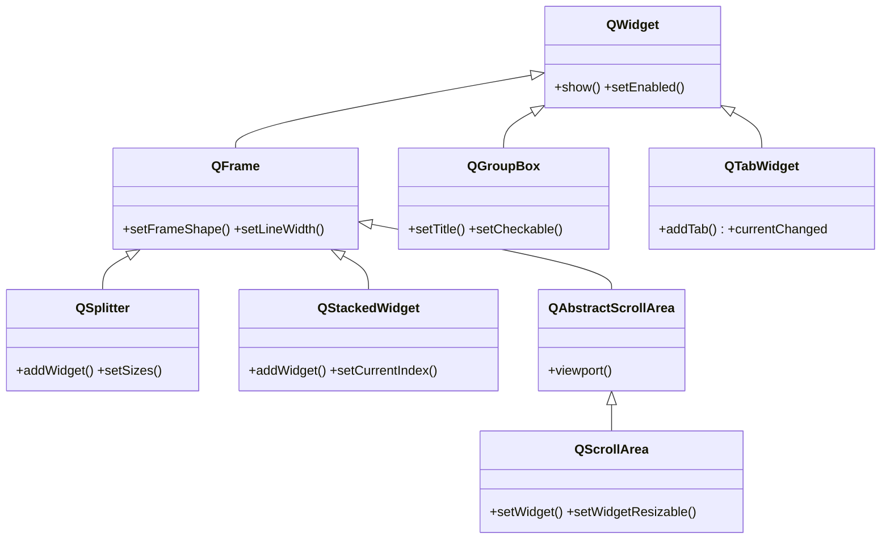
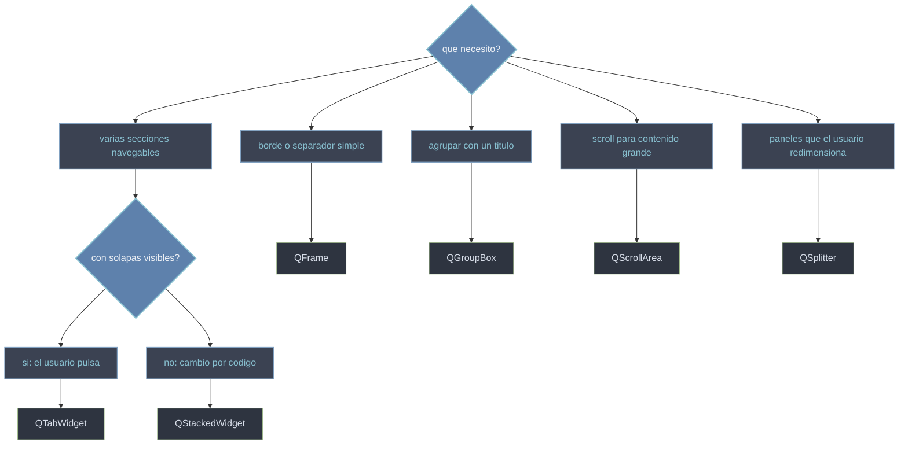

# QtWidgets/contenedores — agrupar y organizar widgets

Esta carpeta agrupa los widgets cuyo proposito es **contener y organizar** a otros, no mostrar un dato propio. Un contenedor da estructura visual a la interfaz: un **marco** o separador (`QFrame`), una **agrupacion con titulo** (`QGroupBox`), **pestanas** con solapas (`QTabWidget`), una **pila** que muestra una pagina a la vez sin solapas (`QStackedWidget`), un area con **scroll** para contenido grande (`QScrollArea`) o paneles **redimensionables** por un divisor (`QSplitter`). Todos son [[QWidget]] de pleno derecho: se dibujan y se colocan en un layout como cualquier otro, pero su contenido son mas widgets.

## En accion

Un `QTabWidget` con dos pestanas, cada una con su propio layout y sus widgets:

```python
from PyQt6.QtWidgets import (
    QApplication, QTabWidget, QWidget, QVBoxLayout, QLabel,
    QLineEdit, QPushButton
)
import sys

app = QApplication(sys.argv)

tabs = QTabWidget()
tabs.setWindowTitle("contenedores en accion")

# pestana 1: un formulario simple
pagina_perfil = QWidget()
lay_perfil = QVBoxLayout(pagina_perfil)
lay_perfil.addWidget(QLabel("Nombre:"))
lay_perfil.addWidget(QLineEdit())
lay_perfil.addWidget(QPushButton("Guardar"))
tabs.addTab(pagina_perfil, "Perfil")

# pestana 2: otro widget contenedor con su layout
pagina_acerca = QWidget()
lay_acerca = QVBoxLayout(pagina_acerca)
lay_acerca.addWidget(QLabel("App de ejemplo v1.0"))
tabs.addTab(pagina_acerca, "Acerca de")

tabs.show()
sys.exit(app.exec())                        # PyQt6: exec() sin guion bajo
```

## Herencia



Casi todos cuelgan de `QFrame` (heredan su marco): `QSplitter`, `QStackedWidget` y `QAbstractScrollArea` —de la que sale `QScrollArea`—. `QGroupBox` y `QTabWidget`, en cambio, cuelgan directos de [[QWidget]]: tienen su propio dibujo (el titulo, la barra de solapas) y no necesitan el marco de `QFrame`.

## Que contenedor uso



## Las clases

| Clase | Hereda de | Rol |
|-------|-----------|-----|
| [[QFrame]] | `QWidget` | marco/borde y separador; base visual de muchos contenedores |
| [[QGroupBox]] | `QWidget` | agrupa widgets bajo un **titulo** (con marco), opcionalmente checkable |
| [[QTabWidget]] | `QWidget` | **pestanas** con solapas; cada una muestra un widget distinto |
| [[QStackedWidget]] | `QFrame` | **pila** de paginas; muestra una a la vez, **sin** solapas (cambio por codigo) |
| [[QScrollArea]] | `QAbstractScrollArea` | area con **barras de desplazamiento** para contenido grande |
| [[QSplitter]] | `QFrame` | paneles separados por un divisor que el usuario **redimensiona** |

## Notas relacionadas

- [[QWidget]] — el contenedor base del que parten todos
- [[concepto_layouts]] — los layouts que colocan a los widgets dentro de cada contenedor
