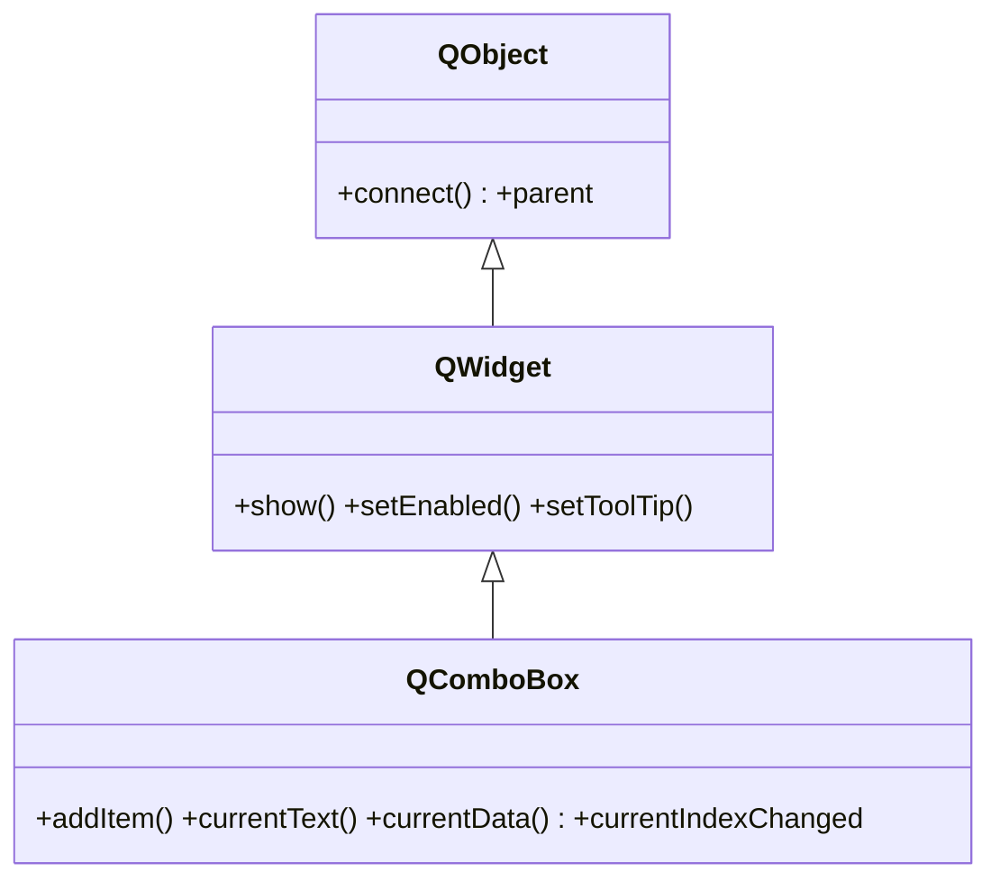

# QComboBox — desplegable de seleccion de una opcion

`QComboBox` es el **desplegable** que permite elegir **una opcion** de una lista. Es el widget tipico para seleccionar de un conjunto cerrado (un pais, una unidad, un modo). Lo normal es crearlo, llenarlo con `addItems`, leer la eleccion con `currentText()` o reaccionar a `currentIndexChanged`. Puede asociar un dato oculto a cada item (`userData`). Mostrarse, habilitarse y el tooltip los hereda de [[QWidget]].

## Importacion

```python
from PyQt6.QtWidgets import QComboBox
```

## Herencia



`QComboBox` deriva directo de [[QWidget]]: mostrarse, habilitarse y el tooltip vienen de ahi; conectar señales y el `parent` vienen de `QObject`. Lo suyo es gestionar la lista de items, la seleccion actual y el dato asociado a cada item.

## Señales

| Señal | Cuando se emite | Argumentos |
|-------|-----------------|------------|
| `currentIndexChanged` | cambia la seleccion, por usuario **o por codigo** (`setCurrentIndex`) | `index: int` |
| `currentTextChanged` | cambia el texto seleccionado | `text: str` |
| `activated` | solo cuando el **usuario** elige un item de la lista | `index: int` |

```python
combo.currentIndexChanged.connect(lambda i: print("indice:", i))
combo.currentTextChanged.connect(lambda t: print("texto:", t))
```

## Propiedades

En Qt los "atributos" son **propiedades**: se leen con getter/setter, no como atributo directo.

| Propiedad | Tipo | Leer \| escribir | Controla |
|-----------|------|------------------|----------|
| `currentText` | `str` | `currentText()` \| `setCurrentText(str)` | el texto del item seleccionado |
| `currentIndex` | `int` | `currentIndex()` \| `setCurrentIndex(int)` | el indice del item seleccionado (0-based) |
| `editable` | `bool` | `isEditable()` \| `setEditable(bool)` | si el usuario puede escribir un valor propio |
| `count` | `int` | `count()` | numero de items (solo lectura) |
| `enabled` | `bool` | `isEnabled()` \| `setEnabled(bool)` | habilitado o en gris (de [[QWidget]]) |

## Constructor y metodos

```python
QComboBox(parent: QWidget | None = None)
```

Una sola sobrecarga; se crea vacio y se llena con `addItem` / `addItems`.

| Firma | Devuelve | Que hace |
|-------|----------|----------|
| `addItem(text: str, userData=None)` | `None` | añade un item; `userData` es un dato oculto opcional |
| `addItems(texts: list[str])` | `None` | añade varios items de golpe |
| `currentText()` | `str` | el texto del item seleccionado |
| `currentIndex()` | `int` | el indice del item seleccionado |
| `setCurrentIndex(index: int)` | `None` | selecciona el item por indice (dispara `currentIndexChanged`) |
| `currentData()` | `Any` | el `userData` asociado al item seleccionado |
| `setEditable(editable: bool)` | `None` | permite que el usuario escriba un valor propio |
| `itemText(index: int)` | `str` | el texto del item en esa posicion |
| `clear()` | `None` | elimina todos los items |

## Casos de uso

```python
from PyQt6.QtWidgets import QApplication, QWidget, QComboBox, QVBoxLayout
import sys

app = QApplication(sys.argv)
w = QWidget(); lay = QVBoxLayout(w)

# 1. Elegir entre opciones leyendo currentText
modo = QComboBox()
modo.addItems(["Claro", "Oscuro", "Sistema"])
modo.currentTextChanged.connect(lambda t: print("modo:", t))
lay.addWidget(modo)

# 2. Guardar un dato oculto por item con userData y leerlo con currentData
pais = QComboBox()
pais.addItem("Peru", "PE")          # texto visible, codigo oculto
pais.addItem("Mexico", "MX")
pais.currentIndexChanged.connect(lambda _: print("codigo:", pais.currentData()))
lay.addWidget(pais)

# 3. Combo editable: el usuario puede escribir su propio valor
fuente = QComboBox()
fuente.addItems(["Inter", "Fira Code", "Arial"])
fuente.setEditable(True)
lay.addWidget(fuente)

w.show(); sys.exit(app.exec())
```

## Errores comunes

| Error | Causa | Solucion |
|-------|-------|----------|
| El slot no reacciona cuando cambias la seleccion por codigo | usaste `activated`, que solo se emite por accion del usuario | usa `currentIndexChanged` si quieres reaccionar tambien al cambio por codigo |
| Confundes el indice con el texto | `currentIndex()` da un `int`, `currentText()` da el `str` | usa el que corresponda; para el dato oculto, `currentData()` |
| `currentData()` devuelve `None` | no asociaste `userData` al añadir el item | pasa el dato en `addItem(texto, dato)` |

## Notas relacionadas

- [[QWidget]] — de donde vienen `show`, `setEnabled` y el resto
- [[concepto_signals_slots]] — como conectar `currentIndexChanged` a un slot
- [[QLineEdit]] — campo de una linea cuando el valor es libre, no de una lista
