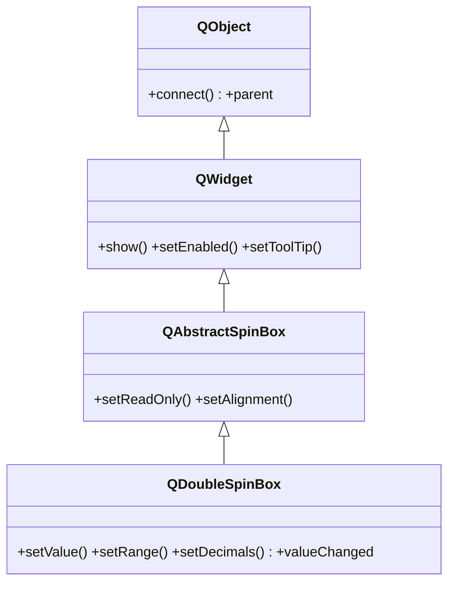

# QDoubleSpinBox — entrada de numeros decimales con flechas

`QDoubleSpinBox` es igual que [[QSpinBox]] pero para **numeros decimales (`float`)**: un campo con flechas arriba/abajo donde el usuario introduce un valor con coma flotante dentro de un rango. Se le fija el rango con `setRange`, cuantos decimales mostrar con `setDecimals`, y se conecta `valueChanged` para reaccionar. Tipico para un precio, una temperatura o cualquier magnitud con parte fraccionaria.

## Importacion

```python
from PyQt6.QtWidgets import QDoubleSpinBox
```

## Herencia



Como [[QSpinBox]], hereda **casi todo** de `QAbstractSpinBox` (la caja, las flechas, la edicion). La unica diferencia frente a `QSpinBox` es que trabaja con `float` y agrega `setDecimals` para controlar cuantas cifras decimales se muestran.

## Señales

| Señal | Cuando se emite | Argumentos |
|-------|-----------------|------------|
| `valueChanged` | cada vez que cambia el valor decimal | `value: float` |

```python
spin.valueChanged.connect(lambda v: print(v))   # v es float
```

## Propiedades

| Propiedad | Tipo | Leer \| escribir | Controla |
|-----------|------|------------------|----------|
| `value` | `float` | `value()` \| `setValue(float)` | el valor decimal actual |
| `minimum` | `float` | `minimum()` \| `setMinimum(float)` | menor valor permitido |
| `maximum` | `float` | `maximum()` \| `setMaximum(float)` | mayor valor permitido |
| `decimals` | `int` | `decimals()` \| `setDecimals(int)` | cuantas cifras decimales mostrar |
| `singleStep` | `float` | `singleStep()` \| `setSingleStep(float)` | cuanto sube/baja cada flecha |
| `suffix` | `str` | `suffix()` \| `setSuffix(str)` | texto despues del numero |

## Constructor y metodos

```python
QDoubleSpinBox(parent: QWidget | None = None)
```

| Firma | Devuelve | Que hace |
|-------|----------|----------|
| `value()` | `float` | el valor decimal actual |
| `setValue(val: float)` | `None` | fija el valor (lo recorta al rango) |
| `setRange(min: float, max: float)` | `None` | fija minimo y maximo de una vez |
| `setDecimals(prec: int)` | `None` | numero de cifras decimales mostradas |
| `setSingleStep(step: float)` | `None` | cuanto cambia el valor por cada flecha |
| `setSuffix(suffix: str)` | `None` | texto fijo despues del numero |

## Casos de uso

```python
from PyQt6.QtWidgets import QApplication, QWidget, QDoubleSpinBox, QVBoxLayout
import sys

app = QApplication(sys.argv)
w = QWidget(); lay = QVBoxLayout(w)

# Precio con 2 decimales
precio = QDoubleSpinBox()
precio.setRange(0.0, 9999.99)
precio.setDecimals(2)
precio.setSingleStep(0.50)
precio.setSuffix(" EUR")
precio.valueChanged.connect(lambda v: print("precio:", v))  # v: float
lay.addWidget(precio)

w.show(); sys.exit(app.exec())
```

## Errores comunes

| Error | Causa | Solucion |
|-------|-------|----------|
| Solo veo enteros / no acepta decimales | usaste [[QSpinBox]] | usa `QDoubleSpinBox` |
| Muestra mas/menos decimales de los que quiero | decimales por defecto | llama a `setDecimals(n)` |
| El valor se topa en 99.99 | no fijaste `setRange` | usa `setRange(min, max)` |

## Notas relacionadas

- [[QSpinBox]] — la version para enteros
- [[QAbstractSpinBox]] — la base que aporta la caja y las flechas
- [[concepto_signals_slots]] — como conectar `valueChanged` a un slot
