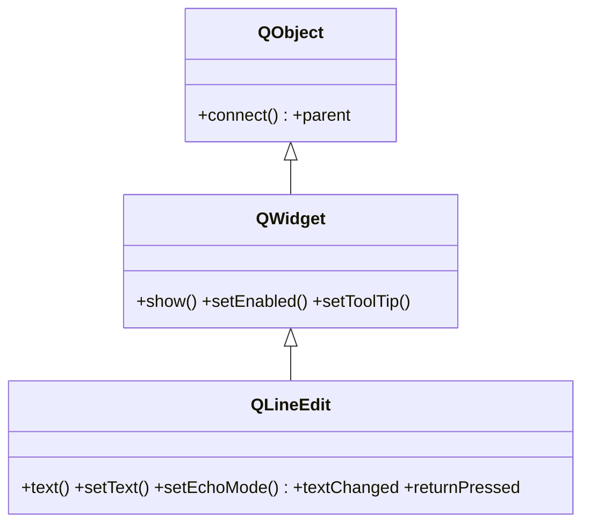

# QLineEdit — campo de texto de una sola linea

`QLineEdit` es el campo de entrada de **una sola linea**: el usuario escribe texto y tu lo lees con `text()`. Es el widget tipico de un formulario (nombre, email, busqueda, password). Lo normal es crearlo, conectar una de sus señales (`returnPressed`, `editingFinished`) y leer su contenido. Mostrarse, habilitarse y el tooltip los hereda de [[QWidget]].

## Importacion

```python
from PyQt6.QtWidgets import QLineEdit
```

## Herencia



`QLineEdit` deriva directo de [[QWidget]]: mostrarse, habilitarse y el tooltip vienen de ahi; conectar señales y el `parent` vienen de `QObject`. Lo suyo es todo lo de editar una linea de texto (`text`, `echoMode`, validador, señales de edicion).

## Señales

| Señal | Cuando se emite | Argumentos |
|-------|-----------------|------------|
| `textChanged` | en **cualquier** cambio del texto, incluso por codigo (`setText`) | `text: str` |
| `textEdited` | solo cuando el **usuario** edita (no al `setText` por codigo) | `text: str` |
| `returnPressed` | al pulsar Enter dentro del campo | — |
| `editingFinished` | al pulsar Enter o al perder el foco | — |

```python
campo.returnPressed.connect(self.buscar)         # buscar al pulsar Enter
campo.textEdited.connect(lambda t: print(t))     # solo lo que escribe el usuario
```

## Propiedades

En Qt los "atributos" son **propiedades**: no se leen como `campo.text` sino con su getter/setter (`campo.text()` / `campo.setText(...)`).

| Propiedad | Tipo | Leer \| escribir | Controla |
|-----------|------|------------------|----------|
| `text` | `str` | `text()` \| `setText(str)` | el texto actual del campo |
| `placeholderText` | `str` | `placeholderText()` \| `setPlaceholderText(str)` | texto gris de pista cuando esta vacio |
| `echoMode` | `QLineEdit.EchoMode` | `echoMode()` \| `setEchoMode(EchoMode)` | como se muestra el texto (Normal / Password) |
| `maxLength` | `int` | `maxLength()` \| `setMaxLength(int)` | numero maximo de caracteres |
| `readOnly` | `bool` | `isReadOnly()` \| `setReadOnly(bool)` | si el campo se puede editar o solo leer |
| `enabled` | `bool` | `isEnabled()` \| `setEnabled(bool)` | habilitado o en gris (de [[QWidget]]) |

## Constructor y metodos

```python
QLineEdit(parent: QWidget | None = None)
QLineEdit(text: str, parent: QWidget | None = None)
```

Dos sobrecargas; la habitual es `QLineEdit()` vacio o `QLineEdit("texto inicial")`.

| Firma | Devuelve | Que hace |
|-------|----------|----------|
| `text()` | `str` | el texto actual del campo |
| `setText(text: str)` | `None` | fija el texto (dispara `textChanged`, no `textEdited`) |
| `setPlaceholderText(text: str)` | `None` | pone el texto de pista cuando esta vacio |
| `setEchoMode(mode: QLineEdit.EchoMode)` | `None` | modo de visualizacion: `EchoMode.Normal` o `EchoMode.Password` |
| `setMaxLength(length: int)` | `None` | limita el numero de caracteres |
| `setReadOnly(readonly: bool)` | `None` | hace el campo solo lectura |
| `setValidator(validator: QValidator)` | `None` | restringe lo que se puede escribir (numeros, regex...) |
| `clear()` | `None` | vacia el campo |

## Casos de uso

```python
from PyQt6.QtWidgets import QApplication, QWidget, QLineEdit, QVBoxLayout
import sys

app = QApplication(sys.argv)
w = QWidget(); lay = QVBoxLayout(w)

# 1. Campo de busqueda: lanza la accion al pulsar Enter
busqueda = QLineEdit()
busqueda.setPlaceholderText("Buscar...")
busqueda.returnPressed.connect(lambda: print("buscar:", busqueda.text()))
lay.addWidget(busqueda)

# 2. Campo de password: oculta el texto con EchoMode.Password (enum con scope)
clave = QLineEdit()
clave.setEchoMode(QLineEdit.EchoMode.Password)
clave.setMaxLength(32)
lay.addWidget(clave)

w.show(); sys.exit(app.exec())
```

## Errores comunes

| Error | Causa | Solucion |
|-------|-------|----------|
| El slot se dispara tambien cuando cambias el texto por codigo | usaste `textChanged`, que reacciona a `setText` | si solo te interesa la edicion del usuario, usa `textEdited` |
| `setEchoMode(QLineEdit.Password)` da error | en PyQt6 los enums tienen scope | usa `QLineEdit.EchoMode.Password` |
| Validas el texto a mano con `if`/`try` | hay un mecanismo nativo | pasa un `QValidator` con `setValidator(...)` |

## Notas relacionadas

- [[QWidget]] — de donde vienen `show`, `setEnabled` y el resto
- [[concepto_signals_slots]] — como conectar `returnPressed` o `textEdited` a un slot
- [[QComboBox]] — desplegable editable cuando hay un conjunto de opciones
