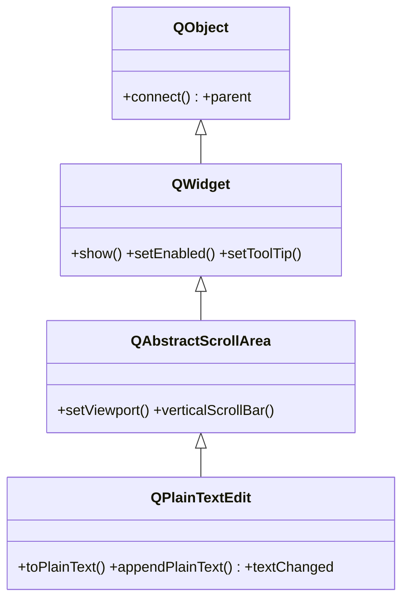

# QPlainTextEdit — editor de texto plano multilinea

`QPlainTextEdit` es un editor de **texto plano multilinea optimizado para mucho texto**: sin formato rico, pero rapido con miles de lineas. Es el widget para una consola/log, un visor de salida o un editor de codigo simple. Si necesitas formato (HTML, negritas, colores) usa [[QTextEdit]]; para volumen y velocidad, este. El scroll, el viewport y el marco vienen de su base `QAbstractScrollArea`.

## Importacion

```python
from PyQt6.QtWidgets import QPlainTextEdit
```

## Herencia



`QPlainTextEdit` deriva de `QAbstractScrollArea` (el area con barras de scroll y viewport; no tiene nota propia), que a su vez deriva de [[QWidget]]. De ahi vienen el scroll automatico, mostrarse y habilitarse; conectar señales y el `parent` vienen de `QObject`. Lo suyo es editar texto plano de forma eficiente.

## Señales

| Señal | Cuando se emite | Argumentos |
|-------|-----------------|------------|
| `textChanged` | cada vez que cambia el contenido (por usuario o por codigo) | — |

```python
editor.textChanged.connect(lambda: print("contenido modificado"))
```

## Propiedades

En Qt los "atributos" son **propiedades**: se leen con getter/setter, no como atributo directo.

| Propiedad | Tipo | Leer \| escribir | Controla |
|-----------|------|------------------|----------|
| `plainText` | `str` | `toPlainText()` \| `setPlainText(str)` | el contenido completo como texto plano |
| `readOnly` | `bool` | `isReadOnly()` \| `setReadOnly(bool)` | si se puede editar o solo leer |
| `enabled` | `bool` | `isEnabled()` \| `setEnabled(bool)` | habilitado o en gris (de [[QWidget]]) |

## Constructor y metodos

```python
QPlainTextEdit(parent: QWidget | None = None)
QPlainTextEdit(text: str, parent: QWidget | None = None)
```

Dos sobrecargas; la habitual es `QPlainTextEdit()` vacio.

| Firma | Devuelve | Que hace |
|-------|----------|----------|
| `toPlainText()` | `str` | el contenido completo como texto plano |
| `setPlainText(text: str)` | `None` | reemplaza todo el contenido |
| `appendPlainText(text: str)` | `None` | añade una linea al final (ideal para logs) |
| `setReadOnly(readonly: bool)` | `None` | hace el editor solo lectura |
| `clear()` | `None` | vacia el contenido |

## Casos de uso

```python
from PyQt6.QtWidgets import QApplication, QWidget, QPlainTextEdit, QVBoxLayout
import sys

app = QApplication(sys.argv)
w = QWidget(); lay = QVBoxLayout(w)

# 1. Una consola/log que crece con appendPlainText (solo lectura)
consola = QPlainTextEdit(); consola.setReadOnly(True)
consola.appendPlainText("[info] arrancando...")
consola.appendPlainText("[ok] listo")
lay.addWidget(consola)

# 2. Un editor de codigo simple
codigo = QPlainTextEdit()
codigo.setPlainText("def main():\n    print('hola')")
lay.addWidget(codigo)

w.show(); sys.exit(app.exec())
```

## Cuando usarlo vs QTextEdit

| Necesitas | Usa |
|-----------|-----|
| Texto plano, mucho volumen (logs, codigo, salida) | `QPlainTextEdit` (mas eficiente) |
| Formato rico: HTML, negritas, colores, imagenes | [[QTextEdit]] |

## Errores comunes

| Error | Causa | Solucion |
|-------|-------|----------|
| Esperabas que el HTML se renderizara | `QPlainTextEdit` solo maneja texto plano | usa [[QTextEdit]] con `setHtml(...)` |
| El log crece pero no veras la ultima linea | no hace scroll automatico al final por si solo en todos los casos | tras `appendPlainText`, mueve el cursor/scroll al final si hace falta |

## Notas relacionadas

- [[QTextEdit]] — editor de texto rico (HTML) cuando hace falta formato
- [[QWidget]] — de donde vienen `show`, `setEnabled` y el resto
- [[concepto_signals_slots]] — como conectar `textChanged` a un slot
