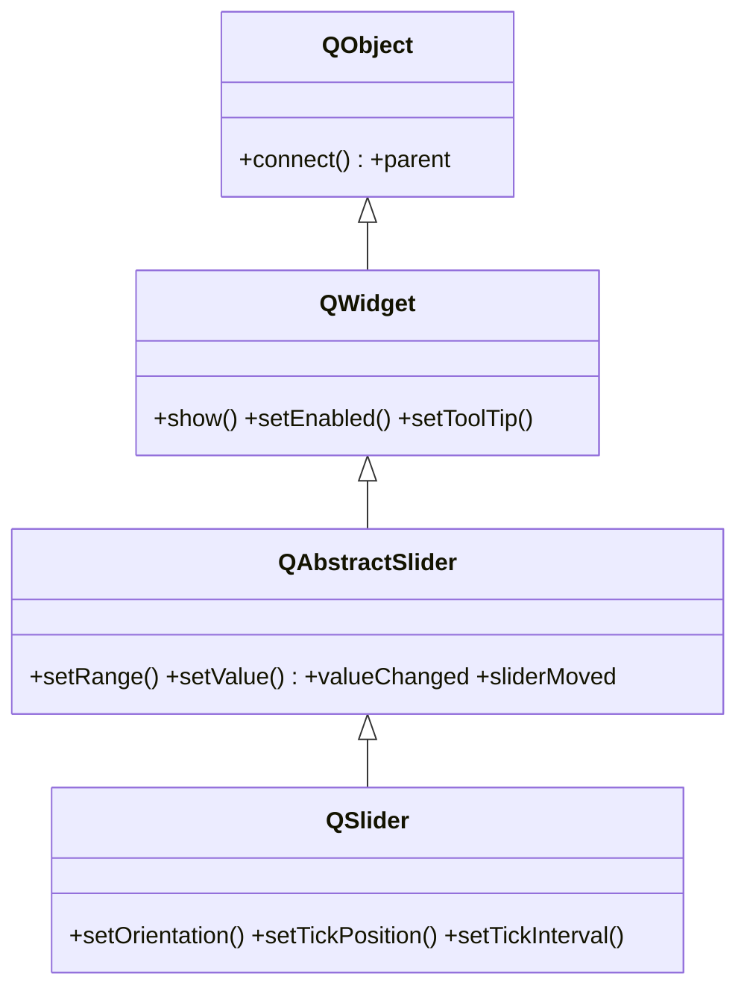

# QSlider — control deslizante para elegir un valor en un rango

`QSlider` es un control **deslizante**: el usuario arrastra un tirador a lo largo de una barra para elegir un valor entero dentro de un rango. Sirve cuando el valor exacto importa menos que ajustarlo de forma rapida y continua (volumen, brillo, posicion). Se le fija el rango con `setRange`, su orientacion (horizontal o vertical) y se conecta `valueChanged` para reaccionar mientras se arrastra.

## Importacion

```python
from PyQt6.QtWidgets import QSlider
```

## Herencia



El valor, el rango, los pasos y las senales (`valueChanged`, `sliderMoved`...) vienen de `QAbstractSlider` —compartidos con `QScrollBar` y `QDial`—; mostrarse y habilitarse de [[QWidget]]; conectar y el `parent` de `QObject`. `QSlider` agrega lo visual de la barra: orientacion y las marcas (ticks).

## Senales

| Senal | Cuando se emite | Argumentos |
|-------|-----------------|------------|
| `valueChanged` | cada vez que cambia el valor (arrastre, teclado o codigo) | `value: int` |
| `sliderMoved` | mientras el usuario arrastra el tirador | `value: int` |
| `sliderPressed` | al presionar el tirador | — |
| `sliderReleased` | al soltar el tirador | — |

```python
slider.valueChanged.connect(lambda v: print(v))   # v es int
```

## Propiedades

| Propiedad | Tipo | Leer \| escribir | Controla |
|-----------|------|------------------|----------|
| `value` | `int` | `value()` \| `setValue(int)` | el valor actual |
| `minimum` | `int` | `minimum()` \| `setMinimum(int)` | menor valor permitido |
| `maximum` | `int` | `maximum()` \| `setMaximum(int)` | mayor valor permitido |
| `orientation` | `Qt.Orientation` | `orientation()` \| `setOrientation(Qt.Orientation)` | horizontal o vertical |
| `singleStep` | `int` | `singleStep()` \| `setSingleStep(int)` | salto con las flechas del teclado |
| `pageStep` | `int` | `pageStep()` \| `setPageStep(int)` | salto con Re/Av Pag o clic en la barra |

## Constructor y metodos

```python
QSlider(parent: QWidget | None = None)
QSlider(orientation: Qt.Orientation, parent: QWidget | None = None)
```

La forma comun pasa la orientacion: `QSlider(Qt.Orientation.Horizontal)`.

| Firma | Devuelve | Que hace |
|-------|----------|----------|
| `value()` | `int` | el valor actual |
| `setValue(val: int)` | `None` | fija el valor (lo recorta al rango) |
| `setRange(min: int, max: int)` | `None` | fija minimo y maximo de una vez |
| `setOrientation(o: Qt.Orientation)` | `None` | `Qt.Orientation.Horizontal` o `.Vertical` |
| `setTickPosition(pos: QSlider.TickPosition)` | `None` | donde dibujar las marcas (ej. `QSlider.TickPosition.TicksBelow`) |
| `setTickInterval(ti: int)` | `None` | cada cuantas unidades hay una marca |

## Casos de uso

```python
from PyQt6.QtWidgets import (
    QApplication, QWidget, QSlider, QLabel, QVBoxLayout
)
from PyQt6.QtCore import Qt
import sys

app = QApplication(sys.argv)
w = QWidget(); lay = QVBoxLayout(w)

etiqueta = QLabel("Volumen: 50")
lay.addWidget(etiqueta)

# Control de volumen horizontal conectado al QLabel
slider = QSlider(Qt.Orientation.Horizontal)   # sin esto, seria vertical
slider.setRange(0, 100)
slider.setValue(50)
slider.setTickPosition(QSlider.TickPosition.TicksBelow)
slider.setTickInterval(10)
slider.valueChanged.connect(lambda v: etiqueta.setText(f"Volumen: {v}"))
lay.addWidget(slider)

w.show(); sys.exit(app.exec())
```

## Errores comunes

| Error | Causa | Solucion |
|-------|-------|----------|
| El slider sale vertical | la orientacion por defecto es vertical | pasa `Qt.Orientation.Horizontal` al construir o usa `setOrientation` |
| El tirador no se mueve / no llega lejos | no fijaste `setRange` | llama a `setRange(min, max)` |
| `Qt.Horizontal` da error | en PyQt6 los enums llevan scope | usa `Qt.Orientation.Horizontal` |

## Notas relacionadas

- [[QAbstractSlider]] — la base que aporta valor, rango y senales
- [[QWidget]] — de donde vienen `show` y `setEnabled`
- [[concepto_signals_slots]] — como conectar `valueChanged` a un slot
