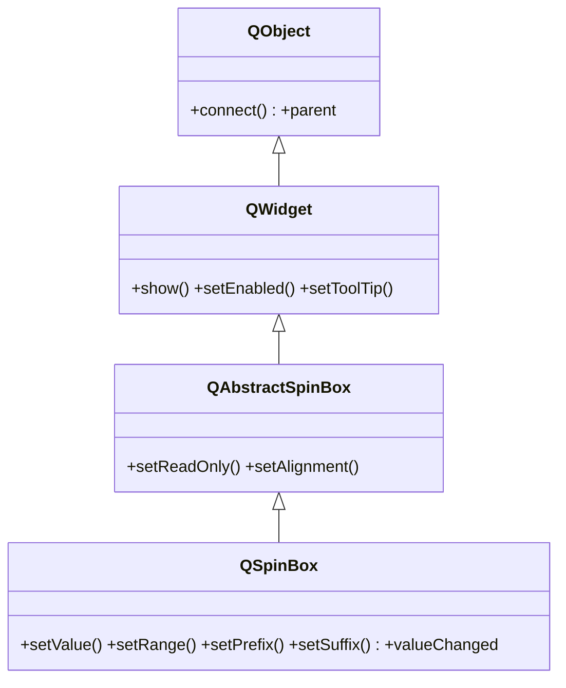

# QSpinBox — entrada de enteros con flechas arriba/abajo

`QSpinBox` es un campo para introducir un **numero entero** dentro de un rango: muestra el valor y unas flechas arriba/abajo para subirlo o bajarlo de a un paso (tambien con teclado o rueda del raton). Lo habitual es fijarle un rango con `setRange`, opcionalmente un prefijo o sufijo (" kg", "%"), y conectar su senal `valueChanged` para reaccionar al cambio. Para decimales se usa [[QDoubleSpinBox]].

## Importacion

```python
from PyQt6.QtWidgets import QSpinBox
```

## Herencia



La caja, las flechas y el comportamiento de edicion vienen de `QAbstractSpinBox`; mostrarse, habilitarse y el tooltip de [[QWidget]]; conectar senales y el `parent` de `QObject`. `QSpinBox` agrega lo especifico de enteros (valor, rango, paso, prefijo/sufijo).

## Senales

| Senal | Cuando se emite | Argumentos |
|-------|-----------------|------------|
| `valueChanged` | cada vez que cambia el valor entero | `value: int` |
| `textChanged` | cuando cambia el texto mostrado (incluye prefijo/sufijo) | `text: str` |

```python
spin.valueChanged.connect(lambda v: print(v))   # v es int
```

## Propiedades

En Qt los atributos son **propiedades** (getter/setter, no atributo directo):

| Propiedad | Tipo | Leer \| escribir | Controla |
|-----------|------|------------------|----------|
| `value` | `int` | `value()` \| `setValue(int)` | el valor entero actual |
| `minimum` | `int` | `minimum()` \| `setMinimum(int)` | menor valor permitido |
| `maximum` | `int` | `maximum()` \| `setMaximum(int)` | mayor valor permitido |
| `singleStep` | `int` | `singleStep()` \| `setSingleStep(int)` | cuanto sube/baja cada flecha |
| `prefix` | `str` | `prefix()` \| `setPrefix(str)` | texto antes del numero |
| `suffix` | `str` | `suffix()` \| `setSuffix(str)` | texto despues del numero (ej. " kg") |

## Constructor y metodos

```python
QSpinBox(parent: QWidget | None = None)
```

| Firma | Devuelve | Que hace |
|-------|----------|----------|
| `value()` | `int` | el valor entero actual |
| `setValue(val: int)` | `None` | fija el valor (lo recorta al rango) |
| `setRange(min: int, max: int)` | `None` | fija minimo y maximo de una vez |
| `setSingleStep(step: int)` | `None` | cuanto cambia el valor por cada flecha |
| `setPrefix(prefix: str)` | `None` | texto fijo antes del numero |
| `setSuffix(suffix: str)` | `None` | texto fijo despues del numero (ej. `" kg"`) |

## Casos de uso

```python
from PyQt6.QtWidgets import QApplication, QWidget, QSpinBox, QVBoxLayout
import sys

app = QApplication(sys.argv)
w = QWidget(); lay = QVBoxLayout(w)

# Selector de cantidad: rango, paso y sufijo
spin = QSpinBox()
spin.setRange(0, 100)        # sin esto, el rango por defecto es 0-99
spin.setSingleStep(5)
spin.setSuffix(" kg")
spin.setValue(10)
spin.valueChanged.connect(lambda v: print("cantidad:", v))  # v: int
lay.addWidget(spin)

w.show(); sys.exit(app.exec())
```

## Errores comunes

| Error | Causa | Solucion |
|-------|-------|----------|
| El valor se topa en 99 | no fijaste `setRange`; el rango por defecto es `0-99` | llama a `setRange(min, max)` |
| Necesito decimales pero se redondean | `QSpinBox` solo maneja enteros | usa [[QDoubleSpinBox]] |
| El sufijo aparece pegado al numero | olvidaste el espacio inicial | usa `setSuffix(" kg")` con espacio |

## Notas relacionadas

- [[QAbstractSpinBox]] — la base que aporta la caja y las flechas
- [[QDoubleSpinBox]] — la version para numeros decimales
- [[concepto_signals_slots]] — como conectar `valueChanged` a un slot
