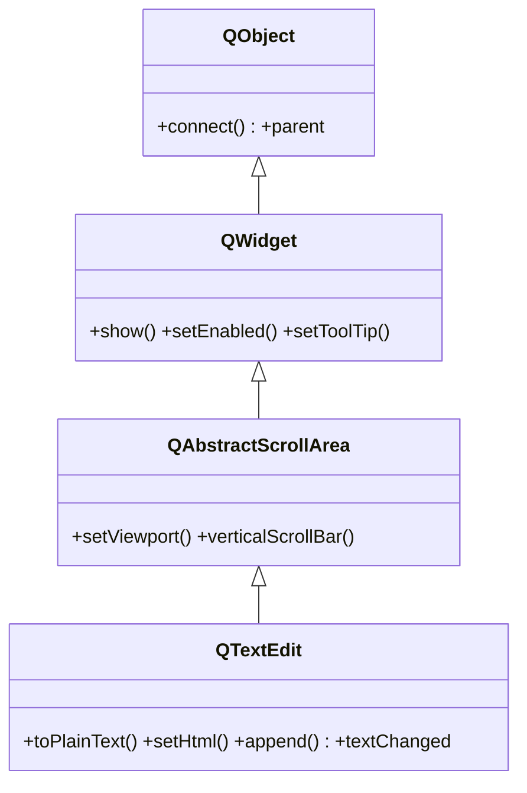

# QTextEdit — editor de texto rico multilinea

`QTextEdit` es un editor de **texto multilinea con formato rico**: ademas de texto plano admite **HTML** (negritas, colores, listas, imagenes). Es el widget para un area de notas, un visor de HTML o un campo de comentarios con formato. Si solo necesitas texto plano y mucho volumen (logs, codigo), usa el mas ligero [[QPlainTextEdit]]. El scroll, el viewport y el marco vienen de su base `QAbstractScrollArea`.

## Importacion

```python
from PyQt6.QtWidgets import QTextEdit
```

## Herencia



`QTextEdit` deriva de `QAbstractScrollArea` (el area con barras de scroll y viewport; no tiene nota propia), que a su vez deriva de [[QWidget]]. De ahi vienen el scroll automatico, mostrarse y habilitarse; conectar senales y el `parent` vienen de `QObject`. Lo suyo es editar/mostrar texto con formato.

## Senales

| Senal | Cuando se emite | Argumentos |
|-------|-----------------|------------|
| `textChanged` | cada vez que cambia el contenido (por usuario o por codigo) | — |

```python
editor.textChanged.connect(lambda: print("contenido modificado"))
```

## Propiedades

En Qt los "atributos" son **propiedades**: se leen con getter/setter, no como atributo directo.

| Propiedad | Tipo | Leer \| escribir | Controla |
|-----------|------|------------------|----------|
| `plainText` | `str` | `toPlainText()` \| `setPlainText(str)` | el contenido como texto sin formato |
| `html` | `str` | `toHtml()` \| `setHtml(str)` | el contenido como HTML (formato rico) |
| `readOnly` | `bool` | `isReadOnly()` \| `setReadOnly(bool)` | si se puede editar o solo leer |
| `enabled` | `bool` | `isEnabled()` \| `setEnabled(bool)` | habilitado o en gris (de [[QWidget]]) |

## Constructor y metodos

```python
QTextEdit(parent: QWidget | None = None)
QTextEdit(text: str, parent: QWidget | None = None)
```

Dos sobrecargas; la habitual es `QTextEdit()` vacio. El `text` inicial se interpreta como texto plano.

| Firma | Devuelve | Que hace |
|-------|----------|----------|
| `toPlainText()` | `str` | el contenido como texto sin formato |
| `setPlainText(text: str)` | `None` | reemplaza todo el contenido por texto plano |
| `toHtml()` | `str` | el contenido serializado como HTML |
| `setHtml(html: str)` | `None` | reemplaza todo el contenido interpretando HTML |
| `append(text: str)` | `None` | anade un parrafo al final (acepta HTML) |
| `setReadOnly(readonly: bool)` | `None` | hace el editor solo lectura |
| `clear()` | `None` | vacia el contenido |

## Casos de uso

```python
from PyQt6.QtWidgets import QApplication, QWidget, QTextEdit, QVBoxLayout
import sys

app = QApplication(sys.argv)
w = QWidget(); lay = QVBoxLayout(w)

# 1. Area de notas con texto plano
notas = QTextEdit()
notas.setPlainText("Escribe aqui tus notas...")
lay.addWidget(notas)

# 2. Mostrar HTML con formato (solo lectura)
visor = QTextEdit()
visor.setReadOnly(True)
visor.setHtml("<h3>Titulo</h3><p>Texto en <b>negrita</b> y <i>cursiva</i>.</p>")
lay.addWidget(visor)

# 3. Un log que crece con append
log = QTextEdit(); log.setReadOnly(True)
log.append("[info] iniciado")
log.append("[ok] conectado")
lay.addWidget(log)

w.show(); sys.exit(app.exec())
```

## Errores comunes

| Error | Causa | Solucion |
|-------|-------|----------|
| `toPlainText()` devuelve etiquetas HTML como texto | metiste HTML con `setPlainText` (lo trata literal) | usa `setHtml(...)` para que interprete el formato |
| El editor va lento con miles de lineas | `QTextEdit` mantiene un documento con formato (pesado) | si es texto plano, usa [[QPlainTextEdit]] |
| El usuario edita un visor que deberia ser de lectura | falto el modo solo lectura | llama a `setReadOnly(True)` |

## Notas relacionadas

- [[QPlainTextEdit]] — texto plano multilinea, mas ligero para mucho volumen
- [[QWidget]] — de donde vienen `show`, `setEnabled` y el resto
- [[concepto_signals_slots]] — como conectar `textChanged` a un slot
