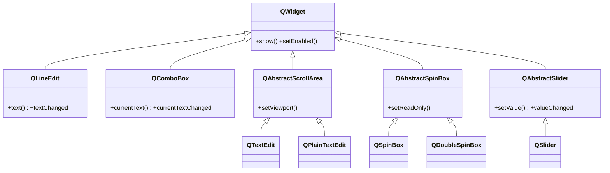
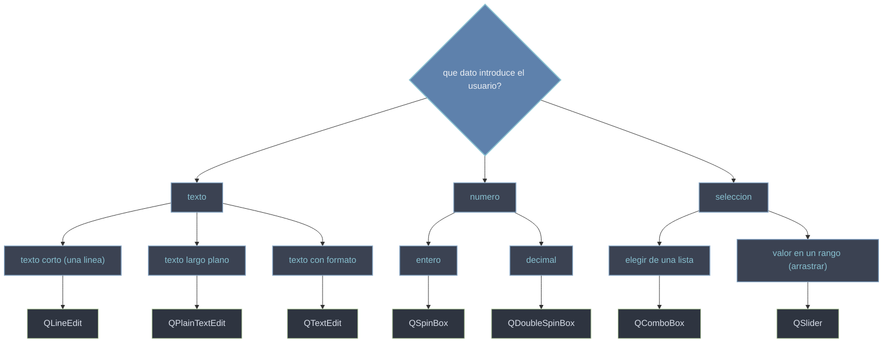

# QtWidgets/entradas — campos de entrada de datos

Esta carpeta agrupa los widgets con los que el usuario **INTRODUCE datos** en la interfaz: texto (una linea o varios parrafos), numeros (enteros o decimales) y seleccion (elegir de una lista o un valor dentro de un rango). Frente a los widgets de salida (que solo muestran), estos **reciben** la entrada y avisan del cambio mediante senales —tipicamente `valueChanged` o `textChanged`— que conectas a un slot para procesar lo introducido (ver [[concepto_signals_slots]]).

## En accion

Un mini formulario con tres tipos de entrada (texto, numero y seleccion) colocados con un `QFormLayout`, que alinea automaticamente cada etiqueta con su campo.

```python
from PyQt6.QtWidgets import (
    QApplication, QWidget, QFormLayout, QLineEdit, QSpinBox, QComboBox
)
import sys

app = QApplication(sys.argv)
ventana = QWidget()
ventana.setWindowTitle("entradas")

form = QFormLayout(ventana)

nombre = QLineEdit()                      # texto corto
edad = QSpinBox(); edad.setRange(0, 120)  # entero
pais = QComboBox()                        # elegir de una lista
pais.addItems(["Espana", "Mexico", "Peru"])

form.addRow("Nombre:", nombre)
form.addRow("Edad:", edad)
form.addRow("Pais:", pais)

nombre.textChanged.connect(lambda t: print("nombre:", t))
edad.valueChanged.connect(lambda v: print("edad:", v))
pais.currentTextChanged.connect(lambda t: print("pais:", t))

ventana.show()
sys.exit(app.exec())
```

## Herencia



Cada familia cuelga de [[QWidget]] por su propia base: los editores de texto largo (`QTextEdit`, `QPlainTextEdit`) sobre `QAbstractScrollArea` porque necesitan scroll; las cajas numericas (`QSpinBox`, `QDoubleSpinBox`) sobre `QAbstractSpinBox`; el deslizante sobre `QAbstractSlider`; mientras que `QLineEdit` y `QComboBox` cuelgan directos de `QWidget`.

## Que entrada uso



## Las clases

| Clase | Hereda de | Senal clave | Rol |
|-------|-----------|-------------|-----|
| [[QLineEdit]] | `QWidget` | `textChanged` | una linea de **texto corto** (nombre, busqueda) |
| [[QTextEdit]] | `QAbstractScrollArea` | `textChanged` | texto largo **con formato** (negrita, color, HTML) |
| [[QPlainTextEdit]] | `QAbstractScrollArea` | `textChanged` | texto largo **plano**, ligero (logs, codigo) |
| [[QSpinBox]] | `QAbstractSpinBox` | `valueChanged` | un **entero** con flechas y rango |
| [[QDoubleSpinBox]] | `QAbstractSpinBox` | `valueChanged` | un **decimal (float)** con flechas y rango |
| [[QComboBox]] | `QWidget` | `currentTextChanged` | elegir **una opcion** de una lista desplegable |
| [[QSlider]] | `QAbstractSlider` | `valueChanged` | un valor en un **rango** arrastrando un tirador |

## Notas relacionadas

- [[QWidget]] — la base comun de todos estos campos
- [[concepto_signals_slots]] — como conectar `valueChanged`/`textChanged` a un slot
