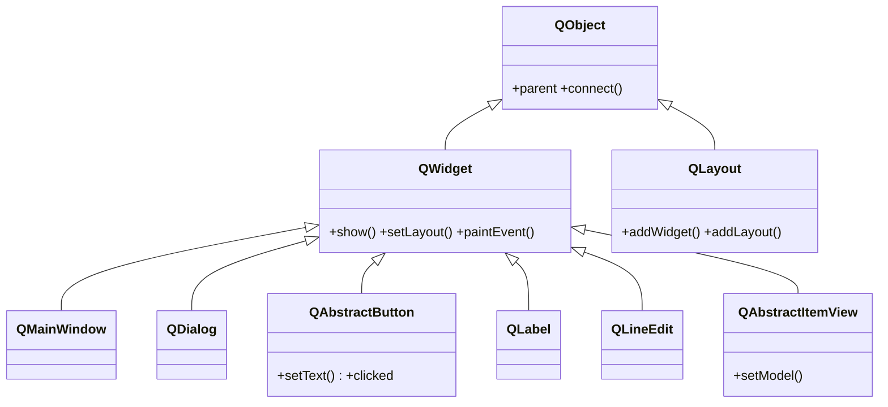

# QtWidgets — los widgets de escritorio

`QtWidgets` es el modulo de los **widgets de escritorio**: todo lo que se ve y se toca en una app clasica. Aqui viven las dos piezas que sostienen el resto: `QApplication` (la app y su bucle de eventos) y `QWidget` (la **base de todo widget**). De `QWidget` cuelga practicamente todo lo demas —los widgets concretos (botones, entradas, etiquetas), las ventanas, los layouts que los colocan y las vistas que muestran datos—. Saber que cada cosa es un `QWidget` es saber que ya tiene `show()`, eventos de raton/teclado y se puede estilizar con QSS.

## En accion

```python
from PyQt6.QtWidgets import (
    QApplication, QMainWindow, QWidget, QVBoxLayout, QLabel, QPushButton
)
import sys

app = QApplication(sys.argv)              # la app y el bucle de eventos

ventana = QMainWindow()                   # una ventana con barra de titulo
ventana.setWindowTitle("QtWidgets en accion")

central = QWidget()                       # el contenedor central
layout = QVBoxLayout(central)             # un layout que apila en vertical
layout.addWidget(QLabel("Hola desde QtWidgets"))

boton = QPushButton("Pulsame")
boton.clicked.connect(lambda: print("clic!"))
layout.addWidget(boton)

ventana.setCentralWidget(central)
ventana.show()
sys.exit(app.exec())                      # exec() (PyQt6, sin guion bajo) bloquea
```

## Herencia



Casi todo el modulo es una rama de `QWidget`: ventanas (`QMainWindow`, `QDialog`), botones (`QAbstractButton`), texto (`QLabel`, `QLineEdit`) y vistas (`QAbstractItemView`). Los **layouts** son la excepcion visible: heredan de `QLayout`, que cuelga directo de `QObject` —no son widgets, sino los gestores que **colocan** widgets dentro de uno.

## Subcarpetas

| Carpeta / nota | Que agrupa | Clases tipicas |
|----------------|-----------|----------------|
| [[QApplication]] | la app y el bucle de eventos | `QApplication` |
| [[QWidget]] | la base de todo widget | `QWidget` |
| [[PyQt6/QtWidgets/ventanas/index\|ventanas]] | ventanas y dialogos de nivel superior | `QMainWindow`, `QDialog`, `QMessageBox`, `QFileDialog` |
| [[PyQt6/QtWidgets/botones/index\|botones]] | botones y casillas | `QAbstractButton`, `QPushButton`, `QCheckBox`, `QRadioButton` |
| [[PyQt6/QtWidgets/entradas/index\|entradas]] | campos de entrada de datos | `QLineEdit`, `QSpinBox`, `QComboBox`... |
| [[PyQt6/QtWidgets/muestra/index\|muestra]] | widgets que solo muestran | `QLabel`, `QProgressBar` |
| [[PyQt6/QtWidgets/contenedores/index\|contenedores]] | agrupan y organizan otros widgets | `QGroupBox`, `QTabWidget`, `QScrollArea`... |
| [[PyQt6/QtWidgets/layouts/index\|layouts]] | colocan los widgets en la ventana | `QVBoxLayout`, `QHBoxLayout`, `QGridLayout`, `QFormLayout` |
| [[PyQt6/QtWidgets/vistas/index\|vistas]] | muestran modelos de datos | `QListView`, `QTableView`, `QTreeView` + sus widgets |
| [[PyQt6/QtWidgets/menus/index\|menus]] | menus, barras y estado de la ventana | `QMenuBar`, `QMenu`, `QToolBar`, `QStatusBar` |

## Notas relacionadas

- [[QApplication]] — el punto de entrada de toda app de widgets
- [[QWidget]] — la clase base de la que cuelga todo el modulo
- [[PyQt6/index\|PyQt6]] — el indice raiz de la libreria
