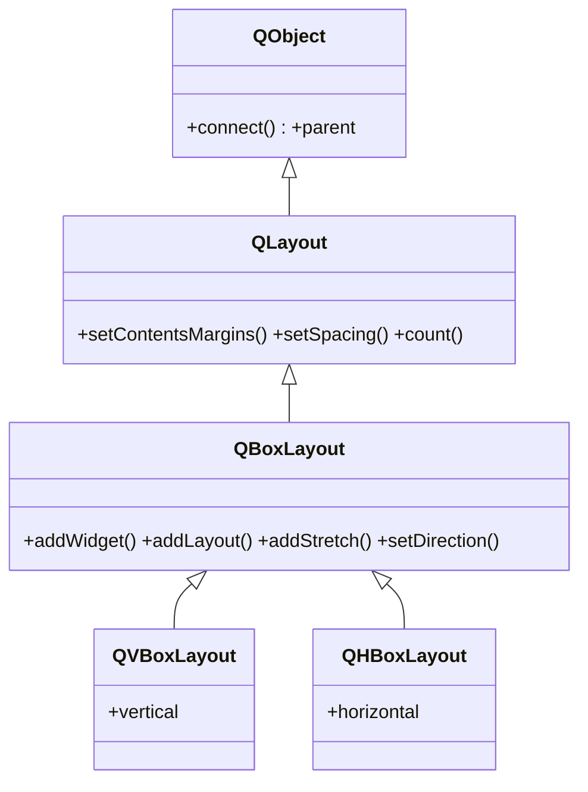

# QBoxLayout — apila widgets en una sola direccion

`QBoxLayout` es la base de [[QVBoxLayout]] y `QHBoxLayout`: coloca los widgets hijos **en una sola direccion** (vertical u horizontal), uno tras otro. Casi nunca se usa "tal cual": lo normal es instanciar directamente las subclases concretas, que solo fijan la direccion por ti. Sus metodos para añadir (`addWidget`, `addLayout`, `addStretch`...) viven aqui y los heredan ambas subclases. Toda la gestion de geometria comun (margenes, espaciado) viene de [[QLayout]].

## Importacion

```python
from PyQt6.QtWidgets import QBoxLayout
```

Se importa para tipar o usar sus enums de direccion; para construir un layout se importan las subclases (`QVBoxLayout`, `QHBoxLayout`).

## Herencia



Lo que `QBoxLayout` **no** define lo hereda: el `parent` y el ser objeto Qt vienen de `QObject`; margenes, espaciado y conteo (`setContentsMargins`, `setSpacing`, `count`) vienen de [[QLayout]]. Lo propio de `QBoxLayout` es colocar en linea y exponer `addStretch`/`addSpacing` y la direccion. Sus dos subclases solo prefijan esa direccion.

## Propiedades

| Propiedad | Tipo | Leer \| escribir | Controla |
|-----------|------|------------------|----------|
| `direction` | `QBoxLayout.Direction` | `direction()` \| `setDirection(Direction)` | sentido en que se apilan los widgets |
| `spacing` | `int` | `spacing()` \| `setSpacing(int)` | separacion entre widgets (px), de [[QLayout]] |
| `contentsMargins` | `QMargins` | `contentsMargins()` \| `setContentsMargins(l, t, r, b)` | margen interior, de [[QLayout]] |

Las direcciones son un enum con scope (PyQt6): `QBoxLayout.Direction.TopToBottom`, y ademas `BottomToTop`, `LeftToRight`, `RightToLeft`.

## Constructor y metodos

```python
QBoxLayout(direction: QBoxLayout.Direction, parent: QWidget | None = None)
```

A diferencia de sus subclases, `QBoxLayout` exige la direccion como primer argumento. El `parent` es opcional: si se pasa, el layout se instala en ese widget contenedor.

| Firma | Devuelve | Que hace |
|-------|----------|----------|
| `addWidget(w: QWidget, stretch: int = 0, alignment: Qt.AlignmentFlag = Qt.AlignmentFlag(0))` | `None` | añade un widget; `stretch` reparte el espacio sobrante |
| `addLayout(layout: QLayout, stretch: int = 0)` | `None` | anida otro layout dentro de este |
| `addStretch(stretch: int = 0)` | `None` | inserta espacio elastico que empuja a los widgets |
| `addSpacing(size: int)` | `None` | inserta un hueco fijo de `size` px |
| `insertWidget(index: int, w: QWidget, stretch: int = 0)` | `None` | añade un widget en la posicion `index` |
| `setSpacing(spacing: int)` | `None` | separacion en px entre widgets (heredado de [[QLayout]]) |
| `setContentsMargins(l: int, t: int, r: int, b: int)` | `None` | fija el margen interior (heredado de [[QLayout]]) |
| `setDirection(direction: QBoxLayout.Direction)` | `None` | cambia el sentido del apilado |

## Casos de uso

El concepto clave de `QBoxLayout` es el **stretch**: factor de reparto del espacio sobrante. `addStretch()` inserta un "muelle" que se expande y empuja a los widgets hacia un lado.

```python
from PyQt6.QtWidgets import (
    QApplication, QWidget, QPushButton, QHBoxLayout, QBoxLayout
)
import sys

app = QApplication(sys.argv)
w = QWidget()

# Direccion explicita: equivalente a un QHBoxLayout
lay = QBoxLayout(QBoxLayout.Direction.LeftToRight, w)

# addStretch entre los dos botones: el muelle los empuja a los extremos
lay.addWidget(QPushButton("Atras"))
lay.addStretch(1)                 # espacio elastico en medio
lay.addWidget(QPushButton("Siguiente"))

w.show()
sys.exit(app.exec())
```

El `stretch` de `addWidget` reparte proporcionalmente: con `addWidget(a, 2)` y `addWidget(b, 1)`, `a` recibe el doble de espacio extra que `b`.

## Errores comunes

| Error | Causa | Solucion |
|-------|-------|----------|
| `QBoxLayout(parent)` da `TypeError` | falta la direccion: es el primer argumento obligatorio | pasa `QBoxLayout(QBoxLayout.Direction.TopToBottom, parent)` o usa una subclase |
| `AttributeError: TopToBottom` | en PyQt6 los enums tienen scope | usa `QBoxLayout.Direction.TopToBottom`, no `QBoxLayout.TopToBottom` |
| Los widgets no se pegan al borde | falta el espacio elastico que los empuje | inserta `addStretch()` antes o despues |
| El layout no aparece | un layout no es un widget | asignalo a un contenedor y muestra el contenedor |

## Notas relacionadas

- [[QLayout]] — la base que aporta margenes, espaciado y `addWidget`
- [[QVBoxLayout]] — subclase que fija la direccion vertical
- [[concepto_layouts]] — modelo mental de la gestion de geometria en Qt
