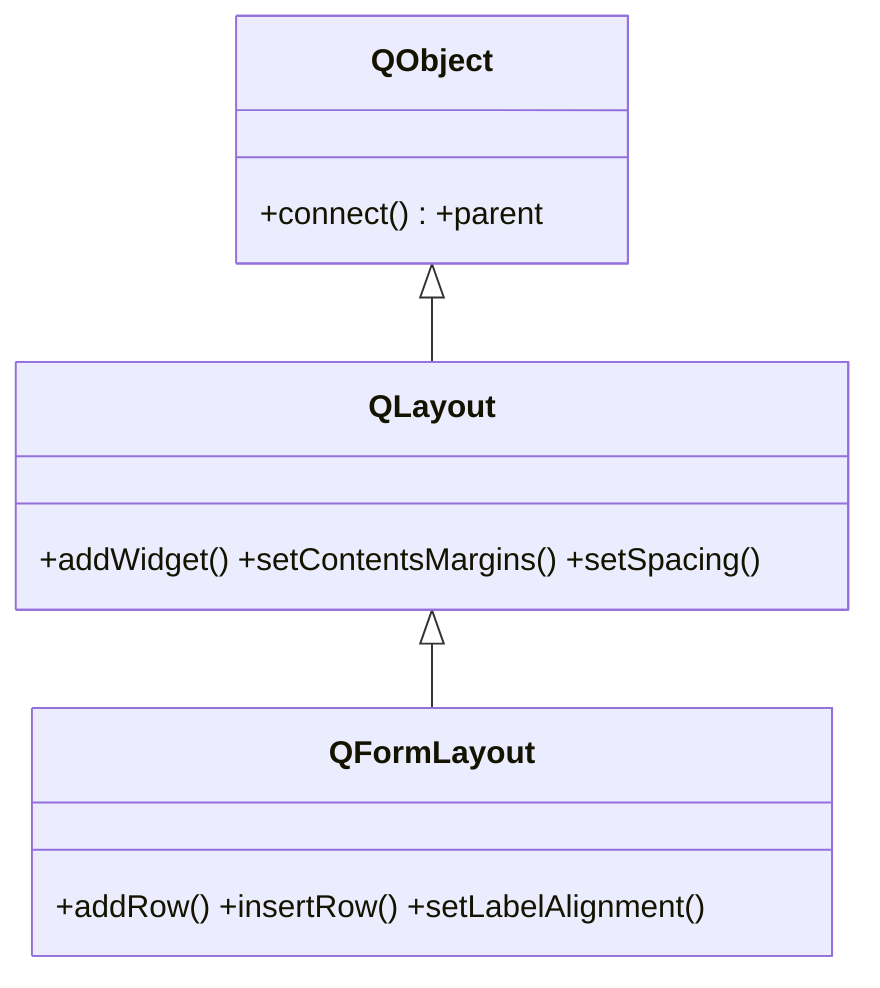

# QFormLayout — filas de etiqueta + campo para formularios

`QFormLayout` dispone los widgets en **filas de dos columnas**: una etiqueta a la izquierda y su control a la derecha. Es el layout ideal para **formularios** (nombre/email/edad...): se anaden filas con `addRow` y el layout se encarga de alinear etiquetas y campos, sin tener que calcular coordenadas. Toda la gestion de geometria la hereda de [[QLayout]]; lo suyo es el patron etiqueta-campo.

## Importacion

```python
from PyQt6.QtWidgets import QFormLayout
```

## Herencia



Lo comun a todo layout (margenes, espaciado, contar/quitar items) viene de [[QLayout]]; de ahi tambien el ser un `QObject` con `parent` y **no** un widget. `QFormLayout` aporta el `addRow` y la disposicion en pares etiqueta-campo, que `QGridLayout` haria a mano.

## Propiedades

| Propiedad | Tipo | Leer \| escribir | Controla |
|-----------|------|------------------|----------|
| `labelAlignment` | `Qt.AlignmentFlag` | `labelAlignment()` \| `setLabelAlignment(flag)` | alineacion de la columna de etiquetas |
| `rowWrapPolicy` | `QFormLayout.RowWrapPolicy` | `rowWrapPolicy()` \| `setRowWrapPolicy(p)` | si la etiqueta baja sobre el campo cuando no cabe |
| `spacing` | `int` | `spacing()` \| `setSpacing(int)` | separacion entre filas/columnas (heredado de [[QLayout]]) |
| `contentsMargins` | `QMargins` | `contentsMargins()` \| `setContentsMargins(l, t, r, b)` | margen interior (heredado de [[QLayout]]) |

## Constructor y metodos

```python
QFormLayout(parent: QWidget | None = None)
```

Si se pasa `parent`, el layout se instala en ese widget; lo habitual es `QFormLayout(contenedor)`. `addRow` tiene varias sobrecargas segun lo que sea la etiqueta:

| Firma | Devuelve | Que hace |
|-------|----------|----------|
| `addRow(label: str, field: QWidget)` | `None` | fila con texto de etiqueta + control (lo habitual) |
| `addRow(label: QWidget, field: QWidget)` | `None` | fila con un widget como etiqueta + control |
| `addRow(widget: QWidget)` | `None` | una fila que ocupa **ambas columnas** (ej. un boton) |
| `insertRow(fila: int, label: str, field: QWidget)` | `None` | inserta una fila en la posicion `fila` |
| `setLabelAlignment(alignment: Qt.AlignmentFlag)` | `None` | alinea la columna de etiquetas (izquierda, derecha...) |
| `setSpacing(spacing: int)` | `None` | separacion en px entre filas/columnas |
| `rowCount()` | `int` | numero de filas del formulario |

> En PyQt6 los enums tienen scope: `Qt.AlignmentFlag.AlignRight`, no `Qt.AlignRight`.

## Casos de uso

```python
from PyQt6.QtWidgets import (
    QApplication, QWidget, QFormLayout, QLineEdit, QSpinBox, QPushButton
)
from PyQt6.QtCore import Qt
import sys

app = QApplication(sys.argv)
w = QWidget()
form = QFormLayout(w)

# 1. Filas etiqueta-campo: el texto va como primer argumento
form.addRow("Nombre:", QLineEdit())
form.addRow("Email:", QLineEdit())

# 2. Otro control en una fila (un spin para la edad)
edad = QSpinBox()
edad.setRange(0, 120)
form.addRow("Edad:", edad)

# 3. Un boton que ocupa toda la fila (sin etiqueta): un solo argumento
form.addRow(QPushButton("Enviar"))

# 4. Alinear las etiquetas a la derecha
form.setLabelAlignment(Qt.AlignmentFlag.AlignRight)

w.show()
sys.exit(app.exec())
```

## Errores comunes

| Error | Causa | Solucion |
|-------|-------|----------|
| Montas un `QGridLayout` a mano para un formulario | `QFormLayout` ya alinea etiqueta y campo solo | usa `addRow("Etiqueta:", control)` y olvidate de las coordenadas |
| Mezclar `addRow` con `addWidget` en el mismo layout | `addWidget` no respeta el patron de dos columnas | en un formulario usa solo `addRow`; para layouts libres, `QGridLayout` |
| El boton no ocupa toda la fila | lo pasaste como `field` de una etiqueta | usa la sobrecarga de un solo argumento: `addRow(QPushButton(...))` |
| `setLabelAlignment(Qt.AlignRight)` da error | en PyQt6 los enums tienen scope | usa `Qt.AlignmentFlag.AlignRight` |

## Notas relacionadas

- [[QLayout]] — la clase base que aporta margenes, espaciado y anadir/quitar
- [[concepto_layouts]] — modelo mental de la gestion de geometria en Qt
- [[QGridLayout]] — la rejilla generica que `QFormLayout` especializa para formularios
