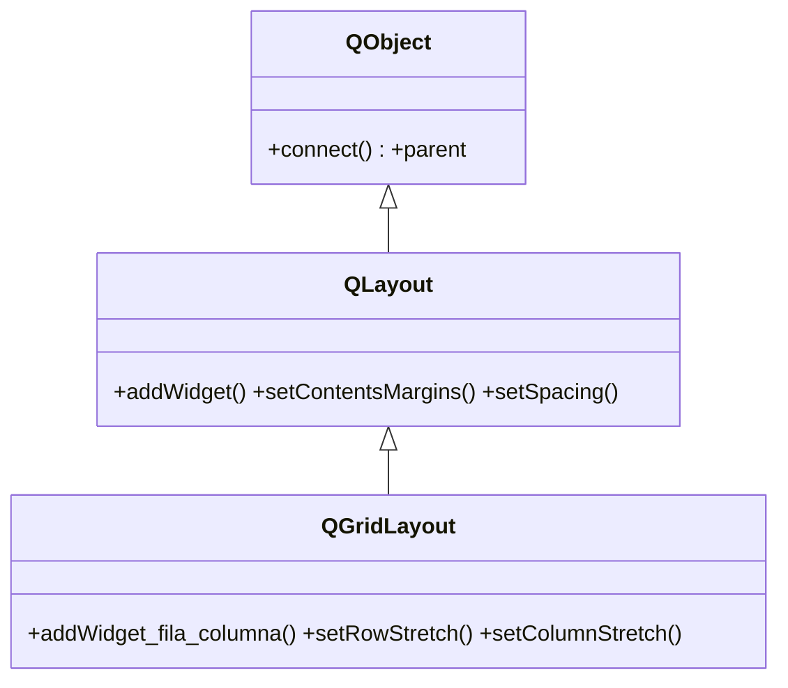

# QGridLayout — coloca widgets en una rejilla de filas y columnas

`QGridLayout` coloca los widgets en una **rejilla** de filas y columnas: cada widget ocupa una celda `(fila, columna)`, y puede extenderse a varias con `rowSpan`/`columnSpan`. Es el layout para todo lo que tiene forma de cuadricula: formularios en rejilla, calculadoras, paneles de mandos. Toda la gestion de geometria (margenes, espaciado, añadir/quitar) la hereda de [[QLayout]]; lo suyo es ubicar por coordenadas en vez de en linea.

## Importacion

```python
from PyQt6.QtWidgets import QGridLayout
```

## Herencia



Lo comun a todo layout (margenes, espaciado, contar/quitar items) viene de [[QLayout]]; de ahi tambien el ser un `QObject` con `parent` y **no** un widget. `QGridLayout` aporta lo de la rejilla: el `addWidget` con `fila`/`columna`, el span y los stretch por fila/columna.

## Propiedades

| Propiedad | Tipo | Leer \| escribir | Controla |
|-----------|------|------------------|----------|
| `spacing` | `int` | `spacing()` \| `setSpacing(int)` | separacion uniforme entre celdas (px) |
| `horizontalSpacing` | `int` | `horizontalSpacing()` \| `setHorizontalSpacing(int)` | separacion horizontal entre columnas |
| `verticalSpacing` | `int` | `verticalSpacing()` \| `setVerticalSpacing(int)` | separacion vertical entre filas |
| `contentsMargins` | `QMargins` | `contentsMargins()` \| `setContentsMargins(l, t, r, b)` | margen interior (heredado de [[QLayout]]) |

## Constructor y metodos

```python
QGridLayout(parent: QWidget | None = None)
```

Si se pasa `parent`, el layout se instala en ese widget; lo habitual es `QGridLayout(contenedor)`. Las filas y columnas se crean solas al usarlas: no hay que dimensionar la rejilla de antemano. **Importante: `row` y `column` empiezan en 0.**

| Firma | Devuelve | Que hace |
|-------|----------|----------|
| `addWidget(w: QWidget, row: int, column: int, rowSpan: int = 1, columnSpan: int = 1, alignment=Qt.AlignmentFlag(0))` | `None` | ubica `w` en la celda `(row, column)`; con `rowSpan`/`columnSpan` ocupa varias celdas |
| `addLayout(layout: QLayout, row: int, column: int, rowSpan: int = 1, columnSpan: int = 1)` | `None` | anida un sub-layout en la celda `(row, column)` |
| `setRowStretch(row: int, stretch: int)` | `None` | factor de crecimiento de la fila: la de mayor `stretch` se queda el espacio sobrante |
| `setColumnStretch(column: int, stretch: int)` | `None` | factor de crecimiento de la columna (idem en horizontal) |
| `setSpacing(spacing: int)` | `None` | separacion uniforme entre celdas en px |
| `setColumnMinimumWidth(column: int, ancho: int)` | `None` | ancho minimo en px para esa columna |
| `setRowMinimumHeight(row: int, alto: int)` | `None` | alto minimo en px para esa fila |
| `rowCount()` | `int` | numero de filas usadas |
| `columnCount()` | `int` | numero de columnas usadas |

> En PyQt6 los enums tienen scope: `Qt.AlignmentFlag.AlignCenter`, no `Qt.AlignCenter`.

## Casos de uso

```python
from PyQt6.QtWidgets import (
    QApplication, QWidget, QPushButton, QLabel, QLineEdit, QGridLayout
)
from PyQt6.QtCore import Qt
import sys

app = QApplication(sys.argv)
w = QWidget()
grid = QGridLayout(w)

# 1. Rejilla 2x2 de botones (fila, columna empiezan en 0)
grid.addWidget(QPushButton("1"), 0, 0)
grid.addWidget(QPushButton("2"), 0, 1)
grid.addWidget(QPushButton("3"), 1, 0)
grid.addWidget(QPushButton("4"), 1, 1)

# 2. Un widget que ocupa las dos columnas con columnSpan
grid.addWidget(QLineEdit("ocupa toda la fila"), 2, 0, 1, 2)

# 3. Una etiqueta centrada con alignment
grid.addWidget(QLabel("titulo"), 3, 0, 1, 2,
               Qt.AlignmentFlag.AlignCenter)

# 4. Stretch: la columna 1 se queda el espacio sobrante al ensanchar
grid.setColumnStretch(0, 0)
grid.setColumnStretch(1, 1)

w.show()
sys.exit(app.exec())
```

## Errores comunes

| Error | Causa | Solucion |
|-------|-------|----------|
| Dos widgets aparecen montados uno sobre otro | los anadiste a la **misma celda** `(row, column)` | usa coordenadas distintas, o un span que no pise otra celda |
| El widget cae en la fila/columna equivocada | olvidaste que `row`/`column` empiezan en **0**, no en 1 | la primera celda es `(0, 0)` |
| El span no se extiende | pasaste `rowSpan`/`columnSpan` en el orden incorrecto | la firma es `addWidget(w, row, column, rowSpan, columnSpan)` |
| Ninguna columna crece al ensanchar la ventana | no fijaste `setColumnStretch` en ninguna | da `stretch > 0` a la columna que deba crecer |

## Notas relacionadas

- [[QLayout]] — la clase base que aporta margenes, espaciado y añadir/quitar
- [[concepto_layouts]] — modelo mental de la gestion de geometria en Qt
- [[QFormLayout]] — para formularios etiqueta-campo, donde la rejilla a mano sobra
