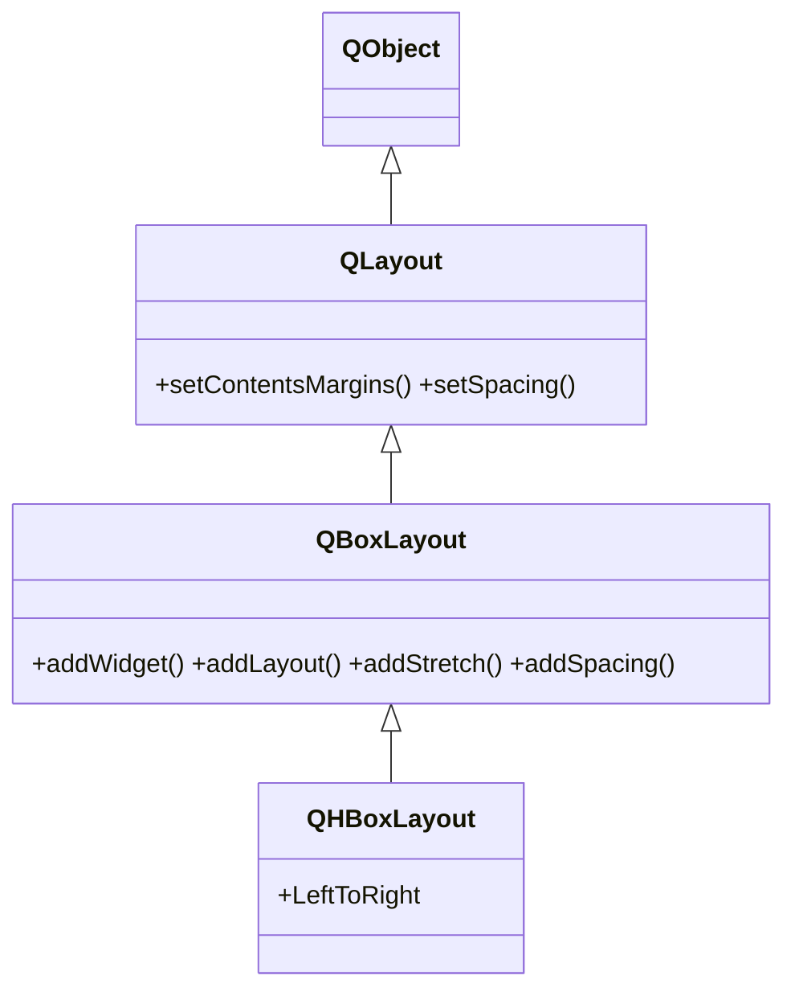

# QHBoxLayout — apila widgets en horizontal

`QHBoxLayout` apila los widgets hijos **horizontalmente**, de izquierda a derecha (una fila). Es la version horizontal de [[QVBoxLayout]]: una subclase de [[QBoxLayout]] que **no anade nada nuevo**, solo fija la direccion en `LeftToRight`. Todos sus metodos (`addWidget`, `addStretch`, `addSpacing`, `setSpacing`...) los hereda; por eso esta nota es breve.

## Importacion

```python
from PyQt6.QtWidgets import QHBoxLayout
```

## Herencia



`QHBoxLayout` apenas aporta logica propia: hereda de [[QBoxLayout]] toda la forma de anadir y empujar widgets, y de [[QLayout]] los margenes y el espaciado. Lo unico suyo es prefijar la direccion horizontal.

## Constructor y metodos

```python
QHBoxLayout(parent: QWidget | None = None)
```

No pide direccion: ya es `LeftToRight`. Si se pasa `parent`, el layout se instala en ese widget contenedor. Todos sus metodos vienen de [[QBoxLayout]] (`addWidget`, `addLayout`, `addStretch`, `insertWidget`, `setSpacing`, `setContentsMargins`...).

## Casos de uso

Una fila de botones. Combinado con `addStretch` se alinean a un lado: el muelle elastico ocupa el espacio sobrante y empuja a los botones hacia la derecha.

```python
from PyQt6.QtWidgets import QApplication, QWidget, QPushButton, QHBoxLayout
import sys

app = QApplication(sys.argv)
ventana = QWidget()

fila = QHBoxLayout(ventana)
fila.addStretch(1)                  # empuja todo lo que sigue a la derecha
fila.addWidget(QPushButton("Aceptar"))
fila.addWidget(QPushButton("Cancelar"))

ventana.show()
sys.exit(app.exec())
```

## Errores comunes

| Error | Causa | Solucion |
|-------|-------|----------|
| Los botones quedan a la izquierda y querias a la derecha | falta el espacio elastico que los empuje | pon `addStretch()` antes de los botones |
| El layout no organiza nada | lo creaste suelto y no lo asignaste | usa `QHBoxLayout(ventana)` o `ventana.setLayout(lay)` |

## Notas relacionadas

- [[QBoxLayout]] — la base de la que hereda todos sus metodos
- [[QVBoxLayout]] — la version vertical
- [[concepto_layouts]] — modelo mental de la gestion de geometria en Qt
