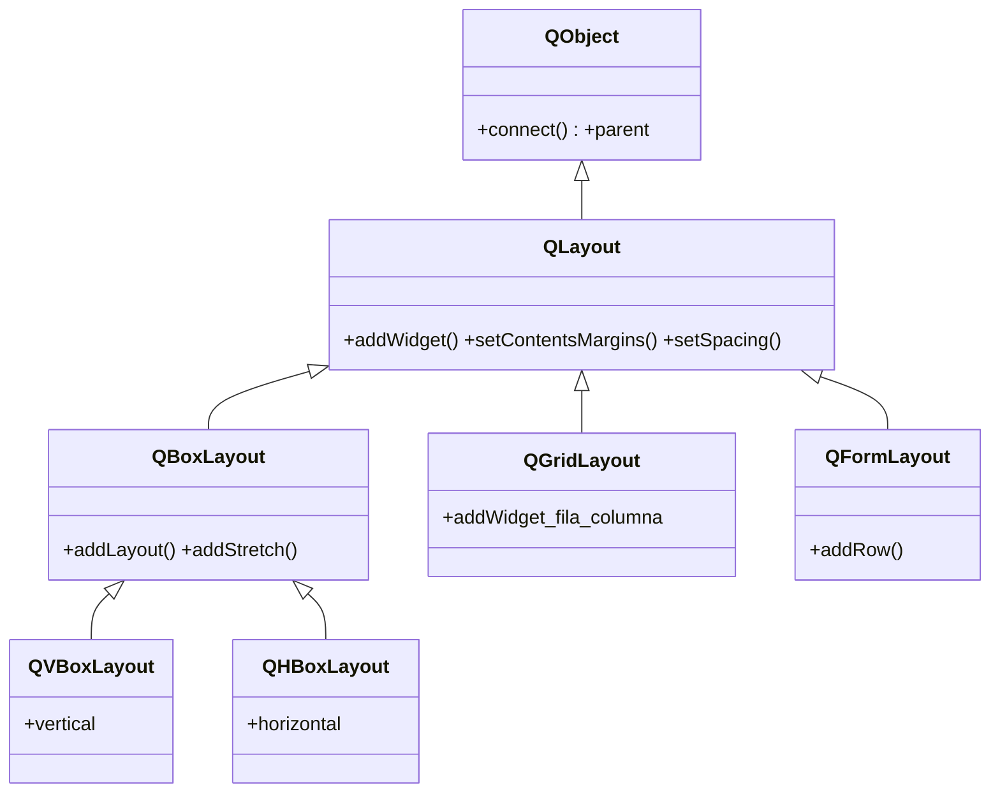

# QLayout — base de los gestores de geometria

`QLayout` es la clase base de todos los layouts de Qt: `QVBoxLayout`/`QHBoxLayout` (via `QBoxLayout`), `QGridLayout` y `QFormLayout`. Su trabajo es **gestionar la geometria de los widgets hijos**: colocarlos y redimensionarlos cuando la ventana cambia de tamano. Punto clave: **no es un widget** — hereda de `QObject`, no de [[QWidget]] — por eso un layout no se muestra ni se pulsa; se **asigna a un widget contenedor** y este lo dibuja. No se usa `QLayout` directo: siempre una subclase concreta.

## Importacion

```python
from PyQt6.QtWidgets import QLayout
```

Se importa para tipar o como base; para construir se importan las subclases (`QVBoxLayout`, `QGridLayout`...).

## Herencia



`QLayout` hereda de `QObject` (no de [[QWidget]]): de ahi el `parent` y el ser un objeto Qt, pero **no** la capacidad de mostrarse. Lo comun a todo layout (anadir widgets, margenes, espaciado) vive aqui; cada subclase aporta su forma de colocar (`QBoxLayout` en linea, `QGridLayout` en rejilla, `QFormLayout` en pares etiqueta-campo).

## Propiedades

| Propiedad | Tipo | Leer \| escribir | Controla |
|-----------|------|------------------|----------|
| `contentsMargins` | `QMargins` | `contentsMargins()` \| `setContentsMargins(l, t, r, b)` | margen interior alrededor del contenido |
| `spacing` | `int` | `spacing()` \| `setSpacing(int)` | separacion entre widgets hijos (px) |
| `enabled` | `bool` | `isEnabled()` \| `setEnabled(bool)` | si el layout reorganiza al cambiar de tamano |

## Constructor y metodos

```python
QLayout(parent: QWidget | None = None)
```

No se instancia directo (es abstracta): da error o un layout inutil. Si se pasa `parent`, el layout se instala en ese widget. Sus metodos los heredan todas las subclases:

| Firma | Devuelve | Que hace |
|-------|----------|----------|
| `addWidget(w: QWidget)` | `None` | anade un widget al layout (lo coloca y gestiona) |
| `addItem(item: QLayoutItem)` | `None` | anade un item generico (uso interno/avanzado) |
| `addLayout(sub: QLayout)` | `None` | anida un layout dentro de otro (definido en subclases como `QBoxLayout`) |
| `setContentsMargins(l: int, t: int, r: int, b: int)` | `None` | fija el margen interior en pixeles |
| `setSpacing(spacing: int)` | `None` | separacion en px entre los widgets |
| `count()` | `int` | numero de items en el layout |
| `itemAt(i: int)` | `QLayoutItem \| None` | el item en la posicion `i` (para recorrer/eliminar) |
| `removeWidget(w: QWidget)` | `None` | quita un widget del layout (no lo destruye) |
| `setAlignment(alignment: Qt.AlignmentFlag)` | `bool` | alinea el contenido dentro del espacio disponible |

> En PyQt6 los enums tienen scope: `Qt.AlignmentFlag.AlignCenter`, no `Qt.AlignCenter`.

## Casos de uso

Siempre con una subclase concreta. El patron es: crear el layout sobre un widget contenedor y anadirle widgets.

```python
from PyQt6.QtWidgets import QApplication, QWidget, QPushButton, QVBoxLayout
import sys

app = QApplication(sys.argv)
w = QWidget()

lay = QVBoxLayout(w)               # el layout se instala en w (su contenedor)
lay.setContentsMargins(12, 12, 12, 12)
lay.setSpacing(8)
lay.addWidget(QPushButton("Aceptar"))
lay.addWidget(QPushButton("Cancelar"))

w.show()                           # se muestra w; el layout no se muestra, organiza
sys.exit(app.exec())
```

## Personalizar (subclasear)

Subclasear `QLayout` es **raro** y avanzado: solo se hace para inventar una estrategia de colocacion que no cubran los layouts existentes (un layout de flujo, circular...). Exige implementar `addItem`, `itemAt`, `takeAt`, `count`, `sizeHint` y `setGeometry`. Para casi todo, combinar `QVBoxLayout`/`QHBoxLayout`/`QGridLayout` anidados es suficiente; no es lo habitual subclasear.

## Errores comunes

| Error | Causa | Solucion |
|-------|-------|----------|
| El layout no aparece / nada se ve | un layout no es un widget; no se muestra solo | asignalo a un widget: `QVBoxLayout(contenedor)` y muestra el contenedor |
| Los widgets se solapan o ignoran el layout | les pusiste posicion/parent a mano en vez de `addWidget` | anadelos siempre con `addWidget` / `addLayout` |
| `QLayout(...)` directo no organiza | es abstracta | usa una subclase (`QVBoxLayout`, `QGridLayout`...) |
| `addWidget` no acepta fila/columna | esa firma es de `QGridLayout`, no de `QLayout` | usa `QGridLayout.addWidget(w, fila, col)` |

## Notas relacionadas

- [[concepto_layouts]] — modelo mental de la gestion de geometria en Qt
- [[QWidget]] — el contenedor al que se asigna el layout
- [[QVBoxLayout]] — la subclase concreta mas usada
