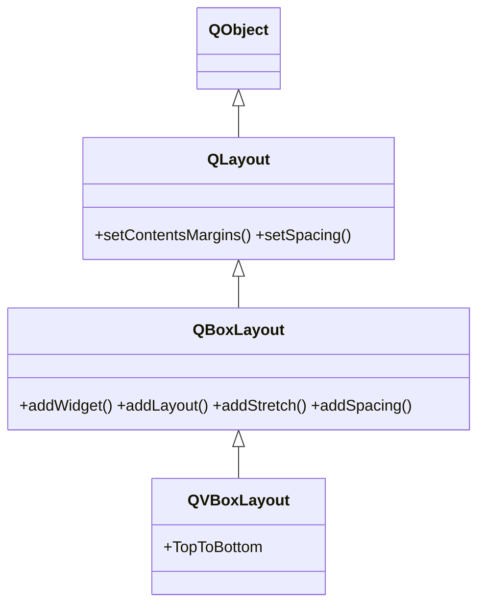

# QVBoxLayout — apila widgets en vertical

`QVBoxLayout` apila los widgets hijos **verticalmente**, de arriba a abajo (una columna). Es una subclase de [[QBoxLayout]] que **no anade nada nuevo**: solo fija la direccion en `TopToBottom`. Todos sus metodos (`addWidget`, `addStretch`, `addSpacing`, `setSpacing`...) los hereda; esta nota es breve por eso. Es, junto a [[QHBoxLayout]], el layout mas usado.

## Importacion

```python
from PyQt6.QtWidgets import QVBoxLayout
```

## Herencia



`QVBoxLayout` apenas aporta logica propia: hereda de [[QBoxLayout]] toda la forma de anadir y empujar widgets, y de [[QLayout]] los margenes y el espaciado. Lo unico suyo es prefijar la direccion vertical.

## Constructor y metodos

```python
QVBoxLayout(parent: QWidget | None = None)
```

A diferencia de [[QBoxLayout]], **no** pide direccion: ya es `TopToBottom`. Si se pasa `parent`, el layout se instala en ese widget contenedor. Todos sus metodos vienen de [[QBoxLayout]] (`addWidget`, `addLayout`, `addStretch`, `insertWidget`, `setSpacing`, `setContentsMargins`...).

## Casos de uso

Una columna de widgets. Hay dos formas de asignar el layout al contenedor: pasarlo en el constructor o con `setLayout`.

```python
from PyQt6.QtWidgets import QApplication, QWidget, QPushButton, QVBoxLayout
import sys

app = QApplication(sys.argv)

# Forma 1: el layout se instala directo en la ventana
ventana = QWidget()
lay = QVBoxLayout(ventana)
lay.addWidget(QPushButton("Arriba"))
lay.addWidget(QPushButton("Abajo"))

# Forma 2 (equivalente): crear el layout suelto y asignarlo
# lay = QVBoxLayout()
# ventana.setLayout(lay)

ventana.show()
sys.exit(app.exec())
```

## Errores comunes

| Error | Causa | Solucion |
|-------|-------|----------|
| El layout no organiza nada | lo creaste suelto y no lo asignaste | usa `QVBoxLayout(ventana)` o `ventana.setLayout(lay)` |
| `QWidget already has a layout` | asignaste dos layouts al mismo widget | un widget solo admite un layout; anida sublayouts con `addLayout` |

## Notas relacionadas

- [[QBoxLayout]] — la base de la que hereda todos sus metodos
- [[QHBoxLayout]] — la version horizontal
- [[concepto_layouts]] — modelo mental de la gestion de geometria en Qt
