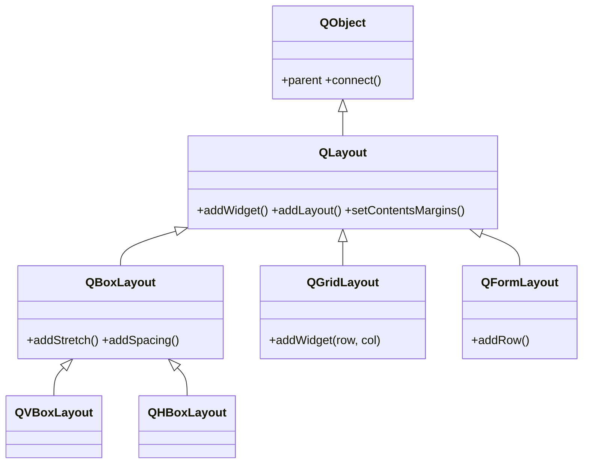
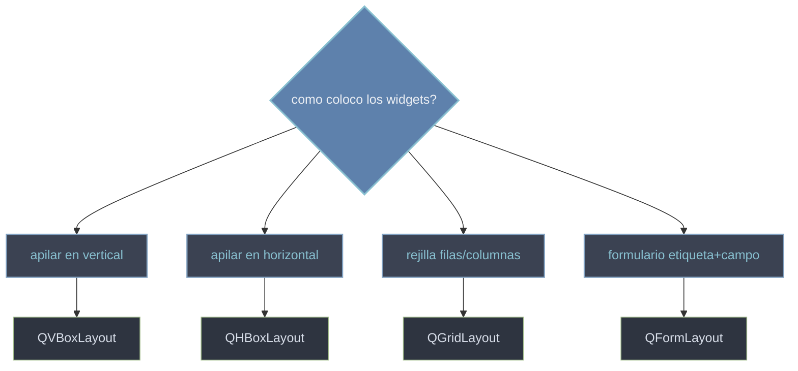

# QtWidgets/layouts — colocar widgets automaticamente

Esta carpeta agrupa la **gestion geometrica**: los layouts colocan y redimensionan los widgets **automaticamente** cuando cambia el tamaño de la ventana (ver [[concepto_layouts]]). En lugar de fijar coordenadas a mano con `setGeometry`/`move` —que clava la interfaz a unas posiciones rigidas que se descuadran al maximizar, cambiar la fuente o traducir el texto—, tu describes la **relacion** entre los widgets (en columna, en fila, en rejilla o como formulario) y el layout recalcula posiciones y tamaños en cada redimension. Un layout no es un widget: hereda de `QLayout`, que cuelga directo de `QObject`, y se limita a **gestionar** la geometria de los widgets que contiene.

## En accion

Anidar un `QHBoxLayout` dentro de un `QVBoxLayout` es el patron base de casi cualquier dialogo: contenido arriba en columna y, al fondo, una fila de botones empujada a la derecha con un stretch.

```python
from PyQt6.QtWidgets import (
    QApplication, QWidget, QVBoxLayout, QHBoxLayout, QLabel, QPushButton
)
import sys

app = QApplication(sys.argv)
ventana = QWidget()
ventana.setWindowTitle("layouts anidados")

raiz = QVBoxLayout(ventana)                 # layout principal: apila en vertical
raiz.addWidget(QLabel("Confirmas la operacion?"))

fila = QHBoxLayout()                         # sub-layout: apila en horizontal
fila.addStretch()                            # empuja los botones a la derecha
fila.addWidget(QPushButton("Cancelar"))
fila.addWidget(QPushButton("Aceptar"))
raiz.addLayout(fila)                         # anidar la fila dentro de la columna

ventana.show()
sys.exit(app.exec())                         # exec() (PyQt6, sin guion bajo) bloquea
```

## Herencia



Los layouts son la excepcion visible del modulo: heredan de `QLayout` —no de `QWidget`—, asi que no se dibujan; lo que define `QLayout` (añadir, anidar, margenes) lo heredan todos. `QVBoxLayout` y `QHBoxLayout` son `QBoxLayout` configurado en una direccion; `QGridLayout` y `QFormLayout` cuelgan directos de `QLayout`.

## Que layout uso



## Las clases

| Clase | Hereda de | Rol |
|-------|-----------|-----|
| [[QLayout]] | `QObject` | base abstracta de todos los layouts: añadir, anidar, margenes y espaciado |
| [[QBoxLayout]] | `QLayout` | base de los layouts en linea (vertical u horizontal); `addStretch`, `addSpacing` |
| [[QVBoxLayout]] | `QBoxLayout` | apila los widgets en **columna** (de arriba a abajo) |
| [[QHBoxLayout]] | `QBoxLayout` | apila los widgets en **fila** (de izquierda a derecha) |
| [[QGridLayout]] | `QLayout` | coloca los widgets en una **rejilla** por fila y columna |
| [[QFormLayout]] | `QLayout` | filas de **etiqueta + campo** para formularios |

## Notas relacionadas

- [[concepto_layouts]] — la gestion geometrica: por que un layout y no `setGeometry`
- [[QWidget]] — el contenedor al que se le asigna un layout
