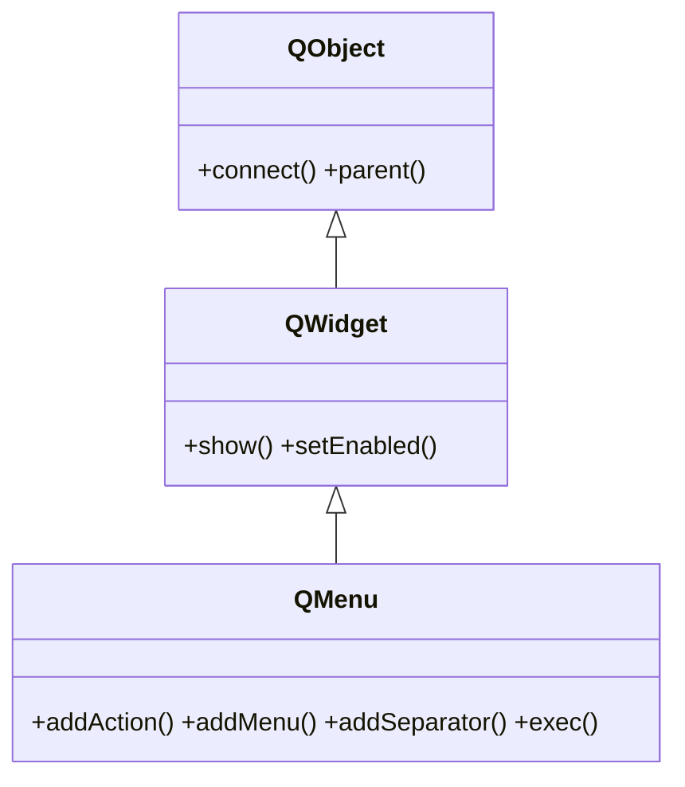

# QMenu — menu desplegable de acciones, submenus y separadores

`QMenu` es un **menu desplegable**: una lista de acciones (`QAction`, en PyQt6 vive en `QtGui`), submenus y separadores. Aparece desde la barra de menus de una [[QMenuBar]], desde un boton, o con clic derecho como **menu contextual** (`exec`). El patron tipico es crearlo con `barra.addMenu("Archivo")`, llenarlo con `addAction`, y conectar el `triggered` de cada accion a un slot.

## Importacion

```python
from PyQt6.QtWidgets import QMenu
```

## Herencia



Como `QMenu` **ES un [[QWidget]]**, lo que no define lo hereda: mostrarse, habilitarse y la geometria vienen de `QWidget`; conectar senales y el `parent` vienen de `QObject`. Lo suyo es agrupar acciones y mostrarse como desplegable o contextual.

## Senales

| Senal | Cuando se emite | Argumentos |
|-------|-----------------|------------|
| `triggered` | se eligio una accion del menu | `action: QAction` (la accion activada) |
| `aboutToShow` | justo antes de mostrarse | — (util para rellenar el menu al vuelo) |

```python
menu.triggered.connect(lambda accion: print(accion.text()))
```

> El `triggered` del **menu** te da la accion elegida (cualquiera). El `triggered` de cada **QAction** es individual: no los confundas.

## Propiedades

En Qt los "atributos" son **propiedades** (getter/setter, no atributo directo). Las relevantes (la mayoria heredadas de [[QWidget]]):

| Propiedad | Tipo | Leer \| escribir | Controla |
|-----------|------|------------------|----------|
| `title` | `str` | `title()` \| `setTitle(str)` | el texto del menu en la barra o submenu |
| `enabled` | `bool` | `isEnabled()` \| `setEnabled(bool)` | habilitado o en gris (de [[QWidget]]) |
| `icon` | `QIcon` | `icon()` \| `setIcon(QIcon)` | icono del menu (en submenus y barras) |

## Constructor y metodos

```python
QMenu(parent: QWidget | None = None)
QMenu(titulo: str, parent: QWidget | None = None)
```

Dos sobrecargas; pero lo habitual es **no instanciarlo a mano** y obtenerlo de `barra.addMenu("Archivo")`. Para un menu contextual, si se crea suelto pasandole el widget padre.

| Firma | Devuelve | Que hace |
|-------|----------|----------|
| `addAction(texto: str)` | `QAction` | crea una accion con ese texto y la devuelve |
| `addAction(action: QAction)` | `None` | anade una `QAction` ya creada al menu |
| `addMenu(titulo: str)` | `QMenu` | crea y devuelve un submenu |
| `addSeparator()` | `QAction` | inserta una linea separadora entre grupos |
| `exec(pos: QPoint)` | `QAction` | muestra el menu en esa posicion (contextual) y devuelve la accion elegida |

## Casos de uso

```python
from PyQt6.QtWidgets import QApplication, QMainWindow, QLabel
import sys

app = QApplication(sys.argv)

ventana = QMainWindow()
ventana.setCentralWidget(QLabel("Contenido"))

# 1. Llenar un menu "Archivo" con acciones, separador y conectar cada triggered
menu_archivo = ventana.menuBar().addMenu("Archivo")

abrir = menu_archivo.addAction("Abrir")          # addAction devuelve la QAction
abrir.triggered.connect(lambda: print("abrir"))  # guardala para conectarla

guardar = menu_archivo.addAction("Guardar")
guardar.triggered.connect(lambda: print("guardar"))

menu_archivo.addSeparator()

salir = menu_archivo.addAction("Salir")
salir.triggered.connect(ventana.close)

ventana.show()
sys.exit(app.exec())                    # PyQt6: exec() (sin guion bajo)
```

Como **menu contextual** (clic derecho), se crea suelto y se muestra con `exec` en la posicion global del raton:

```python
def contextMenuEvent(self, event):      # sobreescrito en un QWidget
    menu = QMenu(self)
    menu.addAction("Copiar")
    menu.addAction("Pegar")
    menu.exec(event.globalPos())        # bloquea y devuelve la accion elegida
```

## Errores comunes

| Error | Causa | Solucion |
|-------|-------|----------|
| No puedo conectar la accion que cree | hiciste `addAction("X")` y descartaste lo que devuelve | guarda el retorno: `acc = menu.addAction("X")` y conecta `acc.triggered` |
| Recibo la accion equivocada al conectar | confundiste el `triggered` del menu con el de la accion | conecta el `triggered` de cada `QAction`, o usa el del menu para todas |
| El menu contextual no aparece | usaste `exec` con una posicion local en vez de global | pasa `event.globalPos()` a `exec(pos)` |

## Notas relacionadas

- [[QMenuBar]] — la barra de la que cuelga este menu desplegable
- [[QAction]] — las acciones que llenan el menu y emiten su propio `triggered`
- [[QMainWindow]] — la ventana que aporta la barra de menus
