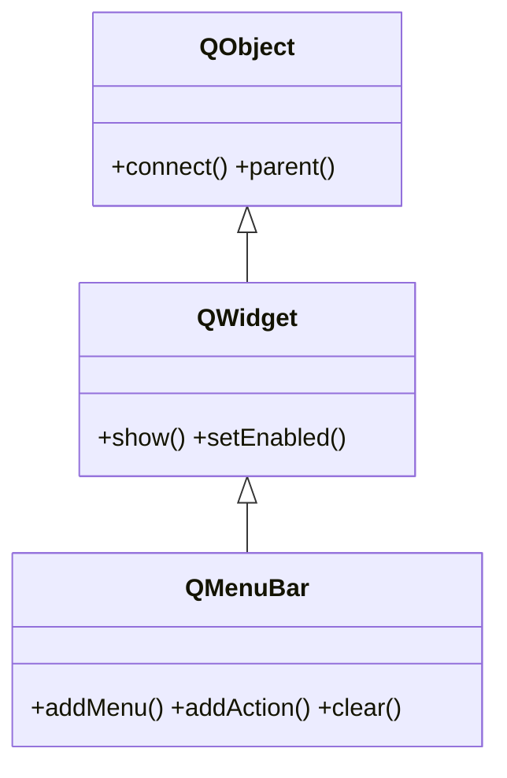

# QMenuBar — la barra de menus horizontal de la ventana principal

`QMenuBar` es la **barra de menus** horizontal que se ve en la parte superior de una [[QMainWindow]] (Archivo, Editar, Ayuda...). Casi nunca se crea a mano: una `QMainWindow` ya tiene la suya y se obtiene con `ventana.menuBar()`, que la crea la primera vez. Sobre ella se cuelgan menus desplegables ([[QMenu]]) con `addMenu`, y cada menu se llena de acciones (`QAction`, que en PyQt6 vive en `QtGui`).

## Importacion

```python
from PyQt6.QtWidgets import QMenuBar
```

## Herencia



Como `QMenuBar` **ES un [[QWidget]]**, lo que no define lo hereda: mostrarse, habilitarse y la geometria vienen de `QWidget`; conectar senales y el `parent` vienen de `QObject`. Lo suyo es solo organizar los menus de nivel superior de la ventana.

## Senales

| Senal | Cuando se emite | Argumentos |
|-------|-----------------|------------|
| `triggered` | se activo cualquier accion de cualquiera de sus menus | `action: QAction` (la accion elegida) |

```python
barra.triggered.connect(lambda accion: print(accion.text()))
```

## Propiedades

En Qt los "atributos" son **propiedades** (getter/setter, no atributo directo). Las relevantes (la mayoria heredadas de [[QWidget]]):

| Propiedad | Tipo | Leer \| escribir | Controla |
|-----------|------|------------------|----------|
| `enabled` | `bool` | `isEnabled()` \| `setEnabled(bool)` | habilitada o en gris (de [[QWidget]]) |
| `visible` | `bool` | `isVisible()` \| `setVisible(bool)` | si esta mostrada (de [[QWidget]]) |
| `nativeMenuBar` | `bool` | `isNativeMenuBar()` \| `setNativeMenuBar(bool)` | usar la barra nativa del SO (macOS arriba del todo) |

## Constructor y metodos

```python
QMenuBar(parent: QWidget | None = None)
```

Un unico constructor, pero **lo idiomatico es no instanciarla**: usa `ventana.menuBar()` sobre una [[QMainWindow]].

| Firma | Devuelve | Que hace |
|-------|----------|----------|
| `addMenu(titulo: str)` | `QMenu` | crea un menu desplegable con ese titulo y lo devuelve |
| `addMenu(menu: QMenu)` | `QAction` | acopla un `QMenu` ya creado a la barra |
| `addAction(texto: str)` | `QAction` | anade una accion directa en la barra (poco habitual) |
| `clear()` | `None` | elimina todos los menus y acciones de la barra |

## Casos de uso

```python
from PyQt6.QtWidgets import QApplication, QMainWindow, QLabel
import sys

app = QApplication(sys.argv)

ventana = QMainWindow()
ventana.setWindowTitle("App con barra de menus")
ventana.setCentralWidget(QLabel("Contenido"))

# La barra de menus de la ventana (la crea la primera vez)
barra = ventana.menuBar()

# Cada addMenu devuelve un QMenu que luego se llena de acciones
menu_archivo = barra.addMenu("Archivo")
menu_archivo.addAction("Salir")

menu_editar = barra.addMenu("Editar")
menu_editar.addAction("Copiar")

ventana.show()
sys.exit(app.exec())                    # PyQt6: exec() (sin guion bajo)
```

## Errores comunes

| Error | Causa | Solucion |
|-------|-------|----------|
| La barra no aparece | creaste un `QMenuBar` suelto en vez de usar la de la ventana | usa `ventana.menuBar()` sobre una [[QMainWindow]] |
| `addAction` en la barra no abre nada | metiste una accion directa donde iba un menu | crea un menu con `addMenu("Archivo")` y mete ahi las acciones |
| El texto del menu no se ve en macOS | la barra nativa reubica algunos items | normal en macOS; si molesta, `setNativeMenuBar(False)` |

## Notas relacionadas

- [[QMainWindow]] — la ventana que aporta la barra de menus con `menuBar()`
- [[QMenu]] — el menu desplegable que se cuelga de la barra
- [[QAction]] — el elemento de menu que se ejecuta al elegirlo
