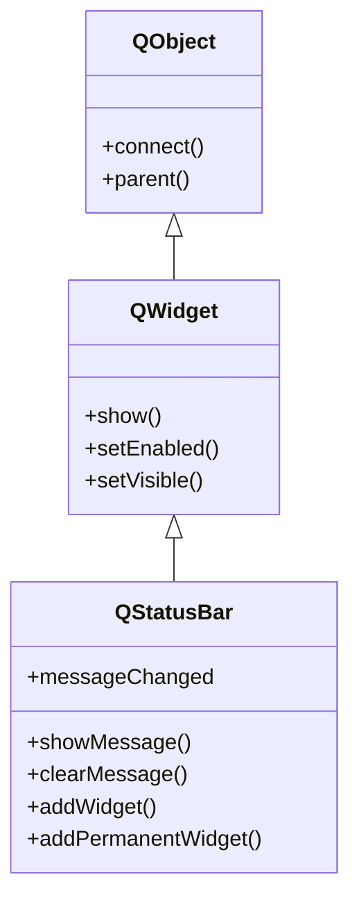

# QStatusBar — barra de estado inferior para mensajes breves

Una **barra de estado** es la franja inferior de una [[QMainWindow]] para **mensajes breves**
(hints, "Listo", "Guardando...") y **widgets de estado permanentes** (un indicador de conexion,
una barra de progreso). No se crea suelta: se obtiene con `ventana.statusBar()`, que la construye
la primera vez y te la devuelve ya acoplada abajo del todo.

## Importacion

```python
from PyQt6.QtWidgets import QStatusBar
```

## Herencia



Como `QStatusBar` **ES un [[QWidget]]**, lo que no define lo hereda: mostrarse, habilitarse y la
geometria vienen de `QWidget`; conectar senales y el `parent` vienen de `QObject`. Lo suyo es
gestionar los **mensajes temporales** y los widgets de estado, temporales o permanentes.

## Senales

| Senal | Cuando se emite | Argumentos |
|-------|-----------------|------------|
| `messageChanged` | cada vez que cambia el mensaje temporal (al ponerlo o al expirar) | `texto: str` (el mensaje nuevo; vacio `""` cuando se borra) |

```python
ventana.statusBar().messageChanged.connect(lambda t: print("estado:", t))
```

## Propiedades

`QStatusBar` casi no expone propiedades configurables: su estado se maneja con metodos
(`showMessage`, `addWidget`). La unica propiedad propia notable, mas las heredadas de [[QWidget]]:

| Propiedad | Tipo | Leer \| escribir | Controla |
|-----------|------|------------------|----------|
| `sizeGripEnabled` | `bool` | `isSizeGripEnabled()` \| `setSizeGripEnabled(bool)` | si muestra el asa de redimension en la esquina |
| `currentMessage` | `str` | `currentMessage()` \| (via `showMessage`) | el mensaje temporal actual |
| `visible` | `bool` | `isVisible()` \| `setVisible(bool)` | si esta mostrada (de [[QWidget]]) |

## Constructor y metodos

```python
QStatusBar(parent: QWidget | None = None)
```

Existe constructor, pero lo idiomatico es **no instanciarla a mano** sino obtenerla con
`ventana.statusBar()`, que la crea y la acopla a la [[QMainWindow]].

| Firma | Devuelve | Que hace |
|-------|----------|----------|
| `showMessage(texto: str, timeout: int = 0)` | `None` | muestra un mensaje temporal; `timeout` en ms, `0` = permanente hasta el siguiente |
| `clearMessage()` | `None` | borra el mensaje temporal actual |
| `currentMessage()` | `str` | el mensaje temporal que se muestra ahora (o `""`) |
| `addWidget(w: QWidget)` | `None` | anade un widget alineado a la **izquierda** (lo tapan los mensajes temporales) |
| `addPermanentWidget(w: QWidget)` | `None` | anade un widget a la **derecha**, que los mensajes temporales **no** tapan |
| `removeWidget(w: QWidget)` | `None` | quita un widget anadido previamente |

## Casos de uso

```python
from PyQt6.QtWidgets import (
    QApplication, QMainWindow, QLabel
)
import sys

app = QApplication(sys.argv)

win = QMainWindow()
win.setWindowTitle("Statusbar demo")
win.setCentralWidget(QLabel("Contenido"))

# 1. Mensaje temporal: desaparece a los 3 segundos (timeout en ms)
win.statusBar().showMessage("Listo", 3000)

# 2. Widget permanente a la derecha: el estado de conexion, no lo tapan los mensajes
estado = QLabel("Conectado")
win.statusBar().addPermanentWidget(estado)

win.show()
sys.exit(app.exec())                      # PyQt6: exec() (sin guion bajo)
```

## Errores comunes

| Error | Causa | Solucion |
|-------|-------|----------|
| La barra no aparece | creaste `QStatusBar(...)` suelta sin acoplarla | usa `ventana.statusBar()`, que la crea y la coloca abajo |
| El mensaje desaparece "solo" | pasaste un `timeout` > 0 a `showMessage` | usa `timeout=0` (permanente) o un widget permanente con `addPermanentWidget` |
| Quiero un dato fijo y `showMessage` lo borra | los mensajes temporales tapan los widgets de la izquierda | pon ese dato con `addPermanentWidget` (a la derecha, no lo tapan) |

## Notas relacionadas

- [[QMainWindow]] — la ventana que crea y acopla la barra con `statusBar()`
- [[QWidget]] — de donde QStatusBar hereda show, geometria y visibilidad
