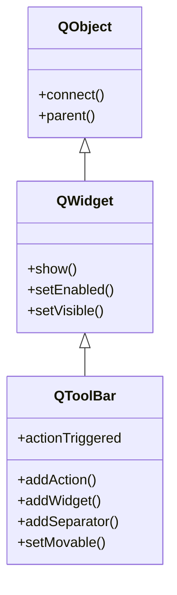

# QToolBar — barra de herramientas con acciones de acceso rapido

Una **barra de herramientas** es una fila (o columna) de botones, normalmente con iconos, que
ejecutan **acciones rapidas**. Es la franja de botones que vive bajo el menu de una ventana de
aplicacion. No se crea suelta: se anade a una [[QMainWindow]] con `ventana.addToolBar("nombre")`,
que la construye, la acopla arriba y te devuelve el `QToolBar` ya colocado. Lo idiomatico es
llenarla con las **mismas** [[QAction]] que ya usa el menu, para no duplicar logica.

## Importacion

```python
from PyQt6.QtWidgets import QToolBar
```

## Herencia



Como `QToolBar` **ES un [[QWidget]]**, lo que no define lo hereda: mostrarse, habilitarse,
ocultarse y la geometria vienen de `QWidget`; conectar senales y el `parent` vienen de `QObject`.
Lo suyo es solo gestionar la fila de **acciones**: anadirlas, separarlas y orientarlas.

## Senales

| Senal | Cuando se emite | Argumentos |
|-------|-----------------|------------|
| `actionTriggered` | cuando se activa una de sus acciones (clic en un boton de la barra) | `action: QAction` (la accion disparada) |

```python
barra.actionTriggered.connect(lambda accion: print(accion.text()))
```

Lo habitual no es conectar `actionTriggered`, sino conectar el `triggered` de **cada** [[QAction]]
por separado; esta senal sirve cuando quieres un unico manejador para toda la barra.

## Propiedades

En Qt los "atributos" son **propiedades** (getter/setter, no atributo directo). Las relevantes
para `QToolBar` (varias heredadas de [[QWidget]]):

| Propiedad | Tipo | Leer \| escribir | Controla |
|-----------|------|------------------|----------|
| `movable` | `bool` | `isMovable()` \| `setMovable(bool)` | si el usuario puede arrastrar la barra a otra posicion |
| `orientation` | `Qt.Orientation` | `orientation()` \| `setOrientation(Qt.Orientation)` | horizontal o vertical |
| `iconSize` | `QSize` | `iconSize()` \| `setIconSize(QSize)` | tamaño de los iconos de los botones |
| `windowTitle` | `str` | `windowTitle()` \| `setWindowTitle(str)` | titulo de la barra (de [[QWidget]]) |
| `visible` | `bool` | `isVisible()` \| `setVisible(bool)` | si esta mostrada (de [[QWidget]]) |

## Constructor y metodos

```python
QToolBar(parent: QWidget | None = None)
QToolBar(title: str, parent: QWidget | None = None)
```

Existe constructor, pero lo idiomatico es **no instanciarla a mano** sino obtenerla con
`ventana.addToolBar("titulo")`, que ya la acopla a la [[QMainWindow]].

| Firma | Devuelve | Que hace |
|-------|----------|----------|
| `addAction(texto_o_action)` | `QAction` | crea un boton de herramienta para la accion; acepta una [[QAction]] existente o un texto/icono |
| `addWidget(w: QWidget)` | `QAction` | mete un widget arbitrario en la barra (ej. un `QComboBox`); devuelve la accion que lo envuelve |
| `addSeparator()` | `QAction` | inserta una linea separadora entre grupos de botones |
| `setMovable(movable: bool)` | `None` | permite (o no) arrastrar la barra a otra posicion |
| `setOrientation(orientation: Qt.Orientation)` | `None` | pone la barra horizontal o vertical |
| `setIconSize(size: QSize)` | `None` | fija el tamaño de los iconos |
| `clear()` | `None` | quita todas las acciones y widgets de la barra |

## Casos de uso

```python
from PyQt6.QtWidgets import (
    QApplication, QMainWindow, QLabel, QComboBox
)
from PyQt6.QtGui import QAction          # PyQt6: QAction vive en QtGui
import sys

app = QApplication(sys.argv)

win = QMainWindow()
win.setWindowTitle("Toolbar demo")
win.setCentralWidget(QLabel("Contenido"))

# 1. La MISMA accion, compartida entre menu y toolbar (no duplicar logica)
guardar = QAction("Guardar", win)
guardar.triggered.connect(lambda: print("guardado"))

win.menuBar().addMenu("Archivo").addAction(guardar)   # va al menu

barra = win.addToolBar("Principal")                   # crea y acopla la barra
barra.addAction(guardar)                              # MISMA accion en la barra
barra.addSeparator()

# 2. Meter un widget arbitrario en la barra con addWidget
combo = QComboBox()
combo.addItems(["Rojo", "Verde", "Azul"])
barra.addWidget(combo)

barra.setMovable(True)

win.show()
sys.exit(app.exec())                                  # PyQt6: exec() (sin guion bajo)
```

## Errores comunes

| Error | Causa | Solucion |
|-------|-------|----------|
| La barra no aparece en la ventana | creaste `QToolBar(...)` suelta sin acoplarla | usa `ventana.addToolBar("titulo")`, que la construye y la coloca |
| Menu y toolbar tienen comportamientos distintos | duplicaste la logica en dos acciones separadas | crea **una** [[QAction]] y pasala a `addAction` del menu y de la barra |
| `addWidget` "desaparece" el widget | lo anadiste a un layout en vez de a la barra | mete el widget con `barra.addWidget(w)`, no con un layout |

## Notas relacionadas

- [[QMainWindow]] — la ventana que crea y acopla la barra con `addToolBar`
- [[QAction]] — la accion que comparten menu y toolbar
- [[QWidget]] — de donde QToolBar hereda show, geometria y visibilidad
